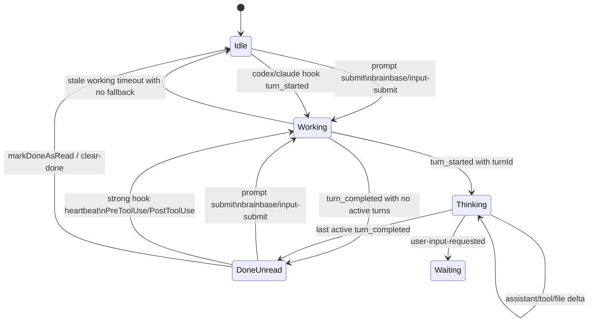

# Session Activity Indicator Lifecycle

## 目的

セッション一覧のアクティブインジケータを、server状態機械、status API、WebSocket、client表示、timeline sort で同じ契約として扱うための正本。

VibePro story: `story-active-indicator-state-machine`

## 正本状態

client の正本状態は `deriveActivityState(hookStatus)` が返す5状態。

| state | 表示 | 意味 |
| --- | --- | --- |
| `idle` | none | 状態なし、既読化済み、または有効な活動なし |
| `working` | blue | prompt送信済み、または強いworkingシグナルあり。active turn ID はまだない |
| `thinking` | blue | active turn ID があり、AIがturn処理中 |
| `waiting` | waiting tone | AIがユーザー入力や選択を待っている |
| `done-unread` | green | AIが停止し、未読の完了更新がある |

色そのものではなく、この5状態をserver/client/sortで共有する。

## 優先順位

1. 強いworkingシグナルは green より優先する。
2. active turn が1つでも残っている間は green にしない。
3. 明示doneは stale spinner より優先する。
4. prompt送信は Codex/Claude hook より先に発生するため、`brainbase/input-submit` として strong working に入れる。
5. `assistant-message-complete` / `assistant-response-complete` は完了ではなく heartbeat として扱う。
6. `status-full` に含まれない session は client からも消す。
7. timeline sort は `thinking|working` を最優先、次に `done-unread`、最後に時系列順。

## 状態遷移



## イベント契約

| sequence | expected state | 理由 |
| --- | --- | --- |
| done -> prompt submit -> no hook yet | `working` | 入力送信は実行開始の強いシグナル |
| done -> Codex hook heartbeat without turnId | `working` | `codex/hook/*` はhook由来の強いworking |
| done -> stale Codex PTY heartbeat only | `done-unread` | legacy fallback は明示doneを壊さない |
| done -> stale Codex PTY heartbeat with running evidence | `working` | 実行証跡が残る場合だけ復元する |
| done -> tmux pane title spinner only | `done-unread` | spinnerは誤検知しやすい弱いfallback |
| clearDone -> tmux pane title spinner | `thinking` | 既読化で明示doneを消した後はfallback可能 |
| active turn -> assistant-response-complete | `thinking` | response complete はturn completeではない |
| two active turns -> one turn_completed | `thinking` | 残turnがあればgreenにしない |
| all active turns -> turn_completed | `done-unread` | explicit terminal event |
| status-full missing session id | `idle` | server正本から消えた状態をclientも消す |

## 実装位置

- Codex notify入口: [scripts/codex-notify.sh](../scripts/codex-notify.sh)
- Codex hook入口: [scripts/codex-hooks-activity.sh](../scripts/codex-hooks-activity.sh)
- 端末入力入口: [server/services/session-runtime/terminal-io-methods.js](../server/services/session-runtime/terminal-io-methods.js)
- server状態機械: [server/services/session-core/activity-service-methods.js](../server/services/session-core/activity-service-methods.js)
- status API: [server/controllers/session/activity-handlers.js](../server/controllers/session/activity-handlers.js)
- WebSocket配信: [server/services/session-activity-ws-service.js](../server/services/session-activity-ws-service.js)
- client同期: [public/modules/session-indicators.js](../public/modules/session-indicators.js)
- client状態導出: [public/modules/core/session-activity-state.js](../public/modules/core/session-activity-state.js)
- timeline sort: [public/modules/ui/views/session-view.js](../public/modules/ui/views/session-view.js)

## VibePro / Graphify 運用

アクティブインジケータ、session realtime、terminal input、Codex/Claude hooks に触るPRは Graphify impact review 必須。

```bash
vibepro story select . --id story-active-indicator-state-machine
vibepro graph . --run-graphify
npm run test:active-indicator
```

PR本文には `Graphify Impact Review` セクションを置き、`vibepro graph . --run-graphify` または `graphify path|query|explain` の証跡を書く。

## 契約テスト

- [tests/server/session-activity-state-machine-contract.test.js](../tests/server/session-activity-state-machine-contract.test.js)
- [tests/server/session-manager.test.js](../tests/server/session-manager.test.js)
- [tests/unit/session-activity-state.test.js](../tests/unit/session-activity-state.test.js)
- [tests/unit/session-indicators-ws.test.js](../tests/unit/session-indicators-ws.test.js)
- [tests/ui/views/session-view.test.js](../tests/ui/views/session-view.test.js)
