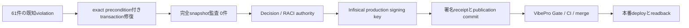
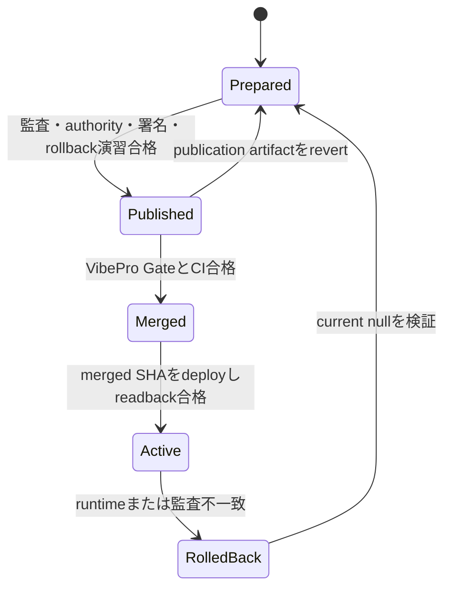
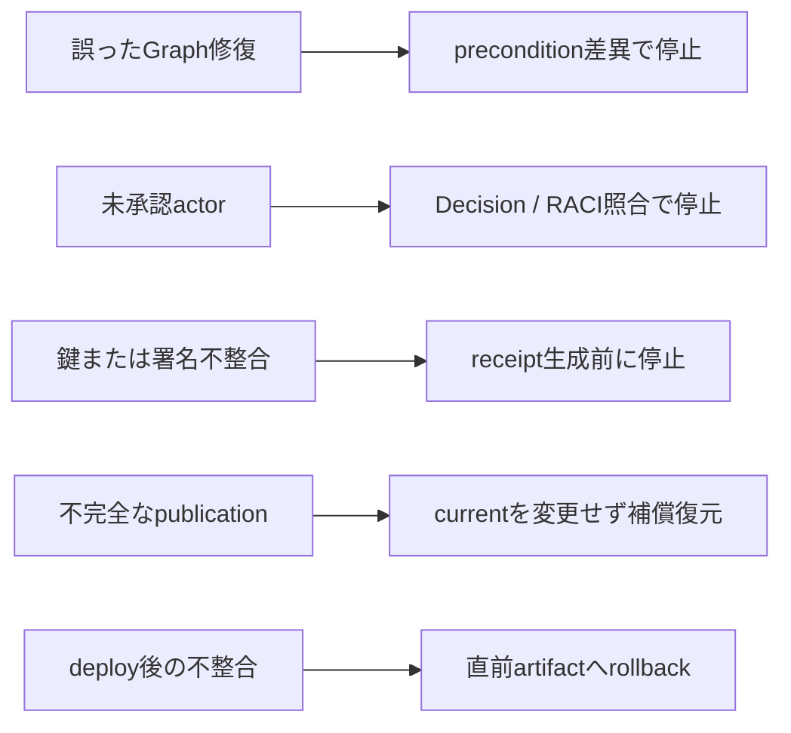

# Brainbase Ontology Production Activation Spec

## Diagrams

## A-001 Graph remediation

実行器は既知の61 violationだけをexact preconditionとし、差異があれば停止する。全変更を1 transactionに含め、削除せず、事前backupとpersist後の0 violationを必須とする。再実行は0 violationならno-op成功とする。

## A-002 Publication authority

Decision IDは`dec_ontology_1_0_0_activation_20260803`、scopeはBrainbase project、proposer / decider / applierは佐藤圭吾とする。Decision payloadはversion、digest、source commit、impact scope、scope、proposer、deciderを完全に保持する。RACIはlaneごとに独立entityとし、Responsible 1件、Accountable 2件を同一scopeへ結ぶ。

## A-003 Signing and publication

Ed25519 keypairはproduction用に生成する。秘密鍵はInfisical productionから署名runtimeだけへ投影し、非機密の公開鍵は`config/ontology/trusted-public-keys.json`で`key_id`に結合して全runtimeへ配布する。Registryは明示されたruntime公開鍵を優先し、未指定なら信頼ストアからreceiptの`key_id`に対応する鍵を解決する。どちらでも検証できなければfail closedとする。publication endpointは認証actor、Graph authority、release bindingを確認して署名receiptを返す。publisher以外のcurrent変更は禁止する。

## A-004 Rollback

publication commitの親がsource commitで、変更pathがreceipt、index、compatibility viewだけであることを検証する。独立checkoutでpublication commitをrevertし、`current: null`かつ`ontology:verify`合格を確認する。演習は本番runtimeやcanonical checkoutを変更しない。

## A-005 Production completion

merge後の本番runtimeでversion指定とcurrent指定のdigestが一致し、署名receiptが検証可能で、DB-backed auditがcompleteかつ0 violationである場合のみ有効化完了とする。

## A-006 Compatibility and operator contract

有効化後はcanonical Graph writeがOntology 1.0.0に対してfail closedになる。既存read APIとlegacy write responseの既存フィールドは維持し、guard状態とontology versionを加算的に返す。環境変数に公開鍵がない開発・検証runtimeでもGit管理の信頼ストアによりcurrentを検証できる。project memberの手動操作は不要とする。

運用責任者は佐藤圭吾とし、次の証跡を同一のmerged commitへ結び付ける。

- deploy: merged SHAを本番checkoutへ反映し、`brainbase-ssot.service`を再起動する。
- readback: health、version指定/current指定API、両digest一致、署名receiptを確認する。
- audit: DB-backed full auditの`collection_complete: true`とviolation 0件を確認する。
- observability: systemd状態、起動後journal、Registry/署名/DB接続エラー不存在を確認する。
- rollback: publication前のartifactへ戻して再起動し、`current: null`とverify合格を確認する。Graph修復とauthority factは保持する。

support ownerとrollback decision ownerも佐藤圭吾とする。これらの本番証跡が揃う前は「公開commit作成済み」「merge済み」「deploy済み」「本番有効化完了」を別状態として報告する。

## S-001 Production activation scenario

- Given: release `1.0.0`のGraph監査、公開authority、署名receipt、rollback演習が合格している。
- When: review済みの同一HEADをCI、merge、本番runtimeへdeployする。
- Then: `current`とversion指定APIのdigest、署名、稼働SHA、health、journal、完全Graph監査が一致する場合だけactiveと判定し、不一致なら直前artifactへrollbackする。
