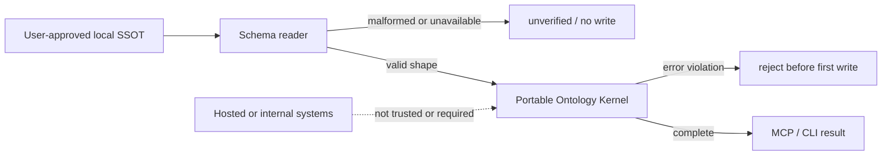

# Portable Ontology Kernel Spec

## Public Contract

Ontology release `1.0.0`は次を一つのobjectとして返す。

- `version`, `effectiveAt`, `compatibility`
- `domains.types`: OSS canonical recordsの型と意味
- `domains.relations`: 許可された関係語彙とdomain/range
- `domains.constraints`: stable rule ID、severity、説明
- `domains.inference`: 明示supersessionとtopic conflictの規則
- `domains.evolution`: from version、migration、rollback、change summary

MCPに次のread-only toolsを追加する。

- `get_ontology`: active release全体を返す。Personal OSの読取を要求しない。
- `audit_ontology`: local SSOTを意味監査し、`complete|unverified`、violations、counts、解釈に用いたOntology versionを返す。`ontologyVersion`で`0.0.0|1.0.0`を選択でき、未対応versionは拒否する。
- `infer_decisions`: current/superseded/conflictsと、version、as-of、evidence、説明を返す。`0.0.0`では1.0.0の`effectiveAt`、supersession、conflict規則を過去へ遡及適用しない。
- `ontology_impact`: `fromVersion`からactive versionまでのcompatibility、変更、migration、rollbackを返す。

CLIに`ontology:show`と`ontology:audit`を追加する。JSONを標準出力へ返し、`ontology:audit`は監査不能またはerror violationがある場合に非0終了する。

## Canonical Record Extension

`DecisionRecord`へ後方互換なoptional fieldを追加する。

- `topic?: string`: 競合判定単位。
- `supersedes?: string[]`: 明示的に置き換えるDecision ID。
- `effectiveAt?: string`: 意思決定が有効になるISO datetime。

既存fieldだけのrecordは引き続きvalidである。
`onboard:init`が生成する`schemas/decisions.schema.json`も、この3 optional fieldをruntime schemaと同じ形で公開する。

## Rules

- `ONT-ENTITY-ID-UNIQUE` (error): graph entity IDは一意。
- `ONT-RELATIONSHIP-ID-UNIQUE` (error): relationship IDは一意。
- `ONT-DECISION-ID-UNIQUE` (error): decision IDは一意。
- `ONT-RELATIONSHIP-PERSON-RESOLVES` (warning): relationshipのpersonは同名person entityへ解決できる。
- `ONT-DECISION-SUPERSEDES-EXISTS` (error): supersedes先が存在する。
- `ONT-DECISION-SUPERSEDES-SELF` (error): 自分自身をsupersedeしない。
- `ONT-DECISION-SUPERSEDES-CYCLE` (error): supersession graphは循環しない。

Zodによる既存file schema validationは形式検証として維持し、このrule setはその後の意味検証として実行する。

## Audit Result

成功時:

```json
{
  "status": "complete",
  "ontologyVersion": "1.0.0",
  "violations": [],
  "counts": { "entities": 0, "relationships": 0, "decisions": 0 }
}
```

読取失敗時は`status: "unverified"`、`violations: []`、`violationCount: null`、unavailable sourceと`issues`を返す。これは「意味違反0件」を証明しない。

## Inference Result

- supersedes参照のtargetは`superseded`へ入る。
- supersededでないDecisionは`current`候補になる。
- 同じ明示`topic`にcurrent候補が2件以上あれば`conflicts`へ入り、単独currentとして扱わない。
- topicのないlegacy Decisionは各IDを独立topicとして扱う。
- resultは`ontologyVersion`、`asOf`、根拠Decision ID、適用rule ID、説明を含む。
- auditにerrorがあるsnapshotからは推論せず、違反を返す。

## Pre-write Guard

`onboard:seed`、`onboard:apply --write`、`onboard:projects --write`は、既存snapshotへ予定追加を反映したin-memory snapshotを作り、最初のfile write前にauditする。error violationがあれば全fileを未変更のまま拒否する。

0.0.0からの更新時は、canonical directoryのbackupと1.0.0 read-only auditを先に行う。既存recordは読取互換だが、canonical writeは1.0.0 auditがerrorなしであることを条件とする。rollbackは直前のpackage versionの再インストールを含み、canonical fileを修正済みの場合だけbackupを復元する。

## Threat Model



Trust boundaryはローカルcanonical fileのreaderとpure kernelの間に置く。入力欠損、重複ID、循環supersessionを正常扱いせず、外部network、secret、内部Graphからruleやfactを注入しない。Ontology contractはpackage内のversion付き定数であり、利用者データを含めない。

## Test Cases

1. release取得で5領域、version/effective/migration/rollbackが揃う。
2. duplicate ID、missing supersedes、self/cycleをstable rule IDで検出する。
3. malformed/missing local SSOTを`unverified`として返し、0 violationsと区別する。
4. 明示supersessionをcurrent/supersededへ導出し、同topicの暗黙競合を解消しない。
5. legacy Decisionと既存MCP/onboarding testが変更なしで通る。

## Verification

- Targeted Vitest: ontology pure kernel、MCP contract、CLI audit、pre-write guard。
- Full Vitest suite。
- TypeScript build。
- VibePro strict-head unit/typecheck/integration/e2e evidence。
