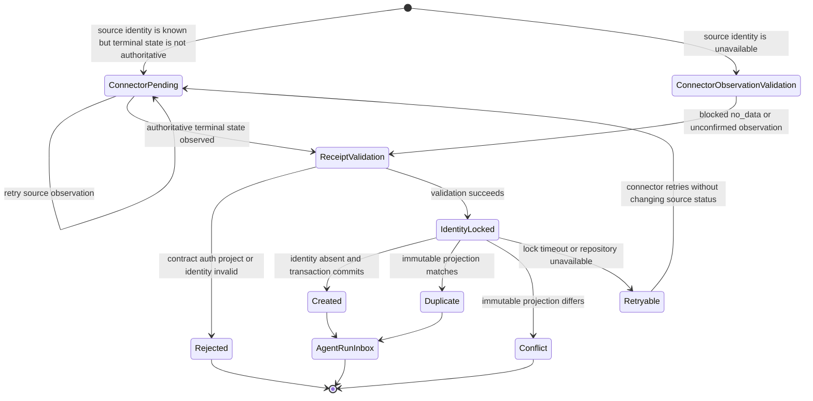
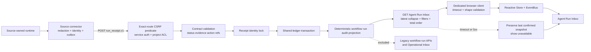
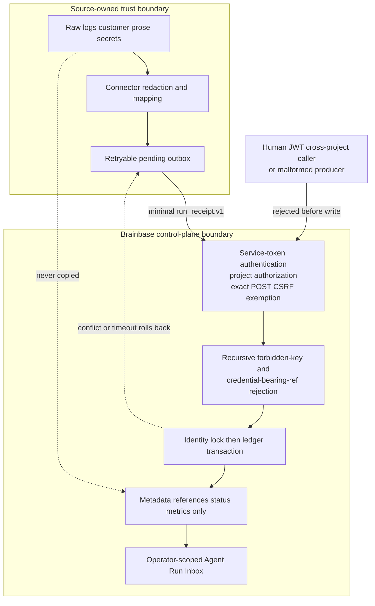

# Cross-runtime Run Receipt Inbox v1 Spec

> Surface lifecycle: contract/API/ledger semanticsは有効。browser architectureとWorkflow Mission Control UIは2026-07-16に廃止し、MCPの全件・history・diagnosisとMac Companionの要介入projectionへ移管した。

## Contract

`run_receipt.v1` is the generic operational result envelope for source-owned jobs observed by Brainbase.

## Required Fields

- `contract_version`: `run_receipt.v1`
- `source.type`: `mana | codex_automations | github_actions | salestailor`
- `source.workflow_id`
- `run.project_id`
- `run.external_run_id`
- `run.status`: `success | failed | blocked | waiting_human | cancelled`
- `run.evidence_state`: `confirmed | unconfirmed | no_data`
- `run.started_at` or `run.finished_at`
- `delivery.idempotency_key`

## Optional Fields

- `source.name`, `source.runtime_target`
- `run.org_id`, `run.workflow_name`, `run.parent_external_run_id`
- `run.finished_at`, `run.summary`, `run.blocker_reason`, `run.action_required`
- `run.observation_kind`: `source_run | connector_observation` (default: `source_run`)
- `run.metrics`: finite number, boolean, or null values only
- `run.evidence_refs[]`: `{ kind, ref, label? }`
- `delivery.attempt`, `delivery.sent_at`

## Invariants

- Canonical identity bytes are UTF-8 JSON of `[run.project_id, source.type, run.external_run_id]` with no whitespace. `delivery.idempotency_key` must equal `rr1_` plus the lowercase SHA-256 hex digest of those bytes.
- WMC run id is `run_receipt_run_` plus the first 32 characters of that digest. WMC workflow id is `run_receipt_wf_` plus the first 32 characters of SHA-256 over UTF-8 JSON `[run.project_id, source.type, source.workflow_id]`.
- `failed` and `blocked` require `run.blocker_reason` or non-`none` `run.action_required`.
- `evidence_state=confirmed` requires at least one evidence reference.
- The forbidden key set `content|body|raw_log|rawLog|transcript|customer_text|customerText|payload` is rejected recursively anywhere in the envelope.
- `source.workflow_id` and every identity field are non-empty strings of at most 200 characters. Optional `source.name`, `source.runtime_target`, and `run.workflow_name` are single-line operational labels of at most 120 characters.
- `run.summary` is a connector-redacted, single-line operational summary of at most 500 characters. `run.blocker_reason` is a connector-redacted, single-line operational reason of at most 300 characters. They must not contain customer prose, secrets, raw logs, or transcripts; the source connector owns redaction before delivery and Brainbase rejects control characters, line breaks, forbidden keys, and oversize values as defense in depth.
- `run.action_required` is one of `none | check_error | resolve_blocker | review_run | retry_run | reauthorize | contact_owner`; connector-specific prose is not accepted in this field.
- Status mapping supplies adapter defaults (`failed=check_error`, `blocked=resolve_blocker`, `waiting_human=review_run`, otherwise `none`). Any source-supplied non-`none` enum action overrides that default for every status and is retained as `source_action_required=true`; this is intentionally distinct from the source status and promotes the Inbox item to priority 1.
- Metric names are single-line operational identifiers of at most 120 characters. Metric values must be finite number, boolean, or null; strings, nested objects/arrays, and content/log/transcript-like metric names are rejected.
- Every evidence reference has `kind=url|artifact_ref|log_ref`, a non-empty `ref` of at most 2048 characters, and an optional single-line `label` of at most 120 characters. `url` accepts only an absolute `https:` URL. `artifact_ref` and `log_ref` require a source-owned opaque URI-like reference matching `^[a-z][a-z0-9+.-]{1,31}:[^\\s]{1,2000}$`. Every kind rejects URI authority or opaque userinfo syntax matching `scheme:(//)?user(:password)?@`; ordinary source-owned colons after the scheme remain valid. Empty or broken refs are rejected.
- `finished_at` may not precede `started_at`.
- Timestamp ordering parses every validated RFC 3339 value into a UTC epoch millisecond. Latest selection and final listing never compare offset-bearing timestamp strings lexicographically. Final listing order is priority ascending, effective epoch descending, persisted-created epoch descending, deterministic run id descending.
- Receipt delivery metadata never changes source `run.status`.
- Connector-owned source identity must be globally unambiguous inside a Brainbase project and distinguish source-defined reruns that can change immutable run fields. GitHub Actions uses `github:<repository_id>:run:<run_id>:attempt:<run_attempt>` and repository-scoped workflow identity. Mana includes `runtime_target + workflow_key`, Codex Automations includes `automation_id`, and SalesTailor includes `job_kind + job_definition_id` in `run.external_run_id`; only redelivery of the same scoped attempt is a delivery retry. Each source connector Story owns a cross-scope collision fixture and a pre-fix rerun fixture.
- Source-specific ownership is traceable to four explicit follow-on artifacts under `docs/connectors/run-receipt/`: `story-mana-run-receipt-connector-v1.md`, `story-codex-automations-run-receipt-connector-v1.md`, `story-github-actions-run-receipt-connector-v1.md`, and `story-salestailor-run-receipt-connector-v1.md`. Their status is `implemented_locally`、`canary_pending`、またはblockerを明示した`blocked_*`のいずれかとし、source-owned outbox testと明示承認済みproduction canaryが揃うまで本接続完了としない。
- `connector_observation` requires `source.workflow_id=__connector_observation__`, `run.status=blocked`, `run.evidence_state=no_data|unconfirmed`, and `run.blocker_reason`. Its external run id names a connector-owned observation attempt, not a source run.
- A connector that already knows a source-owned run identity but cannot yet read an authoritative terminal status keeps that source run in its own pending/outbox state and retries observation. It must not emit `connector_observation` for that known run. `connector_observation` is reserved for an observation attempt where the source-owned run identity itself is unavailable; a later source receipt therefore cannot conflict with or supersede that synthetic observation identity.
- A connector that knows both the source-owned run identity and an authoritative terminal status but cannot retrieve evidence emits a source receipt with that same identity and terminal status, using `evidence_state=unconfirmed|no_data` and the status-appropriate action/blocker mapping. It must not emit a connector observation, synthesize zero metrics, or convert the run to success.
- Ingest requires a repository transaction capability. Every repository serializes unrelated transaction owners through an in-process queue and carries the current owner in `AsyncLocalStorage`. A nested transaction from that same async owner joins the outer transaction without reacquiring the queue/file lease or taking a second snapshot. Only the outermost transaction reloads, commits, or restores. Any nested failure marks the outer owner rollback-only, so a caught inner failure cannot commit partial state. Unsupported repositories fail before writes.
- The JSON repository additionally acquires a file-wide transaction lease with bounded retry, reloads only under that lease, defers intermediate persistence, and commits once. It never steals a live lease; stale recovery requires both an expired lease and proof that the recorded local PID is absent. A failed transaction restores only process memory and never persists its stale snapshot. Lease release always occurs in `finally`.
- Every JsonFile shared-ledger collection mutation primitive rejects calls without an active transaction owner before changing memory. Receipt/workflow identity locks and transaction lease metadata are separately synchronized control-plane state outside `workflow-ledger.json`; they are exempt from the collection guard, and acquire/release never reloads or replaces shared-ledger memory. InMemory identity locks are likewise outside the ledger snapshot. Specialized automation services, WorkflowRunner, external_runner create and duplicate replay, reconciler, and every other production shared-ledger writer use short repository transaction callbacks around atomic persistence groups. Remote handler execution, network I/O, long sleeps, and human waits do not occur while the file lease is held.
- JsonFile seed workflows are inserted before repository publication by a dedicated initialization transaction using the same owner context, file lease, under-lease reload, single commit, and `finally` release. Only missing seeds are inserted; existing ledger content is preserved. Runtime default-workflow repair uses the normal reentrant transaction.
- `external_runner.v0` commits core run state plus deterministic pending-candidate audit intents in one short transaction. Candidate Store calls run outside the lease with global id `extcand_` plus lowercase SHA-256 over UTF-8 compact JSON `["external_runner.v0", workspace_id, org_id || "", project_id, runner_type, external_run_id, source_candidate_id]`. Candidate Store receives `source_event_ids=["external_runner_scope:" + sha256(compactJson(["external_runner.v0", workspace_id, org_id || "", project_id, runner_type, external_run_id])), source_candidate_id]`; this scopes the existing source-event dedupe by project/run and retains the original source id directly, while audit metadata retains it too. Every Candidate Repository rejects an existing primary id with `DuplicateCandidateError` before mutation even when its source-event key differs, and preserves the original record. Each result is finalized in another short transaction. Pending exact replay writes no duplicate audit. On `DuplicateCandidateError`, `findById(derived_id)` is compared through a canonical immutable ingest projection: identity, cognitive/owner/actor/source fields, sorted source/org/project/evidence id sets, workspace/project, ACL/recommendation fields, recursively key-sorted permission snapshot/body, redaction, confidence, and expiry; mutable promotion state and repository timestamps are excluded. Equality adopts and finalizes `stored`; missing/mismatch appends `external_runner.candidate_conflict`, leaves the intent actionable, and rejects `external_runner_candidate_conflict`. Retryable Candidate Store unavailability becomes `deferred`, but an identity-integrity conflict never does. Only a later fully converged duplicate appends the legacy `external_runner.duplicate_replay_ignored` audit inside a short shared-ledger transaction.
- Before duplicate lookup, ingest acquires a receipt identity lock with the exact tuple `workspace_id=run_receipt:<run.project_id>` and `workflow_id=<deterministic run id>`, then enters the repository-wide write transaction. Duplicate lookup, conflict comparison, and persistence execute inside both boundaries, and receipt lock release happens in `finally`. Lock ordering is receipt identity then shared-ledger transaction; shared-ledger transaction code never acquires a receipt identity lock. JsonFile publishes only a fully written and fsynced pending lock through an atomic no-replace hard link, so the canonical lock path is never a partial JSON file. Legacy malformed locks are quarantined under the mutation guard. The mutation guard records owner PID and expiry; a live local owner is never reclaimed, while expired dead-owner and stale ownerless legacy artifacts are quarantined and recovered. A repository without transaction/acquire/release capability fails before writes. Identity-lock contention is a retryable HTTP `503` with `Retry-After`; contract/conflict failures are `400`. Any bounded lock timeout fails before writes. Identical receipts produce one `created` and remaining `duplicate`; distinct receipts and all production writers preserve every committed workflow, run, step, and audit.
- Duplicate equality uses a normalized immutable projection containing `contract_version`, normalized `source`, and normalized `run` fields. `delivery` is excluded in full, including `attempt` and `sent_at`; identity is already enforced by the canonical tuple/key check. Object keys are recursively sorted, absent optional fields are omitted, timestamps use their validated input strings, evidence references are sorted by `kind`, `ref`, then `label`, and metrics are sorted by key. SHA-256 over UTF-8 compact JSON of this projection is stored as `payload_digest`. A retry that changes only delivery metadata is a duplicate; any immutable projection change is `run_receipt_conflict`.

## Mapping

| Contract field | Brainbase surface |
|---|---|
| project + source type + source workflow id | hashed internal `workflows.id`; original id in metadata |
| project + source type + external run id | deterministic `workflow_runs.id` |
| `run.status` | `workflow_runs.metadata.run_receipt.source_status` plus WMC status/closure/action projection |
| `run.evidence_state` | `workflow_runs.metadata.run_receipt.evidence_state` |
| `run.metrics` | `workflow_runs.metadata.run_receipt.metrics` |
| `run.evidence_refs[]` | run metadata plus redacted audit reference summary |
| delivery metadata | `workflow_runs.metadata.run_receipt.delivery` |
| source-supplied action presence | `workflow_runs.metadata.run_receipt.source_action_required` |

## Diagrams

- kind: state
  purpose: connector observation, validation, serialization, duplicate/conflict, and retry transitions
- kind: flow
  purpose: source-owned execution through authenticated ingest to the dedicated operator surface
- kind: threat_model
  purpose: raw-material ownership, authentication/authorization, validation, and atomic persistence boundaries

## State Diagram (`kind: state`)

## Request and Projection Flow (`kind: flow`)

## Threat Model (`kind: threat_model`)

The trust boundary is intentionally asymmetric: source connectors may inspect raw execution material but must emit only the redacted contract, while Brainbase authenticates, validates, serializes, and projects that contract. Brainbase never becomes the raw-log owner. The lock order is always receipt identity before shared-ledger transaction; no code inside the shared-ledger transaction may acquire a receipt identity lock.

## Scenario Clauses

- S-001 `workflow state transition`: confirmed success maps to `success / closed`; an explicit non-`none` source action wins, otherwise `none` is the adapter default.
- S-002 `workflow state transition`: failed maps to `failed / needs_action`; an explicit non-`none` source action wins, otherwise `check_error` is the adapter default, without changing `evidence_state`.
- S-003 `workflow state transition`: blocked maps to `needs_action / needs_action`; an explicit non-`none` source action wins, otherwise `resolve_blocker` is the adapter default.
- S-004 `workflow state transition`: waiting human maps to `waiting_human / open`; an explicit non-`none` source action wins, otherwise `review_run` is the adapter default.
- S-005 `workflow state transition`: cancelled remains `cancelled / closed`; an explicit non-`none` source action wins, otherwise `none` is the adapter default, and it is not counted as success.
- S-006 `workflow retry matrix`: exact duplicate returns the original run and writes no second run.
- S-006a `workflow retry matrix`: a retry changing only `delivery.attempt` or `delivery.sent_at` is duplicate; reordered metric keys or evidence refs normalize to the same digest.
- S-006b `workflow retry matrix`: simultaneous identical receipts serialize under one receipt lock and yield one created run plus duplicate responses, never multiple runs.
- S-007 `workflow rollback guard`: same idempotency identity with different normalized content is rejected without mutation.
- S-008 `workflow rollback guard`: invalid evidence, project mismatch, or unsupported source/status is rejected before writes.
- S-009 `workflow retry transition`: a failed filter request preserves the last confirmed Agent Run Inbox snapshot and confirmed filters, renders the receipt section unavailable, and leaves Operational Inbox usable.
- S-010 `inbox filter`: source, project, run status, and evidence state filters compose without treating unavailable as zero.
- S-011 `workflow auth boundary`: POST cookie/session-only ingest and inaccessible projects are rejected; authenticated operator GET is allowed and project-scoped.
- S-011a `workflow auth boundary`: production CSRF bypass applies only when `req.method === 'POST' && req.path === '/api/run-receipts/ingest'`; `service-token`/`internal` clients reach route ingest, while a normal human JWT is rejected whether supplied as Bearer or cookie/session. `insecure-header` remains test/development-only under the existing auth middleware. `PUT`/`PATCH`/`DELETE` for that same path remain production-CSRF `403`, and existing external-runner/companion/internal-key exemptions remain unchanged.
- S-012 `compatibility guard`: pending `external_runner.v0` candidate replay resumes without a duplicate audit; after full convergence a later exact duplicate preserves the existing `external_runner.duplicate_replay_ignored` audit in a short transaction. Candidate ids are globally derived per run/project scope, an exact existing derived candidate is adopted after store-before-finalize interruption, and mismatch rejects as actionable conflict.
- S-013 `connector observation`: source-unavailable fallback remains visible as a connector observation and is never counted as a source run failure or empty success.
- S-014 `operator surface` (retired): 旧Workflow Mission Control UIの要件。現在はMCPが全件・filter・history・diagnosisを返し、Mac Companionは要介入項目だけを表示する。
- S-015 `shared ledger regression`: receipt workflows remain in the shared repository while generic workflow list/create/detail/update/draft APIs are retired. Receipt workflows are also excluded from the remaining Automation Run compatibility endpoint, generic run detail/rerun endpoints, and the existing Operational Inbox, so a receipt appears exactly once in Agent Run Inbox and cannot be mutated through a legacy surface.
- S-016 `receipt surface failure isolation`: timeout、network failure、5xxはMCPで`unavailable`/`error`として返し、Mac Companionは前回成功snapshotを保持する。空配列や0件へ丸めない。
- S-017 `latest run selection`: receipt history is collapsed by `(project_id, source.type, source.workflow_id)` before filters, priority, count, and limit. Selection uses greatest `finished_at || started_at || created_at`, then greatest persisted `created_at`, then lexicographically greatest deterministic run id. An old blocked run followed by a new success yields only the success; a blocked-status filter does not resurrect the old run; different workflow identities remain independently visible.
- S-018 `total order`: collapsed identities with equal priority are ordered by effective UTC epoch, persisted-created UTC epoch, then deterministic run id, all descending except priority. Equivalent instants with different RFC 3339 offsets compare equal before the later tie-breaks, and repeated limit queries return the same items.
- S-019 `browser architecture` (retired): browser専用client/service/view、Store/EventBus slice、`public/workflows.html`は削除済み。後継境界はMCP control-plane toolとMac Companion client/projectionである。
- S-020 `shared ledger transaction`: concurrent distinct receipt identities preserve both projections; receipt ingest racing `external_runner.v0` create or duplicate replay and specialized automation service/WorkflowRunner mutation preserves every workflow, run, step, and audit; a failed JSON transaction cannot write its rollback snapshot over another committed transaction; same-owner nested calendar-to-meeting-pack transactions complete without deadlock, propagate rollback-only, and unrelated owners remain serialized; shared-ledger collection mutation outside a transaction is rejected before memory or disk changes; identity-lock operations cannot reload pending memory; a controlled two-repository startup fixture proves initialization waits, reloads under the shared lease, inserts only missing seeds, and preserves the other writer's commit; WorkflowRunner initial and terminal mutation groups are separate guarded transactions and no transaction spans a blocked remote handler; candidate outbox interruption resumes idempotently with scoped ids, exact adoption, explicit mismatch conflict, and legacy post-convergence duplicate audit.

## API

- `POST /api/run-receipts/ingest`
  - 201 `{ status: "created", run, workflow, audit_logs }`
  - 200 `{ status: "duplicate", run, workflow, audit_logs }`
  - 400 contract/conflict error
  - 403 auth/project error
  - 503 retryable receipt identity-lock timeout with `Retry-After`
- `GET /api/run-receipts/inbox`
  - filters: `project_id`, `source_type`, `run_status`, `evidence_state`, `limit`
  - response: `{ items, count, has_more, omitted_count }`
  - selection/pagination: collapse to the latest run per workflow identity, then apply all filters and the total order priority asc → effective UTC epoch desc → persisted-created UTC epoch desc → deterministic run id desc; `count` is the matching collapsed total before `limit`, `has_more = count > items.length`, and `omitted_count = count - items.length`
  - repository/service failures return an explicit non-2xx error; they are not converted to a successful empty response

## Verification

- S-011: `tests/server/services/run-receipt-ingest-service.test.js` は組織・取得済みcatalog・project grantを持つ通常メンバーで5 sourceの保存→Inbox取得を検証する。同じ台帳の未認可projectを除外し、組織なし・grantなしでは結果を開示しない。認可policyをmockで迂回しない。
- AC1/AC4/AC6/AC8: `tests/server/services/run-receipt-contract.test.js` rejects pre-fix invalid status/evidence, raw-key bypasses, oversized text, nested metrics, and delivery/status conflation.
- AC2/AC3/AC9/AC15: `tests/server/services/run-receipt-contract.test.js`、`tests/server/services/run-receipt-ingest-service.test.js`、`tests/server/services/workflow-repository-transaction.test.js`、`tests/server/services/external-runner-ingest-service.test.js` がcontract、冪等性、transaction、Candidate Store境界を検証する。Meeting noteはprovider固有reconcilerを持たず、`tests/server/services/meeting-automation-service.test.js` がhandoffとwrite-back境界を検証する。
- AC4/AC5/AC13/AC14: `tests/server/services/run-receipt-inbox-service.test.js` uses fixtures for all six reachable priority buckets, composed filters, connector observation, omitted count, uncertainty preservation, and latest-run collapse. Pre-fix fixtures prove old blocked + new success returns only the success, blocked filtering does not resurrect old history, a separate workflow remains visible, equal instants written with different offsets use the persisted-created-at/run-id tie-break, full cross-identity order is total, repeated limited queries are stable, and count/has_more/omitted_count are computed after collapse and filters.
- AC7/AC10: `tests/server/routes/run-receipt-routes.test.js` and `tests/unit/csrf-run-receipt-ingest-exempt.test.js` prove the pre-fix production behavior first (POST/PUT/PATCH/DELETE on the ingest path are all `403`), then prove the implementation changes only the exact `POST /api/run-receipts/ingest` predicate so it reaches route auth while same-path PUT/PATCH/DELETE and near-match POST paths such as `/api/run-receipts/ingest/extra` and `/api/run-receipts/ingest-legacy` remain `403`; through the real `requireAuth` classification they prove the same human JWT is rejected as both Bearer and cookie while an authorized `bbsvc_` service token succeeds, project denial is write-free, GET remains operator/project-scoped, and existing exemptions are unchanged. This fixture must fail any prefix-based exemption such as `startsWith('/api/run-receipts/ingest')`.
- AC7/AC10 connector compatibility: source固有identity、terminal status mapping、outbox、evidence、connector observationのfixtureは各production connector Storyが実装repository内で所有する。共通Storyはconnectorを含まないため、未実装connector testをverification sourceとして宣言しない。
- AC5/AC11: workflow service/route testsと`mcp/brainbase/tests/tools/control-plane-tools.test.ts`がreceipt/non-receipt分離、全source status/action/blocker/evidence、filter、history、diagnosis、no_data/unconfirmed/unavailable保持を証明する。
- AC12/AC14/S-016/S-019: MCP control-plane testsがtimeout/network/5xxを空成功へ丸めないことを証明し、Mac CompanionのRun Receipt projection testsが前回成功snapshotとstable identityによるfeedback continuityを証明する。
- S-012/S-015: external runner、Meeting Automation、Automation Run、workflow compatibility route testsを維持し、廃止済みWorkflow UI testsは削除する。
