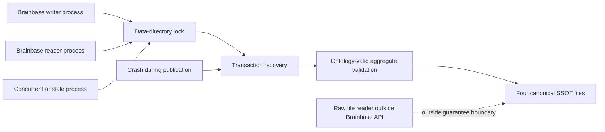

# Local SSOT Atomic Commit Spec

## Public behavior

`onboard:seed`、`onboard:projects --write`、`onboard:apply --write`は、同じdata directoryに対して並行実行されても各成功操作の変更を失わない。成功は4 canonical filesが一つのOntology-valid aggregateを表す場合だけ返す。

`loadPersonalOs`を含むBrainbaseのreaderは、writerの完了を待ち、未完了transactionを回復してから読む。lock timeout、foreign-host lock、回復失敗は空データやviolations 0へ変換せずerrorにする。

通常のCLI/MCP readはそのerrorをrejectする。`audit_ontology`は既存のevidence-safe contractを維持し、canonical inputを確認できない場合は成功扱いやviolations 0にせず`status: unverified`として返す。

`initializePersonalOs`も同じlock/recovery境界を使う。4 filesがすべて存在すればno-op、すべて存在しなければ完全な初期aggregateをcommitし、一部だけ存在する場合は推測で補完せずfail loudする。

## Storage contract

Canonical filesは従来どおり次の4つとする。

- `graph.json`
- `relationships.json`
- `personal-kg.jsonl`
- `decisions.jsonl`

transaction metadataはdata directory内のhidden pathに置き、事実・source count・MCP検索対象に含めない。正常完了後はlockとtransaction残骸を残さない。

## Mutation contract

atomic mutation callbackはlock取得後の最新`PersonalOs`を受け取り、完全な次`PersonalOs`を返す。callbackがthrowした場合はpublishしない。aggregate mutation API自身が`assertOntologyValid`を実行し、検証が成功しない限りstage/publishしない。

低水準のgraph/relationship/JSONL serializerはtransaction内部のnon-exported helperとする。canonical multi-file writeのpublic APIはaggregate mutationとinitializationだけとし、個別writeでatomicityやOntology guardを迂回できない。

## Recovery contract

- `.staging-*`: recovery namespaceへ未登録でありcanonical filesを変更していないため、lock取得後に削除する。
- 通常mutationの登録済み・未commit transaction: 完全な`previous/`の4ファイルをcanonical pathへatomic replaceし、transactionを削除する。
- 初期化の登録済み・未commit transaction: 完全な`next/`の4ファイルをcanonical pathへatomic replaceしてroll forwardし、部分初期化を解消する。
- `COMMITTED` transaction: canonical new stateを採用し、transactionだけ削除する。
- `COMMITTED` markerを論理的な成功境界とする。marker後のtransaction cleanup失敗はcanonical new stateを維持し、呼出し結果を失敗へ反転させずwarningを記録する。残骸は次回accessのrecoveryで削除する。
- この成功境界はprocess crashに対する契約であり、filesystem `fsync`を伴わない電源断耐久性までは保証しない。
- 登録済みtransactionのmetadataまたは必要snapshotが不完全な場合: 自動で空値を補わずfail loudする。
- recoveryはlock保持中だけ実行する。

## Threat model

### threat_model

保護対象は4 canonical filesが表す一つのaggregateと、承認済み事実の非消失である。並行processはdata-directory lockで直列化し、publication途中のcrashは登録済みtransactionから回復する。foreign-host lock、incomplete owner metadata、壊れたsnapshotは推測で処理せずfail loudする。lockを使わないraw file readerは保証外であり、Brainbase API/CLIだけが整合したread contractを提供する。

完全なsnapshotと`PREPARED` markerは`.staging-<uuid>`内で作る。これを同一filesystemのatomic directory renameで`<uuid>`へ変えた時点だけを「登録」とする。したがってprevious copy途中のcrashはcanonical stateを変更せず、不完全backupをrollback対象にしない。

## Test cases

1. 1回のmutationで4領域が更新され、再読込結果が予定aggregateと一致し、runtime残骸がない。
2. 別processの2 writerを同時開始し、両方の追加が各1回残る。
3. 通常mutationのpublish途中へ決定的にfailureを注入し、次readがbefore aggregateと完全一致する。
4. previous copy途中の`.staging-*`、登録済み未commit mutation、登録済み未commit initialization、`COMMITTED`残骸を個別に作り、通常mutationは`previous`へrollback、初期化は`next`へroll forwardすることをassertする。
5. 初回initとwriter/readを競合させても部分的な4 filesを返さず、一部fileだけ存在する初期状態はfail loudする。
6. live same-host lock、foreign-host lock、dead same-host PID、owner metadata生成途中を個別にfixture化し、live/foreign/incomplete ownerを奪わずtimeoutし、dead ownerだけquarantine経由で回復する。
7. `onboard:seed`、`onboard:projects --write`、`onboard:apply --write`の各経路について、共通lock内の最新aggregateから再計算され、Ontology-invalid予定stateが最初のwrite前に拒否されることをassertする。
8. 通常MCP readはlock/recovery errorをrejectし、`audit_ontology`は同じ入力失敗を`status: unverified`で返す。
9. 従来4ファイルのみのdirectoryを読み、最初のatomic mutation後も既存dataとfile shapeを維持する。
10. 既存Ontology、onboarding、MCP testが通る。

## Verification

- focused runtime path: `vitest run tests/ssot-atomic.test.ts`
- negative path: publish failure、recovery failure、lock timeout、partial initializationのfixtures
- integration runtime path: relevant CLI and Ontology tests
- current HEAD: full `npm test`と`npm run build`
- VibePro strict-head evidence and Gate review
