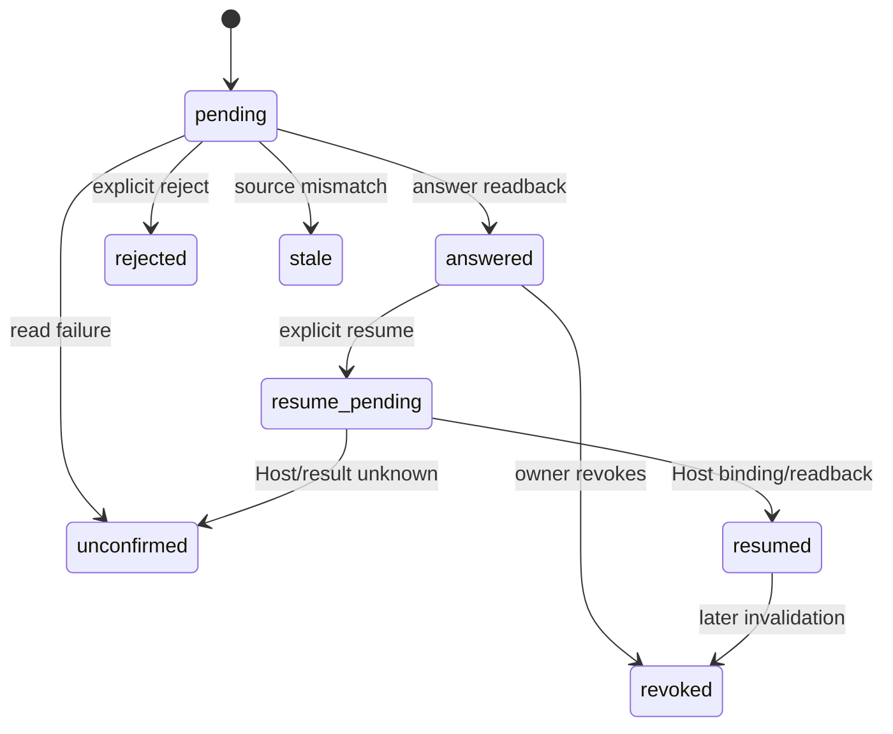

# Personal Human Decision Answer Web v1 — planning-only Spec

> この文書は `story-personal-human-decision-answer-web-v1` の設計案であり、accepted Spec、公開 API、保存スキーマ、実装仕様、production-ready 判定ではない。正本・本人確認・問い binding・再開方式の親判断が終わるまで、ここに書いた field 名や state 名を外部契約として扱わない。

## 1. 目的と設計境界

人に戻した判断について、既存の value-proof を読み、問いと本人確認を束ねた正式回答を canonical record として一度だけ記録し、必要なら Host の明示的な再開 handshake へ渡すための意味契約を検討する。回答受付と作業再開は別の結果として検証し、どちらか一方をもう一方の成功に丸めない。

この Spec が扱うのは単独所有者の local Web、既存の Judgment Host、ローカルの canonical data だけである。組織の承認、複数 owner、外部ログイン、外部送信、Mana の実行・照合、Graph への判断基準の投影、既に起きた外部作用の自動 rollback は扱わない。

## 2. 現行契約の source lock

### 2.1 人に戻した判断の value-proof

現行 `JudgmentValueProof` の識別子は `intent_id` と `decision_attempt_id` であり、`human_decision` は問い・理由・選択肢だけを保持する。回答者、回答、回答状態、再開参照はない（`src/judgment-value-proof.ts:97-138`）。`human_required` の検証も問い・理由・選択肢の非空確認までで、回答の存在や一致を検証しない（同 `:215-244`）。公開 JSON Schema も `human_decision.question`、`why_human`、`options` までである（`contracts/judgment-value-proof/schema.json:114-146`）。

`interruption.question_display_text` と `interruption.question_digest` は別フィールドで、現行 `human_required` の validation は digest を必須にしていない。したがって、digest がない旧記録の問いを回答可能として表示するには別の移行・binding 契約が要る。現在の設計では推測で digest を生成しない。

実データ形状も、契約 fixture では `continued_without_human` と `human_decision=null` であり（`contracts/judgment-value-proof/fixture.json:1-53`）、review test の `waitingProof` では `human_required` と問い digest、本人向け question、理由、選択肢が設定される（`tests/judgment-value-proof-review.test.ts:47-65`）。したがって、回答フィールドが既存 `human_decision` に保存済みであるとは解釈しない。

### 2.2 value-proof review と feedback

review projection は journal の各 proof を `needs_human` などへ分類し、journal が無い・読めない場合は `unavailable` を返す（`src/judgment-value-proof-review.ts:194-248`）。feedback は `judgment-value-proof-feedback.jsonl` へ別追記し、既存 value-proof を変えずに最新値を `human_feedback` evidence ref として反映する（同 `:324-403`）。

HTTP は現在 `/home` の GET と `/feedback` の POST のみである。評価 POST は同一オリジン、起動 token、既知の `intent_id`／`decision_attempt_id` を要求する（`src/value-proof-review-http.ts:73-139`）。これは正式回答の route、canonical record、本人確認、再開契約を提供しない。

### 2.3 Local Web の境界と Host の identity

local Web の書込み境界は same-origin と launch token であり、Host は loopback Host/port を検査する（`src/local-web-security.ts:44-55,88-95`）。general local host は owner を `self` とする既定値を持つが、ブラウザの launch token が人そのものを証明するとは定義していない（`src/local-web-host.ts:64-69,98-108,148-167`）。この Spec は token を owner authentication と同一視しない。

Judgment Host は `session_ref` と `turn_id` に加え、immutable episode・tool event・final・continuation を保持する（`src/judgment-host.ts:169-230,544-565`）。`JudgmentFinalReceipt.answer_digest` は `last_assistant_message` の digest であり、人の正式回答の digest ではない（同 `:1814-1925`）。また receipt は write や外部 action を認可しない（同 `:850-924`）。

## 3. 設計不変条件（候補）

以下は実装前に満たすべき意味上の不変条件である。field 名、route、保存場所、wire format は未確定である。

1. **対象限定**: valid な `human_required` proof だけが回答候補になる。malformed、journal unavailable、問い digest 不在、source conflict は回答成功にしない。
2. **回答正本の単一性**: 既存 value-proof、episode、final を上書きせず、正式回答を一つの immutable canonical record として読み戻せる。画面や projection はその record の派生であり、複数の「最新回答」を独自に持たない。
3. **本人確認の明示**: same-origin、loopback、launch token は Host 境界として必須だが、owner confirmation の意味と証拠を別に定義する。本人確認を省略して「本人の回答」と表示しない。
4. **問いの exact binding**: `intent_id`、`decision_attempt_id`、検証済みの `question_digest`、および元 proof の版または digest を同じ回答に束ねる。表示文の差替え・旧問い・別 attempt は拒否する。
5. **再送の idempotency**: 同じ canonical answer payload の retry は同じ answer identity と readback を返す。異なる回答を同じ attempt に上書きせず、競合を返す。
6. **resume の明示性**: 回答 POST は実行を開始しない。readback 後の別の resume 操作で Host が再度 binding、権限、現在状態を確認する。
7. **拒否と取り消しの不可逆性**: 拒否は resume を許可しない。取り消しは元 record を消さず、以後の resume を阻止する。外部作用の rollback は別の照合契約であり、この Spec の成功ではない。
8. **不確実性の分離**: answer saved、Host accepted、process started、tool event、final receipt、external outcome、independent readback を別々に表示・記録する。未確認を成功や 0 件にしない。
9. **feedback 分離**: 実行後 feedback の status、ID、ファイルを正式回答・owner confirmation・resume authorization に流用しない。
10. **PR #640 境界の維持**: 既存 review UI の「回答・再開不可」「feedback は振り返り」「Codex はコピーのみ」という文言は、その画面の境界表示であり、この Spec は文言だけを実装済み回答経路と解釈しない。

## 4. 回答案（wire/schema の確定ではない）

### 4.1 論理的な answer envelope

実装時に必要な情報の最小意味を次のように置く。実際の field 名、unknown field 方針、JSON Schema、canonicalization は別の accepted Spec で確定する。

```text
answer_identity = sha256(canonical(answer_payload_without_recorded_at))

answer_payload = {
  source: {
    intent_id,
    decision_attempt_id,
    question_digest,
    proof_digest_or_version
  },
  response: {
    kind: select | reject | defer | text,
    selected_option_id?,
    answer_text?
  },
  owner_confirmation: <verification reference>,
  lifecycle: pending | answered | rejected | revoked | stale | resume_pending | resumed | unconfirmed,
  recorded_at
}
```

`answer_identity` は timestamp、HTTP retry token、process ID、保存 path、画面 state を preimage に含めない。同じ問いへ同じ回答を再送する場合だけ同じ identity になる。`owner_confirmation` の値そのものを digest に含めるかは owner model の判断待ちである。`kind=defer` を許す場合、それは拒否とも回答済みとも別の保留状態であり、resume を許可しない。

### 4.2 どれを canonical にするか

次の候補は意味の比較であり、選択されていない。

| 候補 | canonical の置き場所 | 強み | 解決すべき反証 |
| --- | --- | --- | --- |
| S1 | judgment journal の attempt sidecar | Host の `session_ref`／`turn_id` と近く、監査をまとめやすい | 現行 value-proof review は read-only。別種類の answer journal、lock、migration が必要 |
| S2 | value-proof とは別の単独 answer log | 既存 proof の immutable 性と feedback の分離を保てる | attempt、question digest、Host continuation との cross-file atomicity が必要 |
| S3 | canonical local graph/sidecar entity | owner/read contract を共通化しやすい | 現行 proof・Host journal と二重正本になる危険。Graph への意味投影は別判断が要る |

共通条件は「既存 `.value-proof.json` を書き換えない」「同じ answer identity を二つの正本へ別々に commit しない」「部分 commit 後を成功にしない」である。

## 5. lifecycle と再開の候補

### 5.1 状態の意味案

| 状態案 | 意味 | resume |
| --- | --- | --- |
| `pending` | valid proof はあるが、canonical answer が無い | 不可 |
| `answered` | answer record を保存し、同じ内容を読み戻した | まだ不可。別 handshake が必要 |
| `rejected` | owner が問いを拒否した | 不可。新しい attempt が必要 |
| `revoked` | 保存済み answer を owner が無効化した | 不可。自動再回答しない |
| `stale` | source proof、問い、実行状態が現在と一致しない | 不可。新しい問いの確認が必要 |
| `resume_pending` | explicit resume を受け、Host の検証・処理結果待ち | 成功を仮定しない |
| `resumed` | Host が同じ answer binding で再開を受理し、再開 record を読み戻した | 同じ answer から重複再開しない |
| `unconfirmed` | 保存・Host・後続結果のどこかを読み戻せない | 不可。原因を解消して再確認 |

この state machine は候補であり、`defer`、expiration、retry、Host process exit の state を含めるかは未決定である。



### 5.2 turn の結び付け候補

- **T1 same turn**: 現行の `session_ref`・`turn_id`・episode がまだ待機中の場合だけ、その turn を対象にする。既存 Host と近いが、後から開く Web の再開には弱い。
- **T2 continuation turn**: 元 attempt と問い digest を参照する新しい turn を発行し、Host が新しい receipt と実行計画を再評価する。別 session に強いが、新しい turn identity と重複実行契約が必要である。
- **T3 record-only**: answer record だけを保存し、再開は別 Host workflow に委譲する。安全だが、利用者に別の次操作を要求する。

T1/T2/T3 の採択、同じ turn が final 済み・欠落・競合のときの挙動は親判断待ちである。現行 `runJudgmentHost` の同一 turn replay は同じ prompt、turn、session binding の再利用であり、Web から人の answer を注入する契約ではない（`src/judgment-host.ts:1396-1451`）。

## 6. owner confirmation の候補

| 候補 | 証明するもの | 反証 |
| --- | --- | --- |
| O1 | loopback + same-origin + per-launch token + owner の明示クリックを「単独 local owner の presence」とみなす | token possession と人の identity を分けて証明できない |
| O2 | O1 に加えて local OS credential／one-time challenge を要求する | 新しい host/UX/回復契約、秘密情報の扱いが必要 |
| O3 | 外部 login／組織 principal を使う | 本 Story の single local owner・外部依存なしの境界を越える |

O1 は local-only の暫定候補に過ぎず、正式な回答・機微な判断に十分かは未確認である。O2/O3 を採る場合の identity schema、失敗・失効・回復をこの draft だけで決定しない。

## 7. HTTP／Host の論理フロー

route path、method、body schema は未確定だが、実装時の段階と成功の証拠を分ける。

1. **read**: Host が value-proof と answer history を読む。unavailable、malformed、question digest 不在は `answerable=false` と理由を返す。
2. **display**: UI が問い、理由、選択肢、ID、source digest、現在 state、既存 answer/revocation を表示する。display text の差替えは停止する。
3. **submit answer**: same-origin、loopback、launch token、owner confirmation、source binding、現在 state を確認して canonical answer を create-once する。
4. **answer readback**: 保存 bytes／record を再読し、identity・source・status を一致確認する。再読できない場合は saved success を返さない。
5. **explicit resume**: 利用者が回答の readback を見た後に別操作を行う。submit の副作用で自動 resume しない。
6. **Host revalidation**: Host は元 proof、answer record、owner confirmation、turn/episode binding、runtime、権限、現在の対象状態を再読し、必要なら新しい receipt/continuation を作る。判断 receipt は write authorization ではない。
7. **resume readback**: Host handshake、process、tool event、final、外部 outcome、canonical readback を個別に返す。途中で不明になったら `unconfirmed` として止める。

HTTP 2xx、launch ack、Host receipt、process PID、queue acceptance、画面の「再開を依頼しました」は、作業成果や外部結果の確認ではない。

## 8. 二重送信、競合、不可逆操作

### 8.1 idempotency

server が canonical payload から answer identity を再計算し、同じ identity の既存 record を読み戻して返す。ブラウザが作った random key だけを正本 identity にしない。`intent_id`／`decision_attempt_id`／question digest が同じで response が異なる場合は `conflict` とし、latest-wins、上書き、削除してからの差替えを許可しない。

### 8.2 lock/CAS

同一 attempt の answer create、revocation、resume request は同じ binding lock または CAS で直列化する。既存 feedback の `read → append → readback`（`src/judgment-value-proof-review.ts:345-378`）は feedback 用であり、回答の同時送信防止を証明しないため、そのままの実装を回答契約とみなさない。

### 8.3 reject と revoke

- `reject` は「この問いへの回答として進めない」という owner decision を正本に残す。理由を必須にするか選択肢にするかは未決定だが、reject 後の implicit resume は禁止する。
- `revoke` は元 answer を消さず、answer identity と revoke actor/time/reason を束ねた append-only event にする候補である。revoke 後に同じ answer を再送して revocation を回避できないようにする。
- すでに tool が実行された、外部へ送信された、成果が保存された場合、revoke はその事実を取り消さない。別の effect reconciliation／recovery が必要である。

## 9. feedback と PR #640 の境界

### 9.1 feedback

`feedback` は `accepted`、`corrected`、`next_time_ask`、`reverted` の実行後評価であり、`human_feedback` evidence ref として value-proof projection に現れる。正式回答 envelope に feedback status、feedback ID、target layer、feedback file を混ぜない。回答の reject/revoke と feedback `reverted` の表示を別にする。

### 9.2 PR #640

この worktree の base に回答 route は無く、ローカルで確認できる `19b902b2d7be58d26a3870741d375ebb7414f31c` は既存 review UI/Story に次の境界文言を追加した変更である。

- `この画面では、人に戻した判断への回答や作業の再開はできません。`
- `評価は、実行後の振り返りとして記録します。人に戻した判断への回答や承認ではありません。`
- `相談文をコピーするだけで、この画面からCodexへは送信しません。`

委任で指定された PR #640 の remote metadata・全差分はこの作業で取得できていないため未確認である。上記 commit から確認できる範囲を「文言のみの境界」として扱い、回答 UI、API、保存、本人確認、resume を PR #640 の完了成果に数えない。

## 10. 失敗・未確認の結果契約案

| 段階 | 失敗／未確認 | 表示・効果 |
| --- | --- | --- |
| source read | journal unavailable、malformed、proof missing | answerable=false。0 件、問い不在、拒否済みとは表示しない |
| identity | origin/token/owner confirmation mismatch | canonical write なし。既存 record は不変 |
| question binding | ID、digest、proof version の不一致 | stale/conflict。resume 不可 |
| answer create | concurrent different payload、schema、lock/CAS failure | conflict/error。既存 answer を上書きしない |
| answer readback | record が見えない、digest 不一致 | unconfirmed。回答済みと確定しない |
| Host handshake | episode/turn mismatch、receipt conflict、permission missing | resume 不可。既存 journal を巻き戻さない |
| execution/outcome | process、tool、final、external readback の一部不明 | 各層を別表示。成果確認済みにはしない |
| revocation | revoke record の保存または readback 失敗 | 元 answer の状態を変更せず、無効化済みと表示しない |

failure response には raw secret、token、自由な credential 値、他 owner の record を含めない。機械可読 code の確定は実装時の error contract で行う。

## 11. 検証計画

### 11.1 fixture と pure contract

1. valid `human_required` with non-null question digest、問い・理由・2選択肢、未回答状態。
2. `human_decision` 欠落、問い digest 欠落、表示文と canonical question の不一致、unknown field、source digest 差替え。
3. same answer retry、different answer conflict、parallel same/different payload、revoke then retry。
4. reject、defer（採用する場合）、stale、unconfirmed の状態遷移。
5. existing feedback records が answer の候補に混ざらないこと、feedback `reverted` が external rollback にならないこと。

### 11.2 local HTTP/Host

fake `dataDir`、`journalRoot`、loopback server、fresh process を用い、次を実測する。

- request source、owner confirmation、answer bytes、readback、resume request の各 digest と binding。
- Origin、Host/port、token、owner confirmation の単独欠落と、journal unavailable／partial file／lock failure。
- answer 保存後に Host が拒否した場合、answer record が残る／再開は失敗する、という層分離。
- existing episode の same-turn replay、新 continuation、final already exists、tool event conflict の扱い。

### 11.3 結果の完了判定

process/cron/HTTP/receipt/artifact/delivery/readback/outcome を別の assertion にする。answer が保存された証拠だけで「作業再開」「外部成功」「成果確認」を報告しない。実ブラウザ検証は契約と local HTTP の focused test 後に行い、実装されていない段階では行ったと主張しない。

## 12. 未確定事項と親の次判断

1. T1 same-turn、T2 continuation-turn、T3 record-only のどれを採るか。
2. S1 journal sidecar、S2 separate answer log、S3 Graph/sidecar のどれを canonical にするか。
3. `question_digest` の正本入力と、digest が無い旧記録をどう扱うか。
4. O1 local owner presence、O2 explicit challenge、O3 external identity のどれを本人確認とするか。
5. `select`、`text`、`reject`、`defer`、期限切れ、再回答、取り消し理由の意味と必須性。
6. answer readback と resume handshake の API 結果、lock/CAS、freshness/expiration、既存 final との競合。
7. Host が resume を受理した後の execution authority と effect reconciliation の owner。

上記が未決定のままのため、本 Spec は implementation-ready ではない。親はこの一覧から必要な判断を台帳へ戻し、確定後に accepted Spec と実装 Story を分けて作成する。

## 13. 参照ソース

- Story: `docs/stories/story-personal-human-decision-answer-web-v1.md`
- Value-proof type/validation: `src/judgment-value-proof.ts:97-138,215-244`
- Value-proof schema: `contracts/judgment-value-proof/schema.json:1-18,21-38,114-146`
- Review/data feedback: `src/judgment-value-proof-review.ts:194-248,294-403`
- Existing review HTTP: `src/value-proof-review-http.ts:28-139`
- Local Web security/host: `src/local-web-security.ts:44-55,88-95`; `src/local-web-host.ts:64-69,98-108,148-167`
- Judgment Host episode/continuation/final: `src/judgment-host.ts:145-230,544-565,653-703,850-941,1396-1451,1549-1610,1814-1925`
- Existing review Story: `docs/stories/story-personal-value-proof-review-web-v1.md:25-43`
- Local wording-only commit: `19b902b2d7be58d26a3870741d375ebb7414f31c`（PR #640 remote 状態は未確認）

## 14. 設計完了の定義

この draft が完了するのは、親が上記未確定事項を判断し、正本・本人確認・問い binding・二重送信防止・拒否／取り消し・再開条件を accepted な意味契約として再記述できた時点である。コード、schema、API、保存、PR、merge、本番反映、実成果をこの文書だけで完了扱いにしない。
