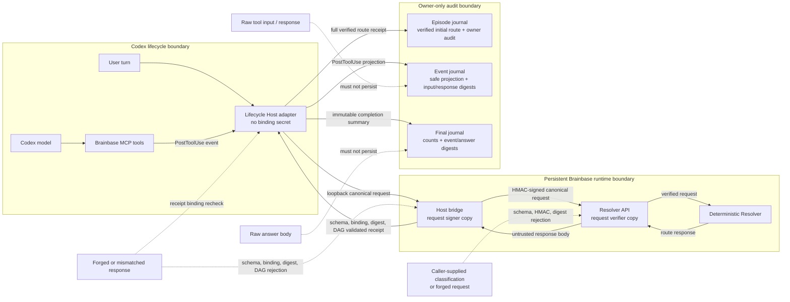

# Brainbase Judgment Resolver episode lifecycle specification

## 1. Invariant

Every managed Codex turn has exactly one judgment episode. The Host opens it before model generation with one context-bound initial route receipt, records 0..N actual Brainbase tool events, and creates exactly one final receipt at `Stop`. The model cannot call Judgment Resolver or author classification/`conversation_context`.

The invariant is not one network call or one knowledge call per turn. Bounded transport retry is allowed before episode creation, and knowledge/retrieval calls may repeat as new evidence changes the next question.

## 2. Host events

### UserPromptSubmit

Required input is `session_id`, `turn_id`, non-empty `prompt`, optional `transcript_path`, `cwd`, `model`, and `permission_mode`. The Host constructs canonical context and resolves the initial route before model generation. An invalid payload or untrusted/mismatched context fails closed.

### PostToolUse

For matching `mcp__brainbase__*` tools, input includes the session/turn binding, `tool_name`, `tool_use_id`, input, and response. The Host persists a safe projection and digests only. The exact same event is idempotent; reuse of one ID with different content is a conflict.

### Stop

Input includes the session/turn binding, `stop_hook_active`, and optional answer text. The Host evaluates required capabilities against immutable events and requires the final answer to begin with the stored owner judgment line plus every stored tool-event line in atomic journal-commit order, with no extra copies. Episode start, event commits, and Stop finalization for the same turn share one per-turn SQLite `BEGIN IMMEDIATE` transaction. The Host prefers Node's built-in SQLite so Codex and shell processes with different CPU/ABI runtimes share the same portable implementation; Node 20 falls back to the locally installed `better-sqlite3` build. The OS releases the transaction lock on process exit, so the Host never reclaims or deletes a guessed-stale process lock file. Missing required knowledge or an invalid owner-visible prefix blocks the first Stop only; after transaction acquisition, `stop_hook_active=true` finalizes incomplete. A bounded transaction-acquisition failure on that active Stop exits non-zero with an explicit diagnostic instead of returning `{}` without a final receipt.

Orphan PostToolUse or Stop events do not create an episode.

## 3. Canonical Resolver input

The public request contains only `request`, `turn_id`, optional `project_code`, and required `conversation_context` using `brainbase-conversation-context-v1`. Context preserves ordered exact user/assistant text, current request exactly once, prior complete episode projections, runtime/project binding, repo-relative instruction digests, completeness, and `source_digest`.

The Host performs structural filtering. It excludes developer envelopes, compaction summaries, reasoning, tool arguments, tool output, raw session identity, and personal absolute paths. Resolver deterministically determines classification and the initial route from that canonical context; there is no caller-supplied classification and no Host-generated semantic summary.

## 4. Canonical JSON and digests

`brainbase-canonical-json-v1` recursively sorts object keys by Unicode code point, preserves array order, serializes JSON primitives normally, and rejects non-finite numbers and undefined.

- `source_digest`: canonical context without `source_digest`
- `context_digest`: exact canonical `conversation_context`
- `request_digest`: exact canonical Resolver request
- `plan_digest`: normalized initial route without volatile identity/time/digest fields
- `event_fingerprint`: bound safe event projection
- `event_set_digest`: `brainbase-judgment-episode-final-v2`が`event_sequence`と`event_fingerprint`の順序付きペアを束縛するimmutable final event set。既存のv1 final receiptは読み取り互換だけを維持し、新規には書かない

All digests are lowercase SHA-256 hexadecimal strings.

## 5. Server-owned classification and DAG

Resolver determines classification with manifest-backed deterministic code. It matches explicit request/context evidence against `semantic_matchers`, may inherit a bounded classification for an under-specified follow-up from the latest prior complete episode or prior raw user message, and applies the current request's minimum action/risk floor. When a request is not a follow-up and has no explicit specialist domain or intent match, v1 applies a server-owned `general/answer` fallback; this is a deterministic default, not evidence of semantic model inference. It owns intent, domain, signal, effect, risk, confidence, policy, and active-DAG selection. It has no LLM provider or model API dependency; `semantic` describes the classification purpose, not the implementation mechanism.

A follow-up with no resolvable referent, or a knowledge classification without the required project context, returns managed `needs_classification` with a clarification DAG. Plain non-follow-up matcher misses use the `general/answer` fallback instead. This is not a transport failure. Only returned `active_nodes`, `active_edges`, and matching `active_node_definitions` execute.

After the initial route, the current Codex model is the open-ended reasoning loop. It follows the selected DAG, decides how to answer, formulates and refines knowledge queries from observed results, and may call knowledge/retrieval tools 0..N times. It cannot reclassify or replace the initial route. Knowledge Resolver separately chooses a canonical source route with deterministic rules; it does not retrieve content. Claude Code is a future Host-adapter candidate for the same responsibility split, but is not part of the current episode-lifecycle hook integration.

Project binding is judgment context, not action authorization. An inaccessible project only removes that project's policies from the applicable set; it does not make general judgment unavailable.

## 6. Episode journal

The journal path uses hashed session and turn IDs with owner-only permissions:

```text
<turn>.episode.json
<turn>.events/<sha256(tool_use_id)>.json
<turn>.continuation.json
<turn>.final.json
```

Creation uses unique temporary files and hard links, so concurrent writers cannot overwrite first-writer evidence. `episode.json` contains the verified initial route and owner judgment audit. Event files never persist raw tool input/response. `final.json` binds event count, qualifying count, event-set digest, final status, and answer digest without storing the answer body.

Legacy v1/v2 adopted receipt journals remain readable. Only `complete` finalized episode projections may enter later `conversation_context`; open or incomplete episodes cannot silently become prior accepted judgment.

## 7. Capability satisfaction

Required `knowledge.resolve` is satisfied only by a successful exact `mcp__brainbase__brainbase_knowledge_resolve` event with a resolved or unconfirmed route status. Unrelated Brainbase calls, failed route calls, search calls, Graph reads, and retrievals do not substitute for choosing the source route.

`brainbase_knowledge_resolve` means reference-destination routing, not retrieval. Its visible event line uses `📚 Brainbase参照先:`. Search, retrieval, and write tools use distinct wording based on the actual tool event.

## 8. Transport and Host bridge

The persistent Brainbase runtime exposes loopback-only `POST /host/judgment/resolve`; it is not an MCP tool. It authenticates runtime state, signs the exact request with the adapter binding, calls `POST /api/judgment/resolve`, verifies full receipt digests/DAGs, and returns `managed|unmanaged`.

Recognized transient timeout/connection/429/502/503/504 failures may retry only before episode creation. After creation, the Host reuses the episode and never re-resolves the turn.

## 9. Finalization and authorization boundary

At Stop, the Host creates one immutable final receipt. When required knowledge is absent, or the exact stored audit lines are missing, duplicated, or out of journal-commit order in `last_assistant_message`, the first Stop returns `decision:block` with a continuation reason and the exact safe lines to render. After acquiring the per-turn transaction, the repeated Stop indicated by `stop_hook_active=true` creates `status=incomplete` and permits termination, preventing an infinite hook loop. A transaction-acquisition timeout is an explicit non-zero hook failure, not a successful empty response. A replay reuses the same final. A complete final records `owner_audit_complete=true`, the expected line count, and an answer digest that live verification binds to the final assistant `response_item` in the canonical JSONL transcript.

Initial and final receipts are judgment and audit evidence. They do not authorize writes or external action. Platform permission, explicit approval, and executor authorization remain unchanged; no separate Effect Guard is added.

## 10. Failure behavior

- terminal before episode: invalid hook input, untrusted context, binding rejection, malformed response, digest mismatch, unmanaged binding, missing active definitions, or same-turn conflict
- terminal event: same `tool_use_id` with a different fingerprint
- recoverable Host crash: SQLite and the OS release the per-turn transaction lock when the process exits; no stale-lock reclamation or path deletion is performed
- explicit active-Stop contention: failure to acquire the per-turn transaction within the bounded wait exits non-zero and writes a diagnostic without fabricating a final receipt
- incomplete completion: required capability or owner-visible audit prefix still absent after the single continuation
- replay: verified immutable episode/event/final is returned without new Resolver or tool evidence

Specific API errors remain distinct. `brainbase_project_not_accessible` is not used merely because project policy is outside the caller's scope.

## 11. Release and rollback contract

- `release_note`: This release changes the Codex judgment lifecycle Host so it uses Node's built-in SQLite when available, preserves atomic episode/event/final transitions, and fails loudly when an active second `Stop` cannot acquire the per-turn transaction. It does not change the public Resolver request schema or add an internal Resolver LLM.
- `rollout_plan`: After merge, align the canonical global Hook checkout, local `:31013` runtime, persistent MCP runtime, and Lightsail `brainbase-ssot.service` to the same merge SHA. Update the three lifecycle Hook bindings only after the canonical checkout is at that SHA, then run one fresh Codex turn.
- `observability_evidence`: Success requires `dirty=false` plus the target SHA from local and public `/api/version`, healthy local/public endpoints, a successful MCP runtime check, and one fresh transcript whose episode contains the expected actual Brainbase events and whose final receipt has `owner_audit_complete=true` with an answer digest matching the final assistant message.
- `rollback_instruction`: Before rollout, capture the exact Hook file and the independently observed SHA for all four runtime surfaces. On failure, follow `docs/brainbase-capabilities/runbooks/judgment-resolve.md#rollback`: restore the canonical Hook/UI checkout, reconcile the persistent MCP runtime, restore Lightsail to its recorded SHA, restore the exact prior Hook file last, and verify one fresh turn. Never delete the owner journal during rollback.

The operator commands and the four-surface rollback order are canonical in `docs/brainbase-capabilities/runbooks/judgment-resolve.md`; Lightsail-specific deployment and rollback commands are canonical in `docs/brainbase-capabilities/runbooks/deploy-lightsail-production.md`.

## 12. Workflow state transition scenarios

- S-001 `workflow state transition`: episodeが存在しないmanaged turnの`UserPromptSubmit`は、検証済みinitial routeを持つopen episodeを正確に1件作る。同一入力のreplayは同じepisodeを返し、再解決しない。
- S-002 `workflow state transition`: open episodeのmatching `PostToolUse`は、同一turnのSQLite transaction内で次の`event_sequence`へ安全なevent projectionを1件追加する。同じ`tool_use_id`と同じfingerprintはreplay、異なるfingerprintはconflictであり既存eventを上書きしない。
- S-003 `workflow state transition`: required capabilityとowner-visible prefixを満たすopen episodeの`Stop`は、ordered event setとanswer digestを束縛したcomplete finalへ1回だけ遷移する。
- S-004 `workflow state transition`: required capabilityまたはowner-visible prefixが不足する最初の`Stop`はcontinuationを要求し、finalを作らない。`stop_hook_active=true`の再Stopはincomplete finalを1件作って終了を許可する。
- S-005 `workflow state transition`: final済みepisodeへの`Stop` replayは保存済みfinalを返し、新しいfinal、Resolver call、tool eventを作らない。
- S-006 `workflow state transition`: activeな再Stopがbounded wait内にSQLite transactionを取得できない場合は非zeroで明示的に失敗し、open episodeをcompleteまたはincompleteへ偽装しない。
- S-007 `workflow state transition`: process crashではOSがSQLite transaction lockを解放し、次processは既存のimmutable episode/eventを再利用して継続する。推測したstale lock fileの削除は行わない。

## 13. Verification matrix

- service/API: strict schema, signing, deterministic manifest-backed classification without an LLM dependency, follow-up inheritance, policy scope, DAG topology
- UserPromptSubmit Host: transcript extraction, structural exclusion, privacy, exact current message, retry/create/reuse/conflict
- PostToolUse Host: 0..N events, exact capability qualification, replay, conflict, safe projection, accurate reference/search/retrieval wording
- Stop Host: zero-call completion when allowed, exact ordered owner-audit prefix, one continuation, incomplete second Stop, complete final, replay
- end-to-end: Codex Host initial dispatch -> Codex open-ended reasoning and repeated model/tool loop -> final episode receipt
- publication: `CLAUDE.md`/`AGENTS.md`, Skill, capability, runbook, story, and tests expose the same lifecycle

## 14. Threat model (`kind: threat_model`)


