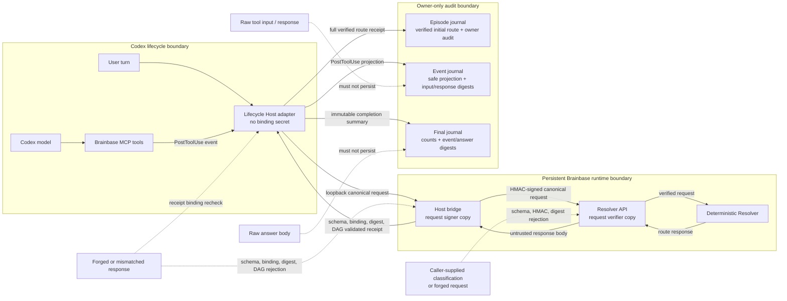

# Brainbase Judgment Resolver episode lifecycle specification

## 1. Invariant

Every managed Codex turn has exactly one judgment episode. The Host opens it at `UserPromptSubmit` with canonical input but no semantic classification. The Codex model authors `model_interpretation` and calls model-callable `brainbase_resolve_turn`; the Host then records 0..N actual tool events and creates at most one final receipt at the contract-defined completing lifecycle event. That event is normally `Stop`; for a previously rejected runtime 2.4 continuation it is the last valid completed state `PostToolUse`. The model cannot author or alter canonical `conversation_context`.

Codex App delegation currently has one explicit recovery path: when `UserPromptSubmit` did not fire, the first `Stop` may recover exactly one current-turn `codex_delegation` from a transcript containing only the current session alias component. That episode records `episode_origin=stop_delegation_recovery` and `route_application=post_generation_recovery`. Its route governs only the Stop decision and later continuation; it must never claim that the route guided the already-produced pre-Stop model output. Normal starts record `episode_origin=user_prompt_submit` and `route_application=pre_generation`.

The invariant is not one network call or one knowledge call per turn. Bounded transport retry is allowed before episode creation, and knowledge/retrieval calls may repeat as new evidence changes the next question.

## 2. Host events

### UserPromptSubmit

Canonical `turn_input` contains `session_id`, `turn_id`, non-empty `prompt`, optional `transcript_path`, `cwd`, `model`, and `permission_mode`. The Host constructs canonical context and saves that exact input. The preferred model path submits only the Host-issued `turn_ref` with `model_interpretation`; the server loads the unchanged canonical input from the Host journal. Cached-schema compatibility may submit `turn_input.turn_ref`, `turn_input_path`, or full `turn_input`, but those legacy forms are not the new canonical ownership path. An invalid payload or untrusted/mismatched context fails closed.

### PostToolUse

For every completed tool, input includes the session/turn binding, `tool_name`, `tool_use_id`, input, and response. The Host persists digests and a bounded safe projection; only matching `mcp__brainbase__*` tools get owner-visible Brainbase lines. The exact same event is idempotent; reuse of one ID with different content is a conflict.

### Stop

Input includes the session/turn binding, `stop_hook_active`, and optional answer text. If the episode is missing, the Host may use only a complete `codex_app` `create_thread` or `send_message_to_thread` delegation envelope for the same turn and one connected session-alias component. Multiple candidates, foreign session components, malformed envelopes, or other tools fail closed as true orphans. A recovered route is explicitly post-generation and cannot be represented as a normal pre-generation episode. The Host evaluates required capabilities, autonomy, continuation, and business-body evidence against immutable events. On completion it returns the stored owner judgment line plus every stored tool-event line in atomic journal-commit order, followed by optional value-proof surfaces, as one owner-visible lifecycle-event `systemMessage`; the model-authored answer does not repeat that surface. For a `continue` receipt, an unnecessary user question produces one short `🔁` in-progress `systemMessage` and an immutable structured continuation record. After safe work completes, the Host adds the journal-bound `🔁` completion line to the completing lifecycle event's `systemMessage`; an unjournaled model-authored completion claim is rejected. Episode start, event commits, and lifecycle finalization for the same turn share one per-turn SQLite `BEGIN IMMEDIATE` transaction. The Host prefers Node's built-in SQLite so Codex and shell processes with different CPU/ABI runtimes share the same portable implementation; Node 20 falls back to the locally installed `better-sqlite3` build. The OS releases the transaction lock on process exit, so the Host never reclaims or deletes a guessed-stale process lock file. Missing required knowledge, autonomy, continuation, or business-body evidence returns `decision:block` on the first repairable Stop and writes no final receipt. If `stop_hook_active=true` and repair remains incomplete after that one block, the Host converges to `audit_degraded` instead of regenerating indefinitely. Transaction-acquisition failure follows the terminal fail-closed boundary.

For runtime 2.4 implement/operate episodes, the answer contains no Stop state. The final tool call is `brainbase_judgment_state_record`; PostToolUse validates its response and stores the state in the same episode journal. `pending` or `pending_safe_work=true` blocks; `waiting_human` is accepted only when its reason code is allowed and matches the visible `⚠️` marker; `completed` is accepted only when `runtime_reason_code` is null, the state event is last, and at least one earlier successful same-episode execution event exists. For a previously rejected continuation, a completed state PostToolUse with missing required value proof returns its `decision:block` unchanged and creates no final; after the model records value proof, a new last completed state PostToolUse becomes the canonical finalization event and returns the owner audit/value `systemMessage`. It does not wait to learn whether a later Stop will arrive. A later Stop replays the immutable final. Missing, malformed, stale, or answer-embedded state blocks instead of falling back to prose. Runtime 2.3 retains the answer marker and runtime 2.2 retains the prose detector only for compatibility. Successful tool evidence establishes execution, not the truth of implementation claims; `content_verification_status` remains `not_evaluated` unless separate tests/readback establish it.

Orphan PostToolUse events are not attached to an episode; each leaves a digest-only orphan marker and visible warning without consuming the Stop repair state. A true orphan Stop cannot create a complete episode or reconstruct the pre-generation route. It writes a digest-only diagnostic, requests one exact degraded-warning/body-preservation repair, then converges to an immutable non-final `audit_degraded` receipt. That receipt is not completion, retrieval success, prior finalized judgment, or action authorization. Missing identity and integrity conflicts remain terminal failures.

## 3. Canonical Resolver input

The public request contains only `request`, `turn_id`, optional `project_code`, and required `conversation_context` using `brainbase-conversation-context-v1`. Context preserves ordered exact user/assistant text, current request exactly once, prior complete episode projections, runtime/project binding, repo-relative instruction digests, completeness, and `source_digest`.

The Host performs structural filtering. It excludes developer envelopes, compaction summaries, reasoning, tool arguments, tool output, raw session identity, and personal absolute paths. Resolver deterministically determines classification and the initial route from that canonical context; there is no caller-supplied classification and no Host-generated semantic summary.

## 4. Canonical JSON and digests

`brainbase-canonical-json-v1` recursively sorts object keys by Unicode code point, preserves array order, serializes JSON primitives normally, and rejects non-finite numbers and undefined.

- `source_digest`: canonical context without `source_digest`
- `context_digest`: exact canonical `conversation_context`
- `request_digest`: exact canonical Resolver request
- `plan_digest`: normalized initial route without volatile identity/time/digest fields
- `event_fingerprint`: bound safe event projection
- `event_set_digest`: `brainbase-judgment-episode-final-v2`が`event_sequence`と`event_fingerprint`の順序付きペアを束縛するimmutable final event set。既存のv1 final receiptは読み取り互換だけを維持し、新規には書かない

All digests are lowercase SHA-256 hexadecimal strings.

## 5. Server-owned classification and DAG

The Codex model proposes semantic classification as `model_interpretation`. Resolver validates it against canonical input and manifest-backed deterministic policy, may inherit bounded context for an under-specified follow-up, and applies minimum action/risk floors. Keyword matches are monotonic safety evidence: they may add obligations, domains, signals, action floors, or risk, but never subtract model-derived requirements. An unmatched keyword rule never removes a capability and never implies a server-owned `general/answer` fallback. Resolver owns policy reconciliation and active-DAG selection, not natural-language understanding.

A missing model interpretation, a follow-up with no resolvable referent, or a knowledge classification without the required project context returns managed `needs_classification` with a clarification DAG. An unmatched keyword rule does not auto-pass. This is not a transport failure. Only returned `active_nodes`, `active_edges`, and matching `active_node_definitions` execute.

After the initial route, the current Codex model is the open-ended reasoning loop. It follows the selected DAG, decides how to answer, formulates and refines knowledge queries from observed results, and may call knowledge/retrieval tools 0..N times. It cannot reclassify or replace the initial route. Knowledge Resolver separately chooses a canonical source route with deterministic rules; it does not retrieve content. Claude Code is a future Host-adapter candidate for the same responsibility split, but is not part of the current episode-lifecycle hook integration.

Project binding is judgment context, not action authorization. An inaccessible project only removes that project's policies from the applicable set; it does not make general judgment unavailable.

## 6. Episode journal

The journal path uses hashed session and turn IDs with owner-only permissions:

```text
<turn>.episode.json
<turn>.events/<sha256(tool_use_id)>.json
<turn>.continuation.json
<turn>.final.json
```

Creation uses unique temporary files and hard links, so concurrent writers cannot overwrite first-writer evidence. `episode.json` contains the verified initial route and owner judgment audit. Event files never persist raw tool input/response. `final.json` binds event count, qualifying count, event-set digest, and final status. Stop completion records `owner_audit_source=stop_hook_system_message` plus the exact raw model-authored answer digest. A previously rejected runtime 2.4 continuation finalizes at the last valid completed state PostToolUse and records `owner_audit_source=post_tool_use_system_message` and `answer_digest=null`; a later Stop only replays it. Neither path stores the answer body or rendered `systemMessage`.

Legacy v1/v2 adopted receipt journals, including historical incomplete finals, remain readable. Only `complete` finalized episode projections may enter later `conversation_context`; open or historical incomplete episodes cannot silently become prior accepted judgment. New incomplete finals are not created.

## 7. Capability satisfaction

Required `knowledge.resolve` execution is satisfied by one authentic exact `mcp__brainbase__brainbase_knowledge_resolve` `PostToolUse` event regardless of response outcome, because repeating an already executed route call would duplicate the tool action. Only `resolved` is a successful routing result. `unconfirmed` and tool failure remain non-qualifying warning results with `success=false`; they do not claim a selected source or retrieval success. Unrelated Brainbase calls, search calls, Graph reads, and retrievals do not substitute for executing the routing tool.

`brainbase_knowledge_resolve` means reference-destination routing, not retrieval. Its visible event line uses `📚 Brainbase参照先:`. Search, retrieval, and write tools use distinct wording based on the actual tool event.

## 8. Transport and Host bridge

The persistent Brainbase runtime exposes loopback-only `POST /host/judgment/resolve`; it is not an MCP tool. It authenticates runtime state, signs the exact request with the adapter binding, calls `POST /api/judgment/resolve`, verifies full receipt digests/DAGs, and returns `managed|unmanaged`.

Recognized transient timeout/connection/429/502/503/504 failures may retry only before episode creation. After creation, the Host reuses the episode and never re-resolves the turn.

## 9. Finalization and authorization boundary

At the contract-defined lifecycle boundary, the Host creates one immutable complete final receipt only after the contract is satisfied and returns the complete journal-derived owner audit/value surface as `systemMessage`. A normal Stop checks the model-authored `last_assistant_message` for capabilities, autonomy, continuation, and business-body safety but does not require that body to contain the audit surface; it records `owner_audit_source=stop_hook_system_message` and the exact answer digest. A previously rejected runtime 2.4 continuation instead finalizes at its last valid completed state PostToolUse, records `owner_audit_source=post_tool_use_system_message` and `answer_digest=null`, and treats any later Stop as replay. The first repairable evidence failure returns `decision:block` with a continuation reason; an incomplete active retry converges to `audit_degraded` instead of regenerating indefinitely. A true orphan Stop requests one degraded warning and answer-body preservation, then records `audit_degraded` and exits 0 without a fabricated complete final or a new-task instruction; another first-phase payload cannot reopen the repair loop. Missing identity, immutable diagnostic conflict, diagnostic integrity failure, and transaction-acquisition timeout are explicit non-zero hook failures. When knowledge is optional and zero Brainbase calls were recorded, the Host `systemMessage` contains `📚 Brainbase未参照: 必須参照なし・実呼び出し0回 ✓`. Audit-only body preservation removes only a leading reserved audit namespace block, including malformed variants, while keeping audit-like content after the business body starts. A replay reuses an existing complete final. The assistant body must not duplicate the Host audit surface; production verification reads the actual owner UI or event stream rather than assuming a stable Hook serialization inside transcript `response_item` records.

For runtime 2.4 implement/operate episodes, final receipt additionally records the journal-derived Stop state, its source, and successful evidence-event count. This does not authorize the action or semantically grade its result. Runtime 2.3 receipts remain readable during rollout.

Initial and final receipts are judgment and audit evidence. They do not authorize writes or external action. Platform permission, explicit approval, and executor authorization remain unchanged; no separate Effect Guard is added.

## 10. Failure behavior

- terminal before episode: invalid hook input, untrusted context, binding rejection, malformed response, digest mismatch, unmanaged binding, missing active definitions, or same-turn conflict
- terminal event: same `tool_use_id` with a different fingerprint
- recoverable Host crash: SQLite and the OS release the per-turn transaction lock when the process exits; no stale-lock reclamation or path deletion is performed
- explicit active-Stop contention: failure to acquire the per-turn transaction within the bounded wait exits non-zero and writes a diagnostic without fabricating a final receipt
- terminal Stop: missing identity, immutable orphan diagnostic/degraded integrity conflict, or transaction timeout exits non-zero without a final receipt; a true missing episode receives one warning-preserving `decision:block` and then converges to non-final `audit_degraded` with exit 0; that immutable orphan state rejects a late Start for the same identity; repairable required-capability, autonomy, continuation, or business-body omissions on an existing episode return one `decision:block`, then an incomplete active retry finalizes as `audit_degraded`
- replay: verified immutable episode/event/final is returned without new Resolver or tool evidence

Specific API errors remain distinct. `brainbase_project_not_accessible` is not used merely because project policy is outside the caller's scope.

## 11. Release and rollback contract

- `release_note`: This release adds a Codex Host `hooks/list` readiness checker, keeps the first evidence-incomplete `Stop` explicitly fail-closed, and makes an incomplete active retry or true orphan Stop converge to `audit_degraded` without an infinite repair loop. It does not add an internal Resolver LLM.
- `rollout_plan`: After merge, align the canonical global Hook checkout, local `:31013` runtime, persistent MCP runtime, and Lightsail `brainbase-ssot.service` to the same merge SHA. Run `npm run check:judgment-hook-readiness`; when it returns `trust_required`, the owner approves the current three Hook definitions through `/hooks`. Only then create a fresh Codex task for live verification. Repository code never writes Codex `trusted_hash`.
- `observability_evidence`: Success requires `dirty=false` plus the target SHA from local and public `/api/version`, healthy local/public endpoints, a successful MCP runtime check, `ready_for_fresh_task`, and tasks created after trust approval. A normal task must complete with `owner_audit_complete=true`, `owner_audit_source=stop_hook_system_message`, and an answer digest bound to the exact model answer. A previously rejected runtime 2.4 continuation must complete with `owner_audit_source=post_tool_use_system_message` and `answer_digest=null`. In both cases the exact Host `systemMessage` audit/value surface must be read back once from the owner UI or event stream; transcript data remains correlation and model-answer evidence only. Only that state is `proven_active`.
- `rollback_instruction`: Before rollout, capture the exact Hook file and the independently observed SHA for all four runtime surfaces. On failure, follow `docs/brainbase-capabilities/runbooks/judgment-resolve.md#rollback`: keep the global Hook on its independent clean checkout until the exact prior Hook file is restored last; restore the shared local UI/MCP disposable runtime with the recorded pinned commit SHA; restore Lightsail separately to its recorded SHA; then verify one fresh turn. Never switch, reset, clean, or stash the dirty canonical source checkout, and never delete the owner journal during rollback.

The operator commands and the four-surface rollback order are canonical in `docs/brainbase-capabilities/runbooks/judgment-resolve.md`; Lightsail-specific deployment and rollback commands are canonical in `docs/brainbase-capabilities/runbooks/deploy-lightsail-production.md`.

## 12. Workflow state transition scenarios

- S-001 `workflow state transition`: episodeが存在しないmanaged turnの`UserPromptSubmit`は、検証済みinitial routeを持つopen episodeを正確に1件作る。同一入力のreplayは同じepisodeを返し、再解決しない。
- S-002 `workflow state transition`: open episodeのmatching `PostToolUse`は、同一turnのSQLite transaction内で次の`event_sequence`へ安全なevent projectionを1件追加する。同じ`tool_use_id`と同じfingerprintはreplay、異なるfingerprintはconflictであり既存eventを上書きしない。
- S-003 `workflow state transition`: required capability・autonomy・continuation・business-body条件を満たすopen episodeは、通常`Stop`、差し戻し済みruntime 2.4 continuationでは最後の正常なcompleted state `PostToolUse`でcomplete finalへ1回だけ遷移し、owner audit/value surfaceを`systemMessage`として1回返す。Stop経路はmodel-authored answer digestを束縛し、PostToolUse経路は未取得を`null`に保つ。
- S-004 `workflow state transition`: required capability・autonomy・continuation・business-body evidenceが不足する最初の`Stop`は`decision:block`でcontinuationを要求し、なお不完全な`stop_hook_active=true`の再Stopは`audit_degraded` finalへ有限収束する。complete finalやknowledge outbox enqueueは作らない。
- S-005 `workflow state transition`: final済みepisodeへの`Stop` replayは保存済みfinalを返し、新しいfinal、Resolver call、tool eventを作らない。
- S-006 `workflow state transition`: activeな再Stopがbounded wait内にSQLite transactionを取得できない場合、またはidentity/integrityを安全に束縛できない場合は非zeroで明示的に失敗する。episode自体が存在しないorphanは警告修復を1回だけ要求し、その後は非finalの`audit_degraded`へ収束してcompleteへ偽装しない。
- S-007 `workflow state transition`: process crashではOSがSQLite transaction lockを解放し、次processは既存のimmutable episode/eventを再利用して継続する。推測したstale lock fileの削除は行わない。

## 13. Verification matrix

- service/API: strict schema, signing, deterministic manifest-backed classification without an LLM dependency, follow-up inheritance, policy scope, DAG topology
- UserPromptSubmit Host: transcript extraction, structural exclusion, privacy, exact current message, retry/create/reuse/conflict
- PostToolUse Host: 0..N events, exact capability qualification, replay, conflict, safe projection, accurate reference/search/retrieval wording
- Stop Host: explicit zero-call audit when allowed, exact ordered owner-audit `systemMessage`, assistant-body non-duplication, repeated repairable continuation, active retry degraded convergence, orphan Stop one-shot degraded convergence, diagnostic integrity fail-closed, complete final, replay
- continuation PostToolUse Host: a previously rejected runtime 2.4 continuation finalizes at the last valid completed state event, returns the exact owner-audit `systemMessage`, records `owner_audit_source=post_tool_use_system_message` and `answer_digest=null`, and makes a later Stop an immutable replay
- end-to-end: Codex Host initial dispatch -> Codex open-ended reasoning and repeated model/tool loop -> final episode receipt
- publication: `CLAUDE.md`/`AGENTS.md`, Skill, capability, runbook, story, and tests expose the same lifecycle

## 14. Threat model (`kind: threat_model`)


