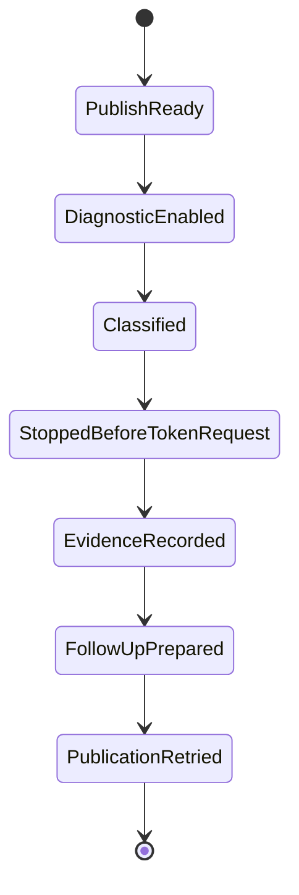

# GitHub Actions OIDC endpoint diagnosis Spec

## Contract

`assertSerializedPublicationContext(environment, request)`は、`BRAINBASE_NPM_OIDC_DIAGNOSTIC=true`のとき、`ACTIONS_ID_TOKEN_REQUEST_URL`を分類して専用errorで停止する。

診断errorのJSON objectは次のboolean keyだけを、この順序で含む。

1. `url_present`
2. `parse_ok`
3. `protocol_https`
4. `hostname_trusted`
5. `raw_authority_colon`
6. `userinfo_present`
7. `normalized_nondefault_port`

URL全文、hostname値、raw authority、path、query、request token、username、password値は含めない。classifierは現行predicateと同じ式で観測するが、通常モードの認可判断には使わない。診断モードはclassification後に必ず停止し、`request`を呼ばない。診断フラグがない通常モードの許可・拒否条件は変更しない。

## Examples

| Input shape | Diagnostic result |
|---|---|
| trusted regional HTTPS endpoint with explicit`:443` | `protocol_https=true`, `hostname_trusted=true`, `raw_authority_colon=true`, `normalized_nondefault_port=false` |
| trusted HTTPS endpoint with`:8443` | 上記に加えて`normalized_nondefault_port=true` |
| userinfo付きendpoint | `userinfo_present=true`; 値は出力しない |
| malformed endpoint | `url_present=true`, `parse_ok=false`; 残りはfalse |

## Verification

- `tests/npm-release.test.ts`: 固定boolean完全一致、機密sentinel非包含、request未呼出、通常モードの既存positive/negative cases。
- `tests/npm-release-validation.integration.test.ts`: credential-free validationと公開前failure semantics。
- `tests/npm-release-workflow.test.ts`: validation/publish job boundaryとworkflow state。
- `tests/e2e/story-brainbase-oss-npm-release-oidc-endpoint.spec.ts`: 固定workflow flagからruntime classifier、秘密値非露出、OIDC request前停止までを一つのrelease-specific flowとして再生する。
- `npm run test:release-evidence`: cleanな同一HEAD上でproduction dependency audit、実tarballのSHA-256/SHA-512、npm integrity、対象versionのregistry E404を一回の実行として記録する。
- `npm run test:e2e`、`npm run build`: release-specific flowを含むrepository regression evidence。

## State diagram

## Release operations

この診断をdevelopへmerge後、`gh workflow run npm-publish.yml --repo Unson-LLC/brainbase --ref develop -f release_ref=develop`で診断runを実行する。boolean vectorとnpm metadata不存在を保存し、原因修正PRではworkflowの診断フラグを削除してから公開を再実行する。

初回公開前のregistry証跡は対象versionの不存在を確認する。公開成功後は`npm view`のdist integrityとgitHeadをreview済みdefault-branch commitへ照合し、不一致または未確認を成功として扱わない。
