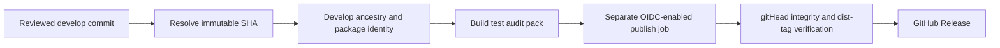
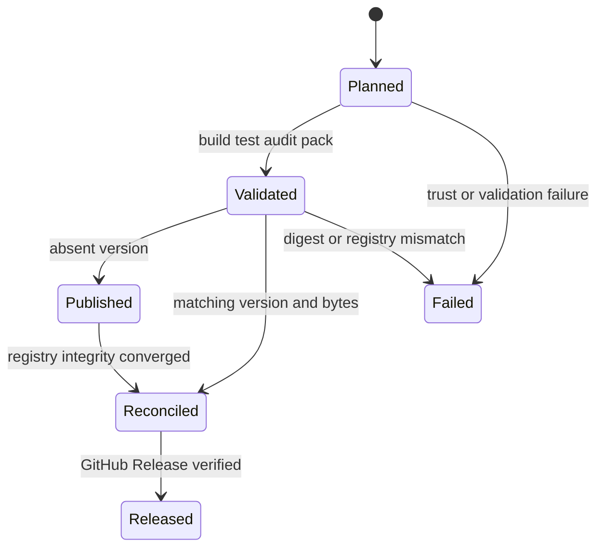
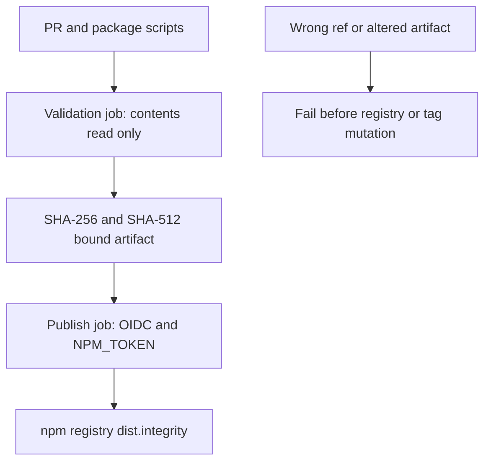

# Brainbase OSS npm Release Spec

## Release flow



## CLI contract

### Plan

```bash
npm run release:plan -- --before <git-ref> --after <git-ref>
```

標準出力へ`release_required`、`version`、`sha`をGitHub Output互換形式で返す。after versionがbefore versionより大きい場合だけ`release_required=true`とする。version据え置き・downgradeは自動公開しない。

### Validate

```bash
npm run release:validate -- --version <semver> --sha <full-commit-sha> --trusted-ref <default-branch-ref> --proof-file <outside-repo-path>
```

固定package name、version、cleanなgit HEADを引数へ照合し、HEADがtrusted refの履歴内にあることを確認する。build、test、`npm audit --omit=dev`を完了し、repository外で最終tarballのmanifestへ期待SHAを`gitHead`として刻印する。そのmanifestを再展開してpackage name・version・gitHeadを照合し、検証後もcheckoutがcleanな場合だけ、最終tarball SHA-256・SHA-512 integrity・package identity・commitを束縛したproofを書く。このフェーズをOIDCとnpm credentialを持たないjobで実行する。

ここでいうcredential-free validationは、npm公開トークン、publication権限、package metadata参照、dist-tag mutationを必要としないことを指す。production auditのread-only vulnerability metadata取得は依存関係の安全性検査であり、publication registry境界には含めない。

### Publish

```bash
npm run release:publish -- --version <semver> --sha <full-commit-sha> --trusted-ref <default-branch-ref> --proof-file <validated-proof> [--provenance]
```

現在の固定package name/version、cleanなgit HEAD、trusted ref到達性、validation proofとtarballの両digestを再照合する。publishはupstream GitHub Actionsのrepository/run/serialization contextに加え、runner endpointから取得したGitHub発行OIDC tokenのaudience、repository、run ID、workflow refが一致する場合だけ許可し、ローカル直接実行や環境変数だけの偽装を拒否する。未公開versionだけ同じtarballを`npm publish <tarball> --ignore-scripts --access public --tag release-<commit>`で非consumer staging tagへ公開する。registry `dist.integrity`がproofのSHA-512 integrityと一致した後だけconsumer tagを同系列の最大versionへ前進させ、staging tagを除去する。workflowはpackage単位で公開処理を直列化し、CLIも変更直前に現在tagを再取得して、既に新しい同系列versionへ進んだtagを巻き戻さない。`--provenance`はGitHub Actionsなどnpmが対応するtrusted CI環境でのみ渡す。

### Verify

```bash
npm run release:verify -- --version <semver> --sha <full-commit-sha>
```

npm metadataの`version`と`gitHead`、期待するdist-tagをread-onlyで検証する。packageが未公開、metadata不一致、registry未収束なら非0終了し、dist-tagを変更しない。

## Dist-tag rules

- stable version: `latest`
- `alpha` prerelease: `alpha`
- `beta` prerelease: `beta`
- `rc` prerelease: `rc`
- その他のprerelease: 先頭identifier。ただしnpm tagとして不正な値は`next`

既存versionを再実行した場合、対象tagは同じtag系列で最大の公開versionへ合わせ、古いversionへ巻き戻さない。

## GitHub Actions contract

- Trigger: `develop`向けPRのmerge、または`workflow_dispatch`。
- PR merge: base SHAとmerge SHAのversion差分が増加した場合だけ公開する。
- Manual dispatch: `origin/develop`の履歴内にある指定refのpackage versionだけを公開・照合する。初回公開と復旧に使う。
- Validation: `contents: read`だけのjobで`npm ci`、build、test、`npm audit --omit=dev`を完了し、実tarballと両digest-bound proofを作る。OIDCとnpm credentialは許可しない。
- Publication: Actions artifactから同じtarball/proofを復元する別jobだけへ`id-token: write`と`NODE_AUTH_TOKEN=${{ secrets.NPM_TOKEN }}`を許可し、CLIとnpm provenanceを使用する。
- Completion: npm metadata照合後に`v<version>` GitHub Releaseを作成または既存tagのcommitを照合する。

## Release operations

### Release note

この変更は、`@unson/brainbase-mcp`に、review済み`develop` commitから同一tarballを検証・公開・registry再照合するmaintainer向けCLIとGitHub Actions経路を追加する。エンドユーザー向けruntimeコマンドやOntologyデータの意味は変更しない。

### Operator action and rollout

1. RepositoryのActions secret `NPM_TOKEN`に`@unson`公開権限のあるnpm tokenを登録する。token値はlog、source、artifactに出力しない。
2. 通常はversion bump済みPRを`develop`へmergeし、merge eventから自動公開する。初回の`0.1.0`公開または復旧ではActionsの`Publish npm package`を手動実行し、`release_ref=develop`を指定する。
3. `validate`と`publish`の両jobが成功した後、npm metadataのversion、`gitHead`、`dist.integrity`、dist-tag、およびGitHub Releaseのcommitを確認してrollout完了とする。

### Observability and support evidence

- GitHub Actionsの`validate`はbuild、test、production audit、tarball proofの失敗点をcredentialなしで表示する。`publish`はartifact digest照合、npm publish、registry収束、GitHub Releaseのどこで失敗したかを表示する。
- ownerが見る最終証拠はnpm registryの`version` / `gitHead` / `dist.integrity` / dist-tagとGitHub Releaseであり、Actionsのgreenだけで完了としない。
- `NPM_TOKEN`未設定またはworkflow無効化中は公開済みと扱わない。sourceとローカルCLIは引き続き使用できるが、npm releaseは未完了である。

### Rollback and recovery

npmの公開versionはimmutableであり、同一versionのbytesを上書きしない。公開前の異常はworkflowを停止し、原因を修正して同じcommitの手動dispatchを再実行する。公開後に不具合が判明した場合は対象versionをdeprecateし、修正とversion bumpを別PRでreviewして新versionを公開する。利用者はそれまで既知の正常versionをpinする。未検証tarballはcommit固有の非consumer staging tagへ公開し、consumer dist-tagを過去versionへ自動的に巻き戻さない。手動変更する場合はregistry metadataとsupport告知を同時にreviewする。

version据え置きやdowngradeが自動公開されないことはplan unit testで確認する。不具合versionの上書きではなく、version bump後のvalidate→publish→verifyの全経路を再実行することをdowngrade/upgrade検証の標準とする。

## Test cases

1. stable/prereleaseから正しいdist-tagを選ぶ。
2. planはversion増加だけをrelease対象にする。
3. registryに同一version・同一gitHeadがあればpublishしない。
4. registryのgitHeadが異なれば失敗する。
5. 404以外のregistry errorを未公開として扱わない。
6. workflowがmerged SHAをcheckoutし、validation後にCLIを呼ぶ。
7. manual refが`develop`履歴外ならcredential注入前に拒否する。
8. verifyはdist-tag不一致時に変更せず失敗する。
9. dirty checkout、固定package名以外、validation proof不一致を公開前に拒否する。
10. 既存Git tagが異なるcommitならGitHub Releaseを作成しない。
11. validation後にtarballが変更された場合はregistry参照前に拒否する。
12. 最終tarball manifestの`gitHead`が期待SHAと一致しなければproofを生成しない。
13. registry `dist.integrity`がvalidation proofと異なる場合はdist-tag変更前に失敗する。
14. validation jobにはOIDCとnpm credentialがなく、publish jobだけが両方を持つ。
15. 並行releaseでconsumer dist-tagが既に新しいversionへ進んでいる場合は変更しない。
16. workflow concurrencyはPR番号やrelease refではなくpackage単位で全公開処理を直列化し、CLIはそのActions context外のpublishを拒否する。

## State diagram



## Threat model


