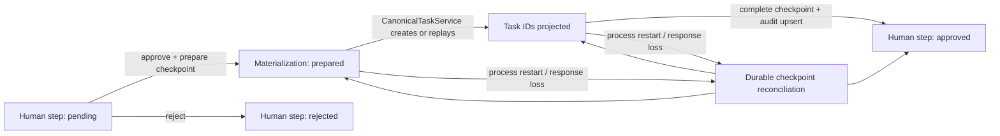
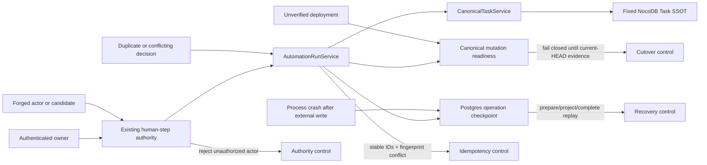

# Canonical Task cutover follow-up Spec

## 対象ユーザーと利用場面

- 対象ユーザーは、Mac CompanionからBrainbaseのPersonal KGへタスクを登録・更新する正当なownerである。
- 利用場面は、Mac Companionで収集・生成した候補を人間が承認し、Brainbase側のCanonical Taskへ確定するときである。
- Mac CompanionはUI・収集・下書きを担い、Canonical Task、監査ログ、実行チェックポイントの正本はBrainbaseサーバーが担う。

## 課題

WorkflowServiceからAutomationRunServiceへの移行後、承認済み候補をCanonical Taskへmaterializeする処理と、その処理を再開可能にする永続チェックポイントが移植されていなかった。また、runtime service factoryが`canonicalTaskService`依存を受け取らず、構成時に黙って破棄していた。

この状態ではAPIと読み取り経路がデプロイされていても、Mac Companionからのタスク作成・更新を安全に開通できない。

## 成功状態

- 承認されたCanonical Task候補がAutomationRunServiceからCanonical Taskへ一度だけmaterializeされる。
- 同一決定の再送、プロセス再起動、途中失敗からの再開でも重複タスクを作らない。
- materialize結果と監査イベントが永続チェックポイントから復元・照合できる。
- Canonical Task依存を注入しない既存Automation Runは従来どおり動作する。
- 本番mutationは、current HEADに紐づく全証跡とpreflightが成功するまで閉じたままにする。

## 受け入れ基準

1. `createAutomationRuntimeServices`が`canonicalTaskService`を`AutomationRunService`へ渡す。
2. Canonical Task候補の承認時、候補ID・決定・入力を検証し、安定したoperation keyでmaterializeする。
3. prepare、project、completeの各段階をPostgresチェックポイントへ保存し、再試行時に結果をreconcileする。
4. 同じ候補と決定の再送は同じ結果を返し、異なる決定の再送はconflictとして拒否する。
5. materialization auditは同じoperation keyに対して重複記録されない。
6. Canonical Task連携のfocused test、関連回帰テスト、全Vitestが新規失敗なしで完了する。
7. 本番readinessを有効化する前に、registryで定義されたcurrent-HEAD証跡をすべて収集し、直接writerが存在しないことをpreflightで確認する。
8. owner認証されたMac Companion経路で作成・更新を確認できない場合、mutationは未開通として扱い、成功を主張しない。
9. collectorが`VIBEPRO_EVIDENCE_ID`、`VIBEPRO_EVIDENCE_RESULT`、`VIBEPRO_EVIDENCE_NONCE`を注入してregistryのCanonical Task evidence specを明示したときだけ、独立worktreeからそのspecを収集する。通常Playwright discoveryは`.worktrees`と`.codex-worktrees`を引き続き除外し、registry外ID、任意test、reporter/provenanceの検証を緩めない。

## 境界判断

- Canonical Taskのsingle-writer、opaque ID、owner認証、readiness fail-closedの設計は既存の`ADR-016-canonical-task-single-writer.md`を維持する。
- 今回はその設計を変更せず、AutomationRunServiceへの移行で欠落した実装を復元するため、新しいADRは不要である。
- KPIは「registry証跡の全件成功」「preflight成功」「owner認証済みの作成・更新成功」の3点とする。Periodは今回の本番cutover完了までとする。

## 状態遷移図

## 脅威モデル

## 責任と権限

- `AutomationRunService`はhuman-stepの決定検証、Canonical Task materializationの順序、永続checkpointからの再開を所有する。
- `CanonicalTaskService`はTask正本への書き込み、owner/People境界、冪等性、readinessを所有する。Automation側はこれらを迂回しない。
- `CanonicalTaskOperationRepository`はTask本文ではなく、operation key、fingerprint、Task ID、目標状態、監査phaseの調停証跡だけを所有する。
- Mac CompanionはUI・収集・下書きだけを所有し、Task正本や承認権限をローカルへ複製しない。
- 独立レビュー、current-HEAD検証、本番runtime証跡が揃わない場合はmutationを閉じたままにする。

## 検証証跡

- focused Canonical Task tests
- Automation Runおよびrouteを含む関連回帰テスト
- full Vitest
- `scripts/collect-canonical-task-evidence.js`
- worktree内での明示evidence targetと通常discovery除外を対照するPlaywright collection regression
- `scripts/preflight-canonical-task-cutover.js`
- owner認証済みMac Companion create/updateの実動確認
