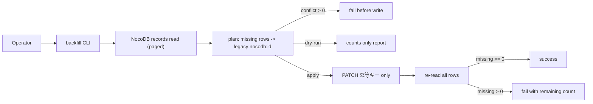
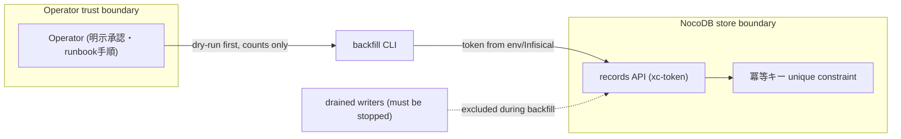

# Canonical Task Idempotency Key Backfill Spec

## Invariants

- 採番キーは`legacy:nocodb:<record-id>`で決定的に導出され、再実行しても同じ行は同じキーになる。
- 冪等キーを既に持つ行は一切変更しない。
- dry-runはNocoDBへの書込（PATCH）を発行しない。
- 採番予定キーが既存キーと衝突する場合、applyは1件も書込まずに失敗する。
- 出力は件数のみで、Task本文・secretを含まない。
- 実行はrunbookのbefore-enable手順内、writer排水後・移行workflow開始前に限定する。

## CLI Contract

- `--dry-run`と`--apply`のどちらか一方だけを受理し、両方・無指定はエラーにする。
- 対象テーブルは`createCanonicalTaskStoreConfig()`のmanifest経由でのみ解決する。
- 認証は`NOCODB_TOKEN`または`NOCODB_API_TOKEN`を必須にする。
- 出力は`mode/total/existing/missing/planned/updated/conflict_count`のJSON 1行とする。

## Read Contract

- NocoDB records APIをページングで全行読み取り、`pageInfo.totalRows`との不足があれば失敗する。
- record IDのない行、重複record IDを検出したら失敗する。

## Write Contract

- applyは欠落行だけへ`冪等キー`フィールドのみをPATCHし、他フィールドへ触れない。
- apply完了後に全行を再取得し、欠落行が0件でなければエラー終了する。

## Diagrams

### Flow (`kind: flow`)

### Threat model (`kind: threat_model`)

## Test Mapping

- S-001 dry-run非書込: `dry-run reports counts without writing to NocoDB`
- S-002 決定的採番: `apply backfills missing keys and verifies zero remaining rows` / `builds deterministic legacy keys`
- S-003 競合停止: `apply refuses to write when a planned key conflicts with an existing key`
- S-004 再検証: `apply backfills missing keys and verifies zero remaining rows`
- ページング: `paginates across multiple pages before planning`
