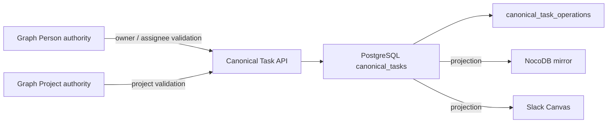
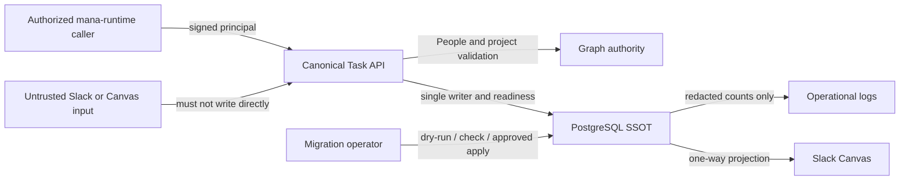

# Canonical Task PostgreSQL SSOT Spec

## Invariants

- 明示的な本番切替後、Task本文の唯一の正本はBrainbase PostgreSQLの`canonical_tasks`である。
- 切替前はNocoDBを正本として維持し、本PRのmergeだけでauthorityを変更しない。
- Graph SSOTはperson、organization、project、decisionの権威を維持する。
- NocoDBとSlack Canvasは再生成可能な投影であり、Canvas直接編集を正本へ逆輸入しない。
- 公開HTTP契約、owner境界、People検証、single-writer、readiness、監査を維持する。
- store障害を空一覧や成功へ縮退しない。

## Repository Contract

- `CanonicalTaskPostgresRepository` は `list/get/findByIdempotencyKey/create/update/delete` を提供する。
- listはstatus、priority、assignee、due範囲、cursor、limitをSQLで適用する。
- createの冪等キー、legacy NocoDB IDはDB一意制約で保護する。
- updateはTask fields、version、operation markersを同じUPDATEで保存する。
- opaque IDは署名付きで、別store・不正ID・不存在を404として扱う。

## Backend Selection

- `CANONICAL_TASK_BACKEND` は `nocodb` または `postgres` だけを受理する。
- 未指定は既存の`nocodb`を維持し、PRのdeployだけで正本を切り替えない。
- 不正値や選択storeの接続失敗で別storeへ暗黙fallbackしない。

## Migration

- schema migrationは冪等で、`--apply`と`--check`を分離する。
- NocoDB移行はdry-run/check/applyを分離し、Task本文・secretを標準出力しない。
- legacy IDまたは冪等キー競合時はapplyを中止する。
- sourceとlegacy ID・冪等キー・payload fingerprint・version・operation markerが全て同じ既存行だけを
  移行済みとして扱い、applyを安全に再実行できる。
- sourceに存在しないtarget-only行は切替前のauthority逸脱として競合にし、applyを中止する。
- 本番applyとbackend切替は別の運用承認・readiness証跡を必要とする。

## Diagrams

### ER (`kind: er`)

### Threat Model (`kind: threat_model`)

## Verification

- PostgreSQL repository unit tests。
- schema/migration unit tests。
- bootstrap backend selection regression。
- 既存Canonical Task service/route tests。
- `git diff --check`とVibePro Gate。
