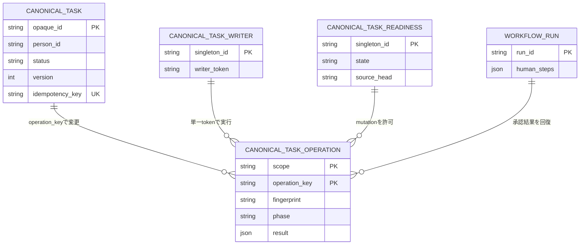
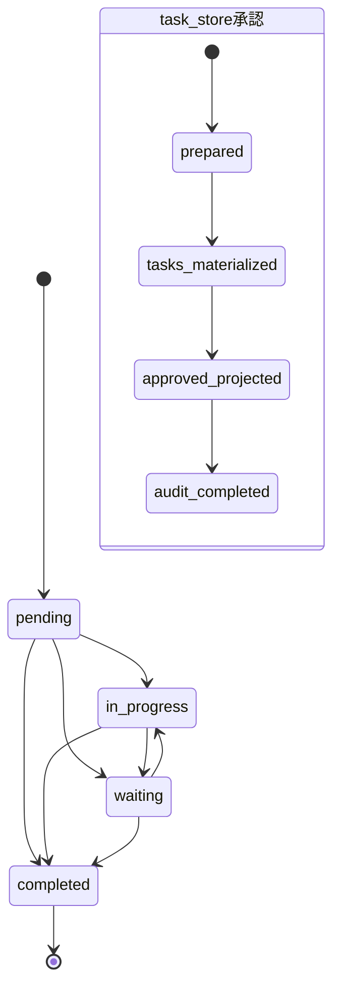
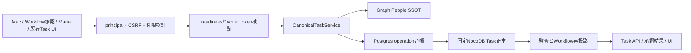
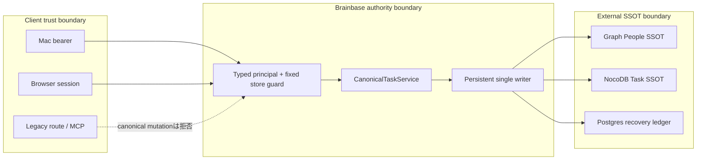

# Mac Companion Canonical Task Provider Spec

## 設計図

### ER (`kind: er`)

### 状態 (`kind: state`)

### 処理フロー (`kind: flow`)

### 脅威境界 (`kind: threat_model`)

## 不変条件

- **INV-1 single-ssot**: Taskの永続化正本はBrainbaseの既存NocoDB Task表だけである。
- **INV-2 person-authority**: 担当者の権威値はGraph SSOTの `person_id` であり、自由入力名は投影に限る。
- **INV-3 no-guessing**: `person_id` のない既存担当者名を名前一致で自動正規化しない。
- **INV-4 optimistic-version**: 全変更は期待版を検証し、成功時だけ版を増加する。
- **INV-5 idempotent-create**: 作成は冪等キーとfingerprintを保存し、同じ要求を重複作成しない。
- **INV-6 materialize-before-approve**: `task_store` 承認は全Taskが正本化された後だけapprovedになる。
- **INV-7 fail-closed**: 正本またはPeople確認が失敗した場合は明示的に失敗し、空・未担当へ変換しない。
- **INV-8 audit**: 作成、更新、状態遷移、削除、承認由来作成はactorと発生元を監査ログに残す。削除はTask ID、削除前version、auth sourceも残す。
- **INV-9 compatibility**: 既存NocoDB Task APIの読取、正本base以外の書込、非Task承認は変更しない。正本baseへの旧Task mutationはCanonical Task APIへ一本化するため明示拒否する。
- **INV-10 access**: Companion認証・owner境界の外からTaskを読み書きできない。
- **INV-11 single-writer-coordination**: Task mutationと`task_store`承認はPostgresの永続writer tokenを持つ単一Brainbase processだけが実行する。別processは503とし、tokenを自動takeoverしない。
- **INV-12 canonical-store-scope**: 正本storeはbase `pva7l2qlu6fdfip`、table `m7iys8m7o1abr3f` に固定し、要求からstoreを選択させない。差し替え可能な環境変数はmanifestファイルのパスを指定する`CANONICAL_TASK_STORE_MANIFEST`だけとし、base/tableの個別overrideは禁止する。
- **INV-13 destination-idempotency**: createの冪等キーはNocoDB正本表で一意にする。operation claimは単一writer内の実行順を調停するが、外部書き込みの一意性根拠にはしない。
- **INV-14 mutation-recovery**: update/transitionは `expected_version`, 最終操作key, fingerprint, 次版を同じNocoDB row patchへ保存し、停止後はそのマーカーだけから適用済みを判定する。旧writer停止確認前のtakeoverは禁止する。
- **INV-15 workflow-recovery-authority**: human stepの全Task ID、候補checkpoint、human step/runの目標状態、監査checkpoint、後処理phaseはPostgres台帳を回復権限とし、Workflow JSONは起動時と読取・再試行前に再投影する。
- **INV-16 mac-wire-contract**: Mac consumer commit `cb9c293` の固定fixtureをHTTP schemaの権限とし、互換aliasだけで必須field欠落を隠さない。
- **INV-17 owner-private-scope**: owner credentialの読取対象はconfigured owner担当Taskだけである。作成時の担当者省略はownerへ補完し、未担当・別person Taskの存在をownerへ開示しない。
- **INV-18 terminal-completed**: `completed` は終端であり、状態遷移は公開された許可表に従う。
- **INV-19 decision-pair**: `decision_mode` と `resolution` は公開対応表の同じ判断を表し、不一致はTask書込前に422で拒否する。
- **INV-20 explicit-overrides**: review itemの表示値は元候補を上書きしない。`edited_fields` に列挙された許可fieldだけを編集権限として扱う。
- **INV-21 idempotent-projection-audit**: workflow再投影の監査IDはoperationとphaseから決定し、同じIDをupsertして再試行で監査行を増やさない。
- **INV-22 no-canonical-writer-bypass**: 正本base/tableを変更するHTTP routeと運用scriptはCanonicalTaskServiceのwriter claim、People検証、版、監査を迂回しない。旧routeは正本base mutationをNocoDB到達前に拒否する。
- **INV-23 disjoint-idempotency-namespaces**: 外部create keyとWorkflow生成keyはserver-sideで異なる保存namespaceへ変換し、client文字列を正本列へそのまま保存しない。
- **INV-24 candidate-compatibility**: 既存の文字列候補とobject候補を同じ権限付き候補へ正規化し、並べ替えに依存しない内容由来IDを投影する。文字列の担当者は未解決のまま保持し、自動名寄せしない。
- **INV-25 legacy-projection**: 正本の`waiting`/`urgent`を既存NocoDB Task UIでも同じ意味へ双方向投影し、未知値を`pending`/`medium`へ黙って変換しない。
- **INV-26 mana-canonical-capture**: Mana captureは正本serviceへ`pending` Taskとして作成し、`mana_capture`発生元を保存する。自由入力担当者、local fallback ID、障害時空一覧を使わない。
- **INV-27 browser-canonical-routing**: 既存ブラウザTask画面は正本baseの全mutationをCanonical APIへ送る。正本以外のbaseだけ旧NocoDB mutationを維持する。
- **INV-28 versioned-idempotent-delete**: 正本Task削除はexpected versionと冪等keyを必須とし、削除結果をoperation ledgerから再生できる。
- **INV-29 mcp-write-fence**: NocoDB MCPのcredentialは正本Task mutation権限を持たない。正本readと他base/table mutationだけを維持する。
- **INV-30 task-auth-and-config**: Task APIはinternal/service-token/bearerだけを許可し、cookie-onlyとinsecure-headerを拒否する。Brainbase、MCP、migrationはcommit済みmanifestの同じcanonical identity hashを検証し、不一致または解決不能時はmutationを停止する。
- **INV-31 authenticated-mana-capture**: Mana captureは認証済みsessionとCSRFを通し、client生成capture IDを再送中保持してactor付きinternal commandへ変換する。actorやownerをrequest bodyから受けない。
- **INV-32 canonical-browser-identity**: browserはcanonical listのopaque ID/versionを権威値とし、旧一覧の同一store行を除外する。cookie-onlyではcanonical操作を無効化し、旧writerへfallbackしない。
- **INV-33 durable-delete-intent**: deleteは版claimとactor namespace付きoperationを分け、削除前認可snapshotとprepared intentを永続化してからNocoDBを変更する。
- **INV-34 guarded-initial-cutover**: 初回migration前に旧直接writerを停止・排水し、rollbackでも旧直接writerを復活させない。
- **INV-35 canonical-actor-principal**: actorは認証済み権威値から`{ type, id }`へ正規化し、固定key順canonical JSONのbase64urlだけをnamespaceに使う。同一personは認証方式が異なっても同じnamespace、異なるtypeまたはIDは異なるnamespaceとなり、body値や区切り文字連結を使わない。
- **INV-36 persistent-mutation-readiness**: 全processはmutation gateをclosedで起動する。Postgresのsingleton readiness rowとcurrent HEADの必須回帰証跡、manifest hash、schema version、writer claimを再検証できた場合だけ開き、全CanonicalTaskService mutationと`task_store`承認で同じgateを強制する。
- **INV-37 evidence-provenance**: `config/canonical-task-evidence-registry.json` の71 entryだけを証拠生成元の権威とする。各entryはID、収集command、test command、owner path、raw artifact path/schema、pre-fix assertionを固定し、collectorとpreflightは欠落、重複、入替、owner不一致、command不一致、stale HEAD、hash不一致を拒否する。

## Actor principalとnamespace

`CanonicalTaskPrincipal`は認証guardが検証済みの値だけから`{ type, id }`を作る。許可typeは`person`,
`service`, `internal`。`person.id`はGraph Peopleの`person_id`、`service.id`は設定済みcredentialの不変ID、
`internal.id`はallowlist済み内部command IDである。Mana sessionとbearerが同じGraph personを表す場合は
どちらも`{ "type": "person", "id": "<person_id>" }`へ収束する。request bodyのactor、表示名、session
raw文字列は権威値にしない。

typeはlower-case ASCII enum、idはUnicode NFCへ正規化したcase-preserving文字列とし、空文字と制御文字を
拒否する。namespaceは固定key順のUTF-8 JSON `{"type":"...","id":"..."}`をpaddingなしbase64urlで
符号化した`v1.<payload>`とする。raw IDを`:`等で連結しないため、type/ID境界と区切り文字を含むIDでも
衝突しない。監査にはprincipal、namespace、auth sourceを別fieldで保存する。

## Task契約

Taskは `id`, `title`, `description`, `status`, `priority`, `assignee_person_id`,
`assignee_display_name`, `due_at`, `waiting_on`, `review_at`, `completed_at`,
`source_refs`, `version`, `created_at`, `updated_at`, `web_url`,
`normalization_warnings` を返す。

`id` はstore schema version、固定base/table、NocoDB record IDを署名付きで束ねた不透明IDとする。
復号したbase/tableが起動時に確定した正本storeと一致しなければ404にし、別projectへ配送しない。

状態は `pending`, `in_progress`, `waiting`, `completed`。優先度は
`low`, `medium`, `high`, `urgent`。日時はISO 8601、未設定はnullである。

一覧は必ず `{ items, total_count, count_status, next_cursor, read_status, warnings, as_of }`
を返す。完全に読み切れた場合は `read_status=complete`, `count_status=exact` とし、部分取得や
下流障害を0件へ変換しない。単体取得、作成、更新、遷移はTask objectを直接返す。

合法な一覧metadataは次だけとする。

| read_status | count_status | total_count | warnings |
|---|---|---|---|
| `complete` | `exact` | 0以上の整数 | 0件以上 |
| `partial` | `lower_bound` | `items.count` 以上の整数 | 1件以上 |
| `partial` | `unknown` | null | 1件以上 |
| `stale` | `unknown` | null | 1件以上 |

v1はlast-known cacheを持たないため`stale`を生成しないが、Mac decoder互換fixtureとして保持する。
NocoDBやGraphの通信失敗は`partial`や`stale`ではなく503である。`warnings` の各要素は
`{ "code": String, "message": String, "source_ref"?: { "type": String, "id": String, "url"?: String } }`
とし、文字列だけのwarningを返さない。

## シナリオ

- **SC-001 list and cursor**: `requested -> auth_checked -> filters_validated -> task_store_read -> normalized -> cursor_page_returned`
- **SC-002 idempotent create**: `requested -> key_validated -> person_verified -> key_absent -> task_created -> audited`; 再送は `key_found -> fingerprint_equal -> existing_returned`。
- **SC-003 idempotency collision**: 同じkeyでfingerprintが違う場合は `key_found -> fingerprint_mismatch -> 409` で書き換えない。
- **SC-004 versioned update**: `requested -> expected_version_checked -> patch_applied -> version_incremented -> audited`。不一致はcurrent Task付き409。
- **SC-005 waiting transition**: waitingへの遷移は `waiting_on` を必須にし、`review_at` を保存する。
- **SC-006 completed transition**: completedへの遷移は `completed_at` をサーバー時刻で保存する。completedからの遷移は409 `invalid_transition` にする。
- **SC-007 unresolved legacy assignee**: 担当者名だけの旧行はnull IDとwarningを返し、People検索を行わない。
- **SC-008 invalid person**: Graphにない `person_id` は422で、Taskを作成・更新しない。
- **SC-009 store unavailable**: NocoDB失敗は503で、空一覧を返さない。
- **SC-010 approval materialization**: `pending human step -> candidates loaded -> deterministic keys -> all tasks materialized -> ids persisted -> approved -> audited`。
- **SC-011 approval retry**: 応答消失後の同じapproveは `approved step -> materialized ids loaded -> same response` となりTaskを増やさない。
- **SC-012 approval failure**: 1件でもTask作成に失敗した場合は `materialization_failed -> step remains pending` となる。
- **SC-013 non-task approval compatibility**: `write_back_target != task_store` は既存resolve経路を通る。
- **SC-014 auth rejection**: 未認証またはownerでない要求はTask storeへ到達しない。
- **SC-015 concurrent create**: 同じkeyの並行POSTは永続claimの勝者だけがNocoDBへcreateし、他方は完了結果を読み同じTaskを返す。
- **SC-016 concurrent approval**: 同じstepの並行approveはstep claimの勝者だけがmaterializeし、他方は保存済み結果を再生する。
- **SC-017 recovery matrix**: Task作成、candidate checkpoint、全ID保存、approval更新、workflow audit、run更新の各境界で停止しても再送で前進し、Taskを増やさない。
- **SC-018 cross-owner rejection**: owner credentialはconfigured owner担当Taskだけを扱う。作成時の省略はowner補完、未担当・別personの読取は404、担当解除・別person指定は403にする。
- **SC-019 get by opaque id**: 固定storeのopaque IDを復号する。ownerにはowner担当Taskだけを返し、別store、不存在、未担当、別personは404 `task_not_found`。service/internalは固定store内の未担当・別personを取得できる。
- **SC-020 single writer**: writer Aがtokenを保持中はprocess Bのmutationと`task_store`承認を503にする。A異常終了後も自動takeoverせず、旧process停止を確認した明示回復後だけBが未完了operationを再開する。
- **SC-021 mutation crash recovery**: NocoDB patch後・operation完了前の再送は、現行版が期待版+1かつ最終操作key/fingerprint一致なら適用済みTaskを返す。不一致なら409で自動再適用しない。
- **SC-022 workflow phase recovery**: Task ID群保存後の停止はPostgresのphase/result JSONからhuman step、run、auditの目標状態をWorkflow JSONへ再投影し、未完了の後処理だけ再開する。
- **SC-023 task-store approval authorization**: 両resolve routeでhuman-step解決権限を持つactorは、承認候補をactor付きinternal commandとして渡し、Graph確認済み別personへmaterializeできる。同じactorがbearerで直接Task APIから別personをcreate/updateする要求は403にする。
- **SC-024 Mac wire fixture**: 固定fixtureで反復status/priority、due bounds、cursor、limit、合法な一覧metadata、GET単体、`to_status`、`version_conflict`、`invalid_transition`、トップレベル `materialized_task_ids` を実routeで再生する。
- **SC-025 review item merge**: unresolvedな元候補をMac review itemの`selected_owner_id`で解決し、編集済みTask fieldを合成してGraph再確認後に作成する。
- **SC-026 review item decisions**: approvedだけをTask化し、rejectedは明示的に除外する。needs_changesが1件でもあればstepをpendingのまま409にする。
- **SC-027 decision pair validation**: top-levelとreview itemの`decision_mode`/`resolution`が対応表と不一致なら422となり、Taskとhuman stepを変更しない。reject混在と全件rejectはapproved exclusionとして到達できる。
- **SC-028 writer lifecycle**: HTTP listen前にclaim/reconcileし、graceful shutdownでreleaseする。claim失敗時のmutationは503、expected token明示回復後は未完了operationから再開する。
- **SC-029 idempotent audit projection**: approved後・audit/run更新前に停止して起動、getRun、approval inbox、retryを繰り返しても、同じoperation/phaseの監査IDは1件だけである。
- **SC-030 legacy canonical write guard**: `/api/nocodb/tasks` のcreate/update/deleteで正本baseを指定すると409 `canonical_task_api_required` となり、NocoDB fetchは呼ばれない。正本base以外と読取は既存契約を維持する。
- **SC-031 operational writer migration**: 正本tableを直接呼ぶ4本の運用scriptは認証済み`/api/companion/tasks` create/update/transitionへ移行し、固定table IDとNocoDB write URLを含まない。
- **SC-032 cross-source idempotency isolation**: 同じclient文字列を送っても直接APIは`api:<actorNamespace>:<key>`、Workflowは`workflow:<output>:<fingerprint>:<ordinal>`を保存し、互いのoperation/result/approval summaryへ衝突しない。actorNamespaceは認証済みtyped principalのcanonical JSON base64urlであり、client値を使わない。
- **SC-033 legacy string candidate compatibility**: 既存fixtureの文字列候補を`title`と未解決ownerを持つ候補へ正規化し、approval inboxと両resolve routeで同じ内容由来`candidate_id`を使う。Mac review itemでGraph確認済みownerを選ぶと一度だけTask化し、未選択なら409でpendingに残す。
- **SC-034 reorder-stable candidate identity**: IDなしobject候補と文字列候補を並べ替えて再投影しても、候補内容ハッシュと同一内容内ordinalから同じcandidate ID集合・Workflow冪等key集合を生成し、停止・再試行後もTaskを増やさない。
- **SC-035 legacy lifecycle projection**: 既存NocoDB adapterは`waiting`を`待ち`、`urgent`を`緊急`へ双方向変換し、未知status/priorityは明示的なunknown値またはwarningとして保持して`pending`/`medium`へ縮退しない。
- **SC-036 Mana canonical capture**: Mana clientは操作開始時にUUID `capture_id`を生成し、応答が確定するまで再利用する。認証済みsessionとCSRFを通したrouteはsessionのGraph person principal付きinternal commandへ変換し、`mana:<actorNamespace>:<capture_id>`をserver namespace化して`pending` Taskを作る。`source_refs`へ`{ type: "mana_capture", id: capture_id, metadata: { original_type, project, content } }`を保存する。Graph確認済み`assignee_person_id`以外は拒否し、NocoDB障害時は503でlocal IDを返さない。
- **SC-037 Mana captures read**: `/captures`はCanonicalTaskServiceから`mana_capture`由来Taskを読んで従来形へ投影し、正本障害を空一覧へ変換しない。
- **SC-038 browser canonical list merge**: bearer利用時はCanonical一覧を先に取得し、旧`/api/nocodb/tasks`一覧からmanifestと同じbase/tableの行を除外してから非正本Taskだけを結合する。Canonical失敗時は画面全体を明示失敗にし、旧正本行を代替表示しない。
- **SC-039 idempotent delete**: 正本Task deleteはexpected versionを検証して一度だけ削除し、同じkey/fingerprintの再送は同じ`{ task_id, deleted, version }`を返す。異内容key再利用と版競合は409である。
- **SC-040 MCP canonical write fence**: MCP create/update/deleteはmanifest identityへ解決した正本Task tableをclient call前に拒否する。`nocodb_update_column`もcolumn metadataから親tableを解決して正本なら拒否する。解決不能またはidentity hash不一致時は全mutationを停止し、正本readだけを維持する。
- **SC-041 Task auth and shared config**: bearer/internal/service-tokenは表のscopeで動作し、cookie-onlyとinsecure-headerはstore未到達で403になる。各許可認証はserver側でtyped principalへ正規化され、body actorを無視する。Brainbase、MCP、migrationは`config/canonical-task-store.json`のcanonical JSON SHA-256を比較し、個別base/table overrideを許可しない。
- **SC-042 Mana auth and retry distinction**: 未認証、CSRF不正、capture ID欠落をstore前に拒否する。応答消失後の同一capture IDは同じTaskを返し、同内容でも新規操作の別capture IDは別Taskを作る。
- **SC-043 browser canonical create and assignee**: 正本projectの作成UIはPeople selectorの`person_id`だけを送る。owner省略はserver補完し、自由入力の「自分」や表示名を権威値として送らない。非正本projectは既存入力を維持する。
- **SC-044 browser canonical update lifecycle delete**: edit、status、deleteは保持中のopaque ID/versionを送り、成功応答でrowとversionを置換する。cookie-only時はcontrolsを無効化してbearer再認証を要求し、旧routeへfallbackしない。
- **SC-045 durable delete recovery**: `task-version:<taskId>:<expectedVersion>`をupdate/transition/delete共通排他にし、`task-delete:<actorNamespace>:<clientKey>`へfingerprint、削除前認可、Task snapshot、prepared stateを保存する。NocoDB削除後・result保存前の停止はprepared intentと行不存在を照合して同じ成功結果を確定する。同じactor namespaceの同key異fingerprintと、別keyによる同version要求は409にする。削除後に別actor namespaceから要求された場合はoperation結果を開示せず404にする。typeまたはIDが異なるprincipalは別namespace、同じGraph personのbearer/sessionは同一namespaceになる。
- **SC-046 initial cutover and rollback**: `docs/runbooks/canonical-task-cutover.md`に従い、全processはmutation gateをclosedで起動する。`before-migration`で旧Brainbase、Mana、MCP、scriptの停止・排水と直接writer 0件を確認する。migration後の`before-enable --evidence-out <artifact>`は認証、両承認route、非Task承認、legacy route/UI、Mana、browser、MCP、delete回復、4 script、migration、Mac wire fixtureを含む全必須回帰とmanifest/schema/writerをcurrent HEADへ束ねる。明示enableはartifact hashとsingleton readiness rowをatomicに検証・更新し、失敗時はclosedを維持する。再起動は保存rowを現在値と再照合するまでclosed、rollbackは最初に明示disableする。
- **SC-047 Mana actor namespace isolation**: configured ownerのactor Aが同じ`capture_id`を再送した場合だけ、自身の同じTaskへ収束する。actor BはPersonal KG owner境界でoperation検索前に403となり、actor Aの保存結果を参照・再生しない。同一Graph personの権威IDは認証元に依存せず同じcanonical principalへ収束する。`person:a:b`と`service:a:b`、IDに区切り文字を含むprincipalもcanonical JSON base64urlで衝突しない。

## HTTP

### 一覧

`GET /api/companion/tasks?status=pending&status=waiting&priority=high&priority=urgent&assignee_person_id=person_x&due_after=...&due_before=...&limit=50&cursor=...`

成功: `{ "items": [...], "total_count": 1, "count_status": "exact", "next_cursor": null, "read_status": "complete", "warnings": [], "as_of": "..." }`

owner credentialでは `assignee_person_id` は設定ownerと同値だけを許可し、省略時もserverがownerへ固定する。
service/internal credentialだけがGraphで確認済みの別personを指定できる。どの認証種別もproject/base/tableは指定できない。
反復`status`と`priority`は各field内でOR、異なるfield間はANDとする。`due_after`と`due_before`は
ISO 8601の包含境界で、null期限は除外する。`due_after > due_before`、未知enum、不正日時、不正cursor、
1未満または50超の`limit`は422 `validation_failed` とfield別errorを返す。

### 単体取得

`GET /api/companion/tasks/:taskId` はTask objectを直接返す。opaque IDのstore scopeを検証し、
固定store以外または不存在の場合は404 `{ "code": "task_not_found", "message": "..." }` とする。
owner credentialでは未担当・別personのTaskも情報非開示のため同じ404にする。

### 作成

`POST /api/companion/tasks` は `Idempotency-Key` headerを必須とし、bodyに `title`,
任意の `description`, `priority`, `assignee_person_id`, `due_at`, `source_refs` を受ける。
owner credentialで`assignee_person_id`省略時はconfigured ownerを保存する。ownerが別personを指定した
場合は403。service/internalでは省略を未担当として保存できる。
headerはclient keyであり、`api:`または`workflow:`から始まる予約prefixは422
`reserved_idempotency_prefix`にする。保存keyはserverが`api:<actorNamespace>:<client-key>`へ変換し、
client文字列を正本列へそのまま保存しない。

### 更新

`PATCH /api/companion/tasks/:taskId` はbodyの `expected_version` を必須とする。変更可能なのは
title、description、priority、assignee_person_id、due_atである。
ownerはconfigured owner担当Taskだけを更新でき、担当者nullまたは別personへの変更は403とする。

### 状態遷移

`POST /api/companion/tasks/:taskId/transitions` は `expected_version`, `to_status` と、waiting時の
`waiting_on`, 任意の `review_at` を受ける。

| 現在 | 許可する遷移先 |
|---|---|
| `pending` | `in_progress`, `waiting`, `completed` |
| `in_progress` | `waiting`, `completed` |
| `waiting` | `in_progress`, `completed` |
| `completed` | なし |

表にない遷移は409 `{ "code": "invalid_transition", "current_task": {...} }` とする。

### 削除

`DELETE /api/companion/tasks/:taskId` はbodyの`expected_version`と`Idempotency-Key` headerを必須とする。
ownerはconfigured owner担当Taskだけを削除できる。成功は
`{ "task_id": "...", "deleted": true, "version": expected_version + 1 }`を返し、その後のGETは404になる。
同じactor namespaceの同じkey/fingerprintの再送はNocoDBへ再度deleteせず保存済み結果を返す。同じactor namespaceでのkeyの異内容再利用は
`idempotency_conflict`、別keyによる同version要求と版不一致はcurrent Task付き`version_conflict`とする。
serverは先に`task-version:<taskId>:<expectedVersion>`をclaimしてupdate/transition/deleteを排他し、
次に`task-delete:<actorNamespace>:<clientKey>`へfingerprint、actor、auth source、owner認可、削除前Task snapshot、
`prepared` stateを保存する。NocoDB削除後に停止した場合は、同じactor namespaceかつ同じkey/fingerprintの再送だけがprepared intentと
固定storeの行不存在を照合し、保存snapshotから同じ成功結果を確定できる。別keyで同じversionをclaimした要求は409、
削除後の別actor namespaceからの要求はoperation lookupも再生も行わず404として結果を開示しない。削除成功と回復確定のどちらも同じ決定的audit IDをupsertする。

### 認証と認可

| 認証種別 | list/get | create | update/transition/delete |
|---|---|---|---|
| bearer | configured owner担当だけ。未担当・別personは404 | 省略時owner補完。別personは403 | owner担当だけ。担当解除・別personは403 |
| service-token / internal | 固定正本store内、明示person filterと未担当を扱える | 省略で未担当、Graph確認済みperson可 | 固定正本store内で可 |
| cookie-only | 403 `task_bearer_required` | 403 `task_bearer_required` | 403 `task_bearer_required` |
| insecure-header | 403 `task_owner_identity_required` | 403 `task_owner_identity_required` | 403 `task_owner_identity_required` |

全操作はtyped canonical principal、そのnamespace、auth source、固定project `brainbase` を監査へ記録する。
`task_store` 承認は直接Task API操作ではない。両resolve routeの既存workflow認証と
`_assertActorCanResolveHumanStep` を先に通し、承認済み候補だけをactor付きservice-internal commandとして
`CanonicalTaskService`へ渡す。このcommandはGraph確認済みの別personをmaterializeできるが、任意の
store/project指定はできない。したがって承認者が別担当者を選んでも、bearer credentialでそのTaskを
直接list/get/updateできる権限は増えない。

### 承認候補と結果

- approval inbox投影時に、文字列候補はtrim済み文字列を`title`、owner未解決を持つ互換objectへ正規化する。
  object候補も同じcanonical field集合へ正規化し、既存`id`/`candidate_id`は保持する。IDがない候補は
  `workflow-output:<outputId>:candidate:<candidateContentHash>:<sameContentOrdinal>`を投影する。
  `candidateContentHash`はtrim済みtitle/description、元owner IDまたは未解決状態、priority、due、sort済みsource refsの
  canonical JSONから作る。同一内容候補は内容ごとに個数を数えたordinal集合を割り当てるため、配列の並べ替えでID集合が変わらない。
  Macは返された`candidate_id`をそのまま返し、resolve時はこの正規化済み候補集合だけを権限とする。
  `response_ref.review_items`がある場合は`candidate_id`優先、なければ`id`で一対一に結合し、未知・重複・
  欠落itemは422にする。review itemがない既存clientは元候補だけを使う。文字列候補はowner未解決のため、
  review itemでGraph確認済みownerが選ばれない限りTask化しない。
- `decision_mode` と `resolution` の合法対応は `approve|approveWithEdits -> approved`,
  `requestChanges -> needs_changes`, `reject -> rejected` だけである。top-levelと全review itemで不一致は
  422 `inconsistent_approval_decision` とし、修正前fixtureで書込0件を確認する。
- top-level resolutionが`approved`のときだけmaterializeする。review itemの`approved`はTask化、
  `rejected`は`excluded_candidates`へ`rejected_by_reviewer`として記録し、`needs_changes`が1件でも
  あればstepをpendingのまま409にする。全件rejectedはTask 0件を明示してapprovedにできる。
- `requestChanges` itemが1件でもあればtop-levelは`needs_changes`、それ以外はrejectが混在または全件rejectでも
  top-levelを`approved`にする。top-level `reject` はcard全体をTask化せずrejectedで閉じる。
- review itemの`title`, `description`, `priority`, `due_at`, `assignee_person_id`は存在だけでは上書きしない。
  `edited_fields`に列挙されたfieldだけを上書きし、未知field、列挙したfieldの値欠落、非列挙fieldの元候補と
  異なる値は422にする。v1 Mac UIが編集権限を持つのは`assignee_person_id`だけである。
  `selected_owner_id`を担当者の最終判断とし、`assignee_person_id`もある場合は同値を必須にする。
  source refsと候補IDは元outputを権限としreview itemから追加・変更させない。
- review itemで選択されたownerは元候補の`owner_resolution`がunresolvedでも上書きできるが、Graphで
  再確認する。review itemに選択がない場合は元候補のresolved/already_selected ownerだけを受理する。
  最終ownerが未解決、ambiguous、ignored、legacy文字列だけなら409
  `task_candidates_require_owner_resolution` と候補別理由を返す。
- candidateの安定IDは上記の内容hash形式を使い、正本へ保存する冪等keyは
  `workflow:<outputId>:<candidateFingerprint>:<sameFingerprintOrdinal>` とし、
  並べ替えでは変化せず、完全に同じ重複候補だけordinalで区別する。
- fingerprintはtrim済みtitle/description、selected owner ID、priority、due、
  sort済みsource refsのcanonical JSONから作り、配列位置・表示名・resolution説明は除外する。
- Postgres operation result JSONへ候補key別Task ID、完了状態、警告を1件ごとにcheckpointし、
  human step metadataの `canonical_task_materialization` へ互換投影する。
- 成功応答は既存キーを保った `{ human_step, resumed_run, materialized_task_ids, materialization: { status, task_ids, excluded_candidates, warnings, replayed } }`。
  `materialized_task_ids` は `materialization.task_ids` と常に同値で、省略しない。
  部分失敗は同じ構造とerror codeを返すがapprovedにしない。

### 旧writerの遮断と移行

`/api/nocodb/tasks` のGETは既存一覧契約を維持する。POSTはmapping解決後、PUT/DELETEは`baseId`検証直後に、
固定正本base `pva7l2qlu6fdfip`なら409 `{ "code": "canonical_task_api_required" }` を返し、table解決・NocoDB writeを呼ばない。
他baseの挙動は変更しない。正本table `m7iys8m7o1abr3f`へ直接fetchしていた
`add-frame-story-tasks.js`、`add-framework-operation-tasks.js`、`complete-doc-tasks.js`、`update-task-status.js`は、
service tokenまたはinternal keyを使うCanonical Task API clientへ移行する。CI policy testで正本table IDと
`/api/v2/tables/.../records` writeの再導入を拒否する。

既存NocoDB UI adapterは正本列の`待ち`/`緊急`をそれぞれ`waiting`/`urgent`へ双方向変換する。
未知status/priorityは入力値を保持してUIへ明示し、`pending`/`medium`へ黙って縮退させない。

既存ブラウザrepositoryは正本baseのTask objectへopaque IDとversionを保持し、createはCanonical POST、
field editはPATCH、statusはtransition、deleteはCanonical DELETEへ送る。非正本baseは従来の
`/api/nocodb/tasks`を使う。bearer利用時はCanonical一覧を先に読み、旧一覧のうちmanifestと同じbase/table行を
除外してから結合する。正本projectのadd/edit modalはPeople selectorのIDだけを権威値にし、成功応答のTaskとversionで
表示rowを置換する。cookie-only sessionでは正本controlをdisabledにしてbearer再認証を要求する。

Mana clientは操作ごとに`crypto.randomUUID()`で`capture_id`を生成し、network responseが確定するまでrequest stateに保持する。
routeは認証済みcookie sessionとCSRFを検証し、sessionからGraph person principalを導出したinternal commandへ変換する。bodyのactor/ownerは受理しない。
`mana:<actorNamespace>:<capture_id>`をoperation keyとして同じserviceへ`pending`で作成し、`{ type: "mana_capture", id: capture_id, metadata: { original_type, project, content } }`
から`/captures`互換形を投影する。

NocoDB MCPはinputのtable name/IDをmetadataでtable IDへ解決してmanifestと比較する。create/update/deleteに加え、
`nocodb_update_column`はcolumn metadataから親tableを解決して正本Task列なら拒否する。identity hash不一致、table/column
解決失敗は正本判定不能として全mutation readinessを失敗させる。readは維持する。いずれも正本障害を旧route、
direct NocoDB、local ID、空一覧へfallbackしない。

### 正本store設定

`config/canonical-task-store.json`は`schema_version`, `base_id`, `table_id`, `table_name`, `project`, `owner_person_id`
を持つcommit済みmanifestである。canonical key順JSONのSHA-256をidentity hashとし、Brainbase、MCP、migrationが
同じfileから計算して起動時に比較する。pathの差し替えは`CANONICAL_TASK_STORE_MANIFEST`一つだけを許可し、base/tableの
片側overrideは禁止する。`createCanonicalTaskStoreConfig()`はmanifestを一度だけ検証・凍結し、core servicesが同じobjectを
Canonical repository、legacy write guard、Mana router、migration/policyへ注入する。module内で`process.env`を再読込しない。
MCPは別processでも同じmanifest/hashを読み、metadataで解決したtable IDと一致しなければ全mutation readinessを失敗させる。

### Mutation readiness

`canonical_task_readiness`はsingleton rowとして`state`, `manifest_hash`, `schema_version`, `writer_token`,
`evidence_hash`, `source_head`, `enabled_at`, `enabled_by`, `disabled_reason`を保持する。process-local gateは
起動時に必ずclosedで初期化し、writer claim/reconcile後に保存rowと現在のmanifest/schema/writerを再検証する。
一致した`ready` rowだけがgateを開ける。欠落、不一致、DB障害はreadを維持して全mutationを503
`canonical_task_mutation_not_ready`にする。

`config/canonical-task-evidence-registry.json`はrunbookの固定71件
（`scenario.SC-001`〜`scenario.SC-047`と24件の`surface.*`）と、各IDのproducer command、owner test/fixture、
test command、raw artifact path/schema、pre-fix assertionを完全一致で保持する。
`scripts/collect-canonical-task-evidence.js`はregistry entry以外を実行せず、current HEAD、registry hash、
owner file hash、実行command、終了codeをraw artifactへ記録する。
raw artifactには`matched_tests`と`matched_assertions`を含める。collectorは対象テストまたは対象assertionが
0件なら終了codeに関係なく`pass: false`として終了し、0件実行のfalse passを許可しない。
`matched_tests`はevidence IDと完全一致するtest titleを、Vitest/Playwrightの専用JSON reporterまたはNode testの
TAP reporterから数える。registryの`runner_adapters`がregistered `test_command`からeffective commandへの唯一の
決定的変換、reporter、result pathを定義する。collectorはshellを介さずargvと明示envでspawnし、
`VIBEPRO_EVIDENCE_ID`、`VIBEPRO_EVIDENCE_RESULT`、runごとの64桁hex
`VIBEPRO_EVIDENCE_NONCE`をregistryの`effective_invocation`どおりに注入する。専用reporterはこの3値が
欠落・形式不正ならtest開始前に失敗し、resultは指定pathへatomic renameでだけ保存する。collectorは
registered/effective argv、env名と値、nonce hash、adapter key、reporter hash、runner result hashをartifactへ保存し、
未登録adapter/env、template外の引数追加、result path差替えを拒否する。custom reporter hashはfile SHA-256、
Node内蔵TAPは`sha256("node:<process.version>:node:test:tap")`とする。

各owner testは`withCanonicalTaskEvidence(evidenceId, assertionCallback, runnerContext)`を使い、証拠対象の
全assertionをcallback内で実行する。helperはevidence IDとenvを照合し、callbackのPromiseが正常完了した後にだけ
`VIBEPRO_ASSERT:<evidence-id>:<nonce>` final eventをrunnerContextのattachment/diagnostic channelへ1回送る。
callback中またはhelper外からのmarkerはfinal eventにならない。専用reporterはfinal eventを現在実行中のtest eventへ
関連付け、test終了時にtitle、status、final event配列をJSONへ保存する。Node TAPではhelperがcallback完了後に
`t.diagnostic`へ出したnonce付きlineだけを認める。collectorはtitle完全一致・status passed・nonce一致の単一eventに
属する単一final eventだけを`matched_assertions: 1`とする。global stdout、failed/skipped test、別title、test終了後、
raw手書きmarker、重複markerは証拠として数えずartifactをfailにする。process raw stdoutは別fileとhashで保持する。

`npm run preflight:canonical-task-cutover -- --phase before-enable --evidence-out <path>`はregistryをallowlistとして扱い、
必須回帰ID、各証跡file hash、producer/owner/schema provenance、source HEAD、manifest hash、schema version、
writer tokenをcanonical JSON artifactへ出力する。欠落、重複、ID/path入替、未登録command、owner hashのstale、
schema不一致、registry hash不一致を拒否する。
`matched_tests == 0`または`matched_assertions == 0`のartifactも拒否する。
preflightはrunner resultとraw outputを独立に再parseして両count、event-marker相関、reporter/result/stdout hashを
照合する。collector/preflight testにはzero test、zero marker、改ざんcount、改ざんstdout、global forged marker、
assertion完了前marker、failed/skipped test marker、別test marker、duplicate marker、env欠落、result path差替え、
reporter hash差替えのfixtureを必須とする。
`npm run canonical-task:readiness -- --enable --evidence <path>`はartifactがcurrent HEADかつ必須回帰全件passで
あることをtransaction内で再検証し、条件成立時だけrowを`ready`へupsertする。失敗時はrowを変更しない。
`--disable --reason <reason>`はrowをatomicに`closed`へ変更し、process-local gateも次のmutationで閉じる。
`CanonicalTaskReadiness.assertMutationReady()`はcreate/update/transition/delete、Mana internal command、4 scriptの
API経路、`task_store`承認materializationのservice入口で必ず呼ぶ。read、非Task workflow、非正本routeは対象外とする。

### 永続調停と回復

`canonical_task_writer`のsingleton rowでprocess tokenを永続化する。Task mutationと`task_store`承認は
active tokenを持つprocessだけが実行し、他processは503 `canonical_task_writer_unavailable` にする。
graceful shutdownはtokenをreleaseする。異常終了時は自動takeoverせず、運用者が旧process停止を確認して
`--recover-writer --expected-token <token>`を実行した場合だけ新tokenへ移譲する。

`canonical_task_operations(scope, operation_key)` の一意制約でcreate key、
`task-version:<opaqueTaskId>:<expectedVersion>`、`task-delete:<actorNamespace>:<clientKey>`、human step IDをclaimする。台帳はTask本文を持たず、
fingerprint、状態、writer token、result JSON、human step/run目標状態、audit checkpoint、後処理phaseを持つ。

createはさらにNocoDBの `冪等キー` 列へDB一意制約を設定する。重複insertはキー検索で既存行を
回収し、fingerprint一致なら同じTask、違えば409にする。update/transition/deleteはversion scopeを共有し、
NocoDB rowへ `最終操作キー`, `最終操作Fingerprint`, 次版を業務変更と同じPATCHで保存する。
現行版が期待版+1でもマーカーが一致しない場合は `version_conflict` とし、適用済みと推測しない。
`server.js`はHTTP listen前にwriterをclaimして未完了operationをreconcileする。claimまたはreconcileに
失敗しても読取serverは起動できるがTask mutationと`task_store`承認は503となる。
`registerGracefulShutdown`はHTTP close後、session cleanup前にwriter tokenをreleaseする。
`scripts/recover-canonical-task-writer.js --expected-token <token>`だけが旧tokenを比較して移譲し、旧processの
停止確認を要求する。起動時およびtask_store human stepの読取・resolve前に、未完了operationをPostgresから読み、保存済み
Task ID、human step/run目標状態、audit checkpointをWorkflow JSONへ冪等に再投影する。task_store以外の
Workflowは既存経路を変えない。

再投影監査は `canonical-task:<operationId>:<phase>` をIDとし、Workflow repositoryの`upsertAuditLog`で
同じIDを置換または維持する。`writeAuditLog`の既存append契約は非Task workflow向けに変更しない。

| 停止点 | 再送時の期待 |
|---|---|
| 一部Task作成後 | deterministic keyで既存Taskを取得し、未作成候補から続行 |
| Task作成後・candidate checkpoint前 | create keyの完了結果からIDを復元してcheckpoint |
| 全ID保存後・approved前 | providerを呼ばずapprovedへ進める |
| approved後・audit/run更新前 | Postgresの目標状態とcheckpointをWorkflow JSONへ再投影し、未完了の後処理だけ進める |
| approvedだがID metadata欠落 | deterministic key群から全IDを復元できる場合だけ修復し、不足時は409 |
| 同時approve | 単一writer内のstep claimとdestination uniqueで同一結果へ収束し、他方は同じ結果を返す |
| writer異常終了 | 自動takeoverせず503。旧process停止確認後の明示回復で同じoperationから再開 |
| delete prepared後・NocoDB削除前 | 保存済みactor/認可/fingerprintを照合し、行があれば同じversion claimで削除を続行 |
| NocoDB削除後・delete result前 | prepared intentと固定storeの行不存在を照合し、保存snapshotから同じresultとauditを確定 |

### Migrationとrelease順序

実行責任は`docs/runbooks/canonical-task-cutover.md`、機械検査は`scripts/preflight-canonical-task-cutover.js`、
回帰は`tests/server/scripts/preflight-canonical-task-cutover.test.js`が持つ。

1. 旧Brainbase、Mana、NocoDB MCP、4本の運用scriptを停止・排水し、`npm run preflight:canonical-task-cutover -- --phase before-migration`でNocoDB監査、process一覧、静的検査上の直接writerが0であることを確認する。旧processを動かしたままmigrationしない。
2. `node scripts/migrate-canonical-task-operations.js --apply` 後に `--check` し、Brainbaseの
   InfoSSOT Postgres接続設定でwriter singleton、operation schema、unique key、result JSON、目標状態、phaseを確認する。
3. `node scripts/migrate-canonical-task-columns.js --apply` 後に `--check` し、固定NocoDB Task表の
   必須列と `冪等キー` のDB一意制約を確認する。metadata APIが一意制約を作れない環境ではapplyを
   成功扱いせず、管理DB migrationが完了するまでTask書き込みを有効にしない。
4. manifest hashを確認し、legacy/Mana/MCP guardを含む新BrainbaseとMCPをclosed gateで起動する。認証、approval inbox、両resolve route、非Task承認、旧route/UI、Mana、browser、MCP、delete回復、4 script、migration、Mac wire fixtureを実行し、`npm run preflight:canonical-task-cutover -- --phase before-enable --evidence-out .vibepro/verification/canonical-task-cutover/before-enable.json`でcurrent HEADの証跡を生成する。
5. `npm run canonical-task:readiness -- --enable --evidence .vibepro/verification/canonical-task-cutover/before-enable.json`がatomicに成功した後だけmutationを解禁し、実route契約を確認してMac Companionを反映する。rollback時は最初に`npm run canonical-task:readiness -- --disable --reason rollback`を実行し、その後`--phase rollback`でschema、manifest、legacy/Mana/MCP guardの維持と旧writer非復活を確認してforward fixする。

## 検証

- BDDで47シナリオをAPIとserviceの実経路へ対応付け、修正前に新規fixtureが失敗することを記録する。
- NocoDB repositoryはfake fetchでfield mapping、cursor、冪等照会、版更新を検証する。
- Workflow serviceは実repository ledgerとfake canonical task serviceで承認順序と再試行を検証する。
- 既存Companion認証、approval inbox、NocoDB Task controllerの回帰テストを実行する。
- Mac consumer契約は `tests/fixtures/companion-canonical-task-mac-cb9c293.json` に固定し、
  `/Users/ksato/workspace/code/brainbase-mac-companion` のconsumer基準`cb9c293`とschema hashを照合する。
- 既存 `/api/nocodb/tasks` の読取・非正本base書込・正本base write guard、`/api/workflow-runs/:runId/human-steps/:stepId/resolve`、
  `/api/workflow-human-steps/:stepId/resolve`、非`task_store`承認を明示回帰対象にする。
- server起動closed/readiness再検証、claim/reconcile、graceful release、明示回復CLI、`getRun`/approval inbox読取時reconcile、
  retry、非`task_store`、旧NocoDB API、4本の移行済み運用script、旧UIのwaiting/urgent投影、文字列候補、
  冪等key namespace、Mana capture、既存ブラウザmutation、versioned delete、MCP write fence、Task固有auth、共有store configをcurrent-headのpath surface evidenceとapproval summary/gate artifactへ含める。
- MCP packageの`npm test`が`mcp/nocodb/tests/canonical-task-write-guard.test.js`を実際に実行すること、actor type/ID/Unicode/区切り文字衝突、browser modal/event、Mana auth/retry、delete停止回復を検証証跡に含める。初回cutoverは`tests/server/scripts/preflight-canonical-task-cutover.test.js`と`tests/server/services/canonical-task-readiness.test.js`で3 phase、必須回帰欠落、stale HEAD/hash、atomic enable失敗、再起動時不一致、明示disableを検証する。
