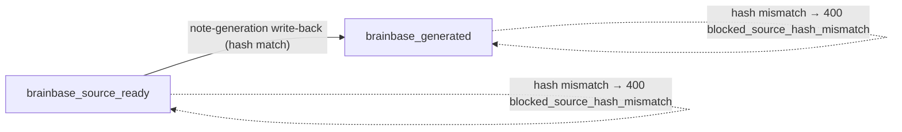
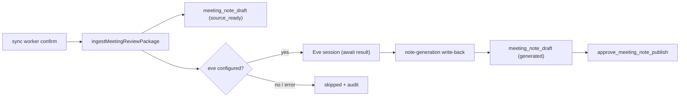
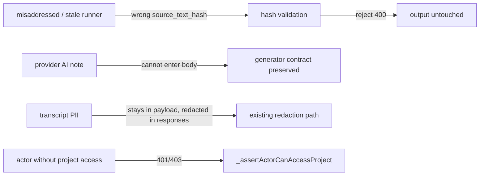

# Meeting Note Generation DAG Wiring Spec

## Transcript Segment Normalization

`normalizeSourceArtifact` must normalize transcript text that arrives as a JSON-encoded segment array before any hashing or preview extraction.

Detection: the trimmed transcript text parses as JSON to an array whose elements are objects carrying a string `content` (or `text`) field. Anything else passes through unchanged.

Expansion:

```text
[{"content": "お疲れ様です。", "speaker": "Speaker 1", "start_time": 80}, ...]
→
Speaker 1: お疲れ様です。
Speaker 2: ...
```

- Segment order is preserved as received.
- `speaker` (fallback `original_speaker`) prefixes each line when present; segments without a speaker emit the content line alone.
- Consecutive segments by the same speaker stay on separate lines (no merging).
- The result feeds `source_text`, `source_text_length`, `text_preview`, and `transcript_hash`. JSON braces and `\uXXXX` escapes must not survive into any of these fields.
- If every segment normalizes to an empty line, the raw payload is kept as-is — an intentional exception so upstream corruption stays visible downstream.

## Ingest Auto-Dispatch

After `ingestMeetingReviewPackage` records outputs and human steps (non-idempotent path only), the service attempts to dispatch the `transcript_to_meeting_note` loop intent:

- If `eveSessionClient.isConfigured()` is false → skip with `reason: 'eve_not_configured'`.
- If `dispatchLoopIntentToEve` throws → skip with `reason: 'dispatch_failed'`; the error message is recorded in the audit log entry `workflow.meeting_pack.note_generation.dispatch_skipped`.
- On success → `status: 'requested'` with the Eve session run id, audit log entry `workflow.meeting_pack.note_generation.dispatch_requested`.

Response contract (added to `meeting_review_ingest`):

```json
{
  "note_generation_dispatch": {
    "status": "requested | skipped",
    "reason": "eve_not_configured | dispatch_failed | loop_intent_missing",
    "loop_intent_id": "loop_...",
    "eve_session_run_id": "run_... (requested only)"
  }
}
```

Idempotent replays do not re-dispatch and return `status: 'skipped'`, `reason: 'idempotent_replay'`.

Secondary idempotency (source artifact match): `package_id` はtranscript hash由来のため、hash方式の変更（transcript正規化等）で同一録音のpackage_idが変わり得る。ingestは `source_event.mcp_resource_uri`（fallback: `artifact_ref`）+ providerの安定キーで既存runを照合し、一致すれば `idempotent: true` / `idempotent_source: 'source_artifact_match'` / `prior_package_id` を返して重複run・output・human stepを作らない（INV-note-dag-010 / AC-012 / S-004）。

## Note Generation Write-Back Contract

`POST /api/workflows/control/meeting-pack/note-generation`

Request:

```json
{
  "org_id": "org_unson",
  "project_id": "brainbase",
  "package_id": "meeting-source:msrc_...",
  "source_text_hash": "sha256-of-normalized-primary-transcript",
  "note": {
    "title": "optional new title",
    "body": "# 議事録\n\n..."
  },
  "runner": { "type": "eve", "session_id": "..." }
}
```

- `run_id` may be passed instead of `package_id`; when only `package_id` is given the run id is derived with the same stable-id scheme as ingest.
- `note.body` is required and must be a non-empty string.
- `source_text_hash` is required and must equal the current `payload.source_text_hash` of the `meeting_note_draft` output → otherwise 400 `blocked_source_hash_mismatch`.
- Unknown run → 404. Run without a `meeting_note_draft` output → 400 `blocked_note_output_missing`.
- Missing `org_id` or `project_id` → 400 `blocked_invalid_note_generation`.

Effect on the `meeting_note_draft` output payload:

- `body` (and `title` when provided) replaced with the generated minutes.
- `generation_status: 'brainbase_generated'`, `generated_at`, `generated_by` (runner echo) set.
- `generator: 'brainbase_meeting_pack'`, `generation_source: 'transcript_to_meeting_note'`, `provider_note_authoritative: false` preserved.
- `source_text_hash`, `source_transcripts`, `source_event` provenance preserved untouched.
- Output `preview` refreshed from the new payload.
- Repeated write-backs overwrite the note and are audited (`workflow.meeting_pack.note_generation.recorded`); `generation_status` never returns to `brainbase_source_ready`.

## State Transitions

`meeting_note_draft` output payload state machine (kind: state):



Scenario clauses for state transitions (spec.json canonical ids: ST-001→S-005, ST-002→S-006, ST-003→S-007, ST-004→S-008, ST-005→S-009):

- ST-001: ingest直後の `meeting_note_draft` outputは `generation_status: brainbase_source_ready` で作成される（transition: none → brainbase_source_ready）。
- ST-002: hash一致の書き戻しで `brainbase_source_ready → brainbase_generated` へ遷移する（S-003）。
- ST-003: `brainbase_generated` 状態への再書き戻しは `brainbase_generated` に留まり、`brainbase_source_ready` へ後退しない（S-003）。
- ST-004: hash不一致・run不在・body欠落の書き戻しは状態遷移を起こさず、outputは変更されない（S-003）。
- ST-005: dispatch結果は `requested | skipped(eve_not_configured | dispatch_failed | loop_intent_missing | idempotent_replay)` のいずれかで確定し、ingest run状態（waiting_human）へ影響しない（S-002）。

## Generation Flow (kind: flow)



## Threat Model (kind: threat_model)



- 書き戻しは `org_id` / `project_id` / run帰属 / `source_text_hash` の4点一致を要求し、別会議・別プロジェクトへの誤書き込みを遮断する。
- provider生成noteを本文へ昇格させる経路は追加しない（`provider_note_authoritative: false` 維持、INV-note-dag-007）。
- transcript本文（PII含みうる）はresync preview応答に露出しない既存契約を変更しない（INV-brainbase-note-008 継承）。

## Out of Scope

- The generation prompt/runner implementation inside the Eve session.
- Changing human step semantics, task/decision candidate heuristics, or Graph SSOT playbook resolution.
- Backfilling already-ingested source-ready drafts.
