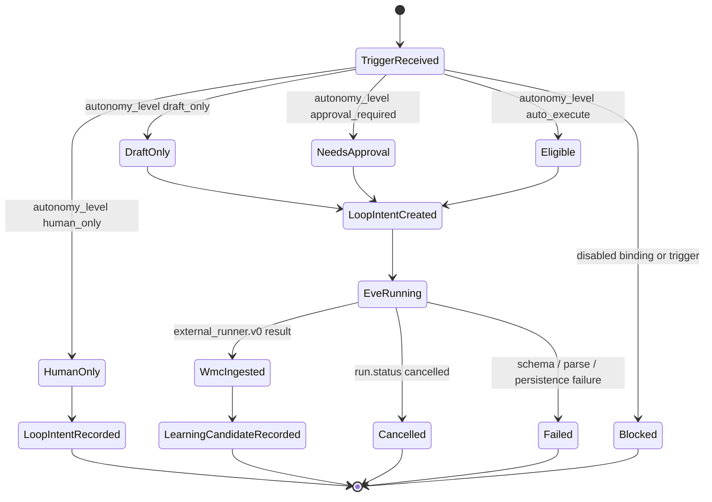

# Org Agent Loop Control v0 Spec

## Contract

Org Agent Loop Control v0は、Eve接続前提でBrainbase側が持つRole Agent、Workflow選択、Trigger、Loop Eligibilityの最小契約である。

## Data Model

| Collection | Required Fields | Purpose |
|---|---|---|
| `role_agent_instances` | `id`, `org_id`, `project_id`, `role_archetype_id`, `name`, `owner_id`, `context_policy`, `tool_scope`, `workflow_constraints` | 組織別のAgent設定 |
| `workflow_templates` | `id`, `name`, `workflow_kind`, optional `org_id`, optional `project_id`, optional `judgment_dag_id` | Role Agentが選べるWorkflow候補 |
| `workflow_bindings` | `id`, `org_id`, `project_id`, `role_agent_instance_id`, `workflow_template_id`, `autonomy_level`, `enabled` | AgentとWorkflow候補の接続 |
| `workflow_triggers` | `id`, `org_id`, `project_id`, `workflow_binding_id`, `trigger_type`, `enabled` | human / event / schedule入口 |
| `loop_intents` | `id`, `org_id`, `project_id`, `workflow_binding_id`, `trigger_id`, `input_payload`, `eligibility` | 実行前の判断記録。`input_payload` はJSON互換の実入力または `null` を保存する |

## Allowed Values

- `trigger_type`: `human`, `event`, `schedule`
- `autonomy_level`: `human_only`, `draft_only`, `approval_required`, `auto_execute`
- `eligibility.status`: `human_only`, `eligible`, `needs_approval`, `blocked`

## Mapping

| Brainbase Field | Eve / WMC Surface |
|---|---|
| `role_agent_instances.id` | `external_runner.v0 run.role_agent_instance_id` |
| `workflow_templates.id` | `external_runner.v0 run.workflow_template_id` |
| `workflow_triggers.id` | `external_runner.v0 run.trigger_id` |
| `loop_intents.id` | `external_runner.v0 run.loop_intent_id` |
| `workflow_bindings.autonomy_level` | `loop_intents.eligibility` と Run Trace Eligibility |
| `org_id` | WMC workflow/run/context/human/output/audit と Learning Candidate `org_ids[]` |

## Gate Rules

- Role Agent Instance、Workflow Binding、Workflow Trigger、Loop Intentは `org_id` を必須にする。
- Graphの `org_id` / `project_id` / `person_id` / `raci_id` は参照IDとして扱い、Role AgentやTriggerをGraph SSOTの新しい真理として直入れしない。
- `org_id` はGraph同期済みproject configのproject id / alias / repo由来キーで解決できる既知参照だけを保存できる。WMCは任意の `org_id` 文字列を新規組織真理として作ってはならない。
- `project_id` がある場合は既存project accessと同じ選択可能性・アクセス検証を使う。
- Workflow Templateに `project_id` がある場合、作成・一覧・Binding時に既存project accessと同じアクセス検証を使う。
- project-scoped Workflow Template一覧は、同じprojectのtemplateに加えてglobal templateも候補として返す。
- 非adminのWorkflow Template作成は `project_id` を必須にし、project grantを持たないactorがglobal/org-scoped templateを作成できないようにする。
- Workflow Bindingの `org_id` はRole Agent Instanceの `org_id` と一致しなければならない。
- org限定Workflow Templateの `org_id` がある場合、Workflow Bindingの `org_id` と一致しなければならない。
- project限定Workflow Templateの `project_id` がある場合、Workflow Bindingの `project_id` と一致しなければならない。
- Workflow Triggerの `org_id` はWorkflow Bindingの `org_id` と一致しなければならない。
- Workflow Triggerの `project_id` はWorkflow Bindingの `project_id` と一致しなければならない。
- Loop Intentの `project_id` はWorkflow BindingおよびWorkflow Triggerの `project_id` と一致し、指定したTriggerは同じBindingに属さなければならない。
- Loop Intentは `input_ref`、`input_summary`、`input_payload` を保存でき、`input_payload` は任意の文字列ではなくJSON互換object/arrayまたは `null` として保持する。
- disabledなBindingまたはTriggerから作るLoop Intentは `eligibility.status=blocked` にする。
- Eve ingestでRole Agent Instance、Workflow Template、Workflow Binding、Trigger、Loop Intent参照を受け取る場合は `run.org_id` を必須にし、WMCとLearning Candidateへ決定的に伝播する。
- Eve ingestでRole Agent Instance、Workflow Template、Workflow Binding、Trigger、Loop Intent参照を受け取る場合、Brainbase側の既存台帳に存在し、`org_id` / `project_id` / parent lineageが一致しなければならない。
- Eve ingestでLoop Control参照付きpayloadが既存 `workflow_id` を指定する場合、既存Workflowの `org_id` / `project_id` は `run.org_id` / `run.project_id` と一致しなければならず、orgなしWorkflowをorg付きLoop Control runへ再利用してはならない。
- Eve ingest中にWMC run/context/output/audit保存の途中で失敗した場合、Workflow Mission Controlの部分保存をrollbackし、後続retryをsilent duplicateにしない。
- Eve ingestのduplicate replayは保存済みのrun/context/human/output/audit/Learning Candidateと再送payloadの安定フィールドが一致する場合だけduplicateとして扱い、内容差分がある再送は保存前に拒否する。
- Learning Candidateの外部Candidate Store書き込みに失敗した場合、WMC runをrollbackせず、`external_runner.learning_candidate.deferred` auditと `persistence_status=deferred` を証跡として残す。
- Eve `run.status=cancelled` はWMC `status=cancelled`、`closure_state=closed`、`action_required=none` に正規化し、承認待ちや再試行待ちとして扱わない。

## Scenario Clauses

- S-001: `workflow state transition` UnsonとSalesTailorに同じ `role_archetype_id=sales` を持つRole Agent Instanceを別 `org_id` で保存できる。
- S-002: `workflow state transition` `human`、`event`、`schedule` triggerを同じBindingに紐付け、入力payloadを保持したまま同じEligibility構造へ遷移できる。
- S-003: `workflow state transition` `autonomy_level=approval_required` のLoop Intentは `eligibility.status=needs_approval` として保存される。
- S-004: `workflow state transition` disabled Bindingまたはdisabled Triggerから作るLoop Intentは `eligibility.status=blocked` として保存され、Agent Loop Control UIでenabled/disabled状態を確認・設定できる。
- S-005: `workflow state transition` `autonomy_level=human_only` のLoop Intentは `eligibility.status=human_only` として判断記録だけを保存し、Eve実行へ進めない。
- S-006: `workflow state transition` Eve payloadの `org_id` とLoop Control参照はRun TraceとLearning Candidateへ伝播される。
- S-007: `workflow retry matrix` `human`、`event`、`schedule` triggerは同じBindingから個別Loop Intentとして再生できる。
- S-008: `workflow rollback guard` Role Agent / Workflow Template / Binding / Trigger / Loop Intentの管理APIは `/api/workflows/control/...` を正とし、旧パス名と同名のWorkflow IDが存在する場合は既存 `GET /api/workflows/:workflowId` を優先する。
- S-009: `workflow rollback guard` org不一致のRole Agent / Workflow Binding / Trigger / Loop Intent / 既存Workflow再利用は保存前に拒否される。
- S-010: `schema_failure` Loop Control参照付きで `run.org_id` が空または欠落したEve payload、不正な `trigger_type`、不正な `autonomy_level` は保存前に拒否される。
- S-011: `auth_denied` 未認証の外部runner ingestはWorkflow Mission Controlへ入らない。
- S-012: `workflow state transition` Eve `run.status=cancelled` はWMC `status=cancelled`、`closure_state=closed`、`action_required=none` として保存され、承認待ちや再試行待ちには入らない。
- S-013: `parse_failure` malformed JSONまたは非object external runner payloadはparser/contract境界で拒否され、WMC run/context/output/auditへ保存されない。
- S-014: `retry_or_async_failure` 同じEve external runの同一内容再送はduplicateとして同じWMC runを返し、内容差分のある再送は `duplicate_payload_mismatch` として拒否する。
- S-015: `persistence_failure` WMC run/context/output/auditは部分保存を許容せず、Learning Candidateは保存済みまたはdeferred audit evidence付きで可視化される。

## Design Diagrams

### Flow Diagram (`kind: flow`)

```mermaid
flowchart LR;
  human["Human trigger"] --> trigger["Workflow Trigger<br/>human / event / schedule"];
  event["Event trigger"] --> trigger;
  schedule["Schedule trigger"] --> trigger;
  trigger --> eligibility["Loop Eligibility Gate"];
  eligibility --> intent["Loop Intent"];
  intent --> wmc["Workflow Mission Control"];
  wmc --> adapter["Eve Runtime Adapter<br/>external_runner.v0"];
  adapter --> eve["Eve Agent Runtime"];
  eve --> tools["Tools / Channels / Schedules / Sandbox"];
  tools --> eve;
  eve --> adapter;
  adapter --> wmc;
  wmc --> kg["Candidate Store / Personal KG"];
  wmc --> graph["Graph SSOT refs<br/>org / project / person / decision"];
```

### State Diagram (`kind: state`)



## Production Path Matrix

| Surface | Input | Persistence | Evidence |
|---|---|---|---|
| Role Agent registry | `POST /api/workflows/control/role-agents` | `role_agent_instances` | `tests/server/routes/workflows.test.js` |
| Workflow selection | `POST /api/workflows/control/bindings` | `workflow_bindings` | `tests/server/services/workflow-org-agent-control.test.js` |
| Trigger | `POST /api/workflows/control/triggers` | `workflow_triggers` | `tests/server/services/workflow-org-agent-control.test.js` |
| Loop Eligibility | `POST /api/workflows/control/loop-intents` | `loop_intents.input_payload` + `loop_intents.eligibility` | `tests/e2e/story-org-agent-loop-control-v0-contract.spec.ts` |
| Agent Loop Control UI | `/workflows.html` Agent Loop Control | Binding / Trigger enabled state and Loop Intent creation form | `tests/e2e/story-org-agent-loop-control-v0-contract.spec.ts` |
| Eve ingest | `POST /api/external-runner/ingest` | WMC run/context/output/audit + Learning Candidate stored/deferred evidence | `tests/server/services/external-runner-ingest-service.test.js` |
| UI trace | `/workflows.html` Run Trace | Decision Context display | `tests/e2e/story-org-agent-loop-control-v0-contract.spec.ts` |

## Workflow Replay Matrix

| Scenario | Input | Expected replay result |
|---|---|---|
| Human request | `trigger_type=human` + `input_payload` | Loop Intent is created with the binding eligibility and stored input payload |
| Event request | `trigger_type=event` + `input_payload` | Loop Intent uses the same binding eligibility as human and stores event input payload |
| Schedule request | `trigger_type=schedule` + `input_payload` | Loop Intent uses the same binding eligibility as human and stores schedule input payload |
| Approval-required binding | `autonomy_level=approval_required` | `eligibility.status=needs_approval` |
| Human-only binding | `autonomy_level=human_only` | `eligibility.status=human_only`; Loop Intent is retained as a decision record and does not advance to Eve |
| Disabled binding | `enabled=false` | `eligibility.status=blocked` |
| Disabled trigger | `enabled=false` | `eligibility.status=blocked` |
| Eve return | `external_runner.v0 run.org_id` | WMC and Learning Candidate include org and loop refs |
| Eve cancelled | `external_runner.v0 run.status=cancelled` | WMC run is `status=cancelled`, `closure_state=closed`, `action_required=none` |
| Malformed runner request | malformed JSON / non-object payload | Parser/contract rejects before WMC persistence |
| Eve retry / async resend | same `runner.external_run_id` and org/project with same normalized payload | Duplicate response returns the same WMC run without double persistence |
| Eve retry / async conflict | same `runner.external_run_id` and org/project with changed normalized payload | Reject with `duplicate_payload_mismatch` before suppressing changed evidence |
| Partial storage failure | missing WMC run/context/output/audit or silent Learning Candidate failure | Treated as `persistence_failure`; Candidate Store write failure must be visible deferred audit evidence |

## Verification

- `tests/server/routes/workflows.test.js`
- `tests/server/services/workflow-org-agent-control.test.js`
- `tests/server/services/external-runner-ingest-service.test.js`
- `tests/e2e/story-org-agent-loop-control-v0-contract.spec.ts`
