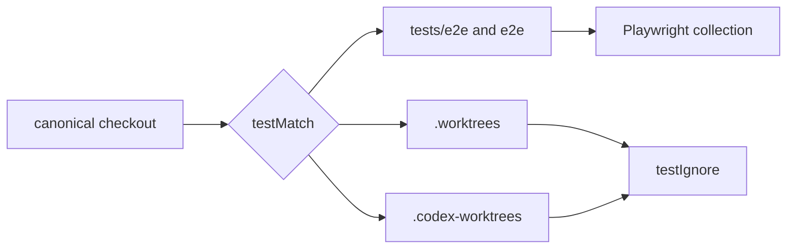

# SPEC: Playwright Worktree Discovery Boundary

## Invariants

- **INV-1**: 正本の`tests/e2e/**/*.spec.@(js|ts)`、`tests/e2e/**/*.test.@(js|ts)`、`e2e/**/*.spec.@(js|ts)`は探索対象である。
- **INV-2**: パス中に`.worktrees/`を含むファイルは探索対象外である。
- **INV-3**: パス中に`.codex-worktrees/`を含むファイルは探索対象外である。
- **INV-4**: test collection境界の変更はserver、port、project、reporter契約を変更しない。

## Contracts

- **C-1**: `playwright.config.js`はリポジトリルートを`testDir`として維持する。
- **C-2**: `testIgnore`は`**/.worktrees/**`と`**/.codex-worktrees/**`を明示する。
- **C-3**: Playwright collectorは除外先のファイルをimportしない。

## Diagrams

- kind: flow
  path: `docs/specs/story-playwright-worktree-discovery-boundary.md`
  purpose: canonical checkoutからtestMatchを通った候補を、nested worktree境界で除外して収集する流れを示す。

## Verification

| Clause | Evidence |
|---|---|
| INV-1, C-1 | `tests/unit/playwright-config-boundary.test.js`、`playwright test --list` |
| INV-2, INV-3, C-2 | `tests/unit/playwright-config-boundary.test.js` |
| C-3 | 擬似worktreeを置いた`playwright test --list` |
| INV-4 | 設定snapshot契約と差分確認 |

## Anti-patterns

- **AP-1**: 現在存在するworktree名を個別列挙する。
- **AP-2**: 正本テスト配置を一方だけへ狭める。
- **AP-3**: Gitの追跡・ignore契約をテストrunnerの探索契約として代用する。
