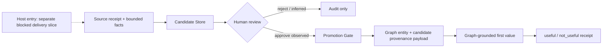
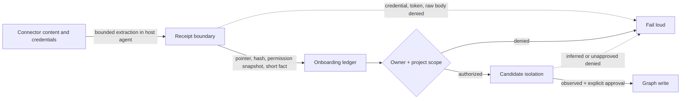

# 10分オンボーディング実動Spec

## Delivery Boundary

本Specは認証済みhostが作成したbounded source receiptを受け取った後のserver/API/MCP runtimeだけを規定する。connector discovery、provider authorization、bounded content retrieval、Agent SkillからMCP toolsへのbindingは`story-ten-minute-world-onboarding` AC-001..006の別PRであり、このSpecのfixtureはそのhost entryを実装・検証した証拠ではない。

## Invariants

- RT-INV-001: runはentity正本ではなく、Graph SSOTを代替しない。
- RT-INV-002: connector credential、token、raw source body、answer本文をrun ledgerへ保存しない。
- RT-INV-003: candidateはsource receipt、evidence ID、permission snapshot、owner/project scopeを持つ。
- RT-INV-004: `observation_class=inferred` はGraphへ昇格できない。
- RT-INV-005: Graph writeはrequest actorのaccessを使ったPromotion Gate経由だけで行う。
- RT-INV-006: first-value receiptは同一runでpromoted済みGraph IDだけを参照する。
- RT-INV-007: `first_value_answer_reviewed`はuseful/not_usefulの人の判定後だけ成立する。
- RT-INV-008: source collection失敗、Graph unavailable、権限拒否を空データや成功に変換しない。
- RT-INV-009: runの取得とmutationはproject scopeだけでなくowner本人に限定し、同一projectの別actorを拒否する。
- RT-INV-010: Graph昇格はGraph entity payloadの`derived_from_candidate_id`とCandidate Storeの`promoted_graph_entity_id`で双方向provenanceを保持し、cross-store IDをGraph edge endpointとして使わない。Graph障害、candidate最終化失敗、run ledger失敗後もapprovedまたはpromoted candidateから同じGraph IDへ安全に再結合できる。
- RT-INV-011: `first_value_answer_reviewed`はterminalであり、source追加、candidate review、first-value上書きで過去状態へ戻さない。
- RT-INV-012: `permission_snapshot`は秘密値を持たないallowlist fieldだけを受理し、8KiB以内のscalarまたはbounded string arrayに限定する。
- RT-INV-013: source batchは全candidateをwrite前に検証し、deterministic candidate IDで途中失敗後の同一payload再試行を回復する。
- RT-INV-014: 同一runの`source_id`はreceipt identityに対してimmutableであり、hash、permission、evidence pointerの別版はcandidate write前に409で拒否する。
- RT-INV-015: production JSON run ledgerのcold-start loadは同一processで単一化し、readは初回loadと進行中mutationの完了を待つ。mutationはread-modify-writeからatomic file replacementまで直列化し、再起動直後を含む同時API requestでsource receiptまたはworkflow stateを失わない。JSON repositoryはsingle-writer processに限定する。
- RT-INV-016: approve/rejectのreview reasonは1..500文字かつsecret-like値を含まない場合だけ受理し、検証失敗時はCandidate Store、監査event、Graph、run stateを変更しない。
- RT-INV-017: JSON run ledgerは`onboarding_runs.v1`だけを読み書きする。欠落または未知のschema versionは503でfail-closedにし、version skew中の旧/新processが既存ledgerを黙って変換・上書きしない。

## Workflow Scenario

- RT-SCENARIO-001: `initialized → source_ready → candidates_ready → promotion_reviewed → first_value_ready → first_value_answer_reviewed`を正規遷移とする。中断した非terminal stateはretry/resumeできるが、terminalの`first_value_answer_reviewed`から過去状態へrollbackしない。

## HTTP contract

| Method | Path | Purpose |
| --- | --- | --- |
| POST | `/api/onboarding/runs` | value target、source mode、project scopeでrun開始 |
| GET | `/api/onboarding/runs/:runId` | actor scope内のrunとcandidate projectionを取得 |
| POST | `/api/onboarding/runs/:runId/sources` | source receiptと抽出candidate factを取り込む |
| POST | `/api/onboarding/runs/:runId/candidates/:candidateId/review` | approve/rejectを記録し、approve時だけGraphへ昇格 |
| POST | `/api/onboarding/runs/:runId/first-value` | answer hash、promoted IDs、不足contextを記録 |
| POST | `/api/onboarding/runs/:runId/first-value/review` | useful/not_usefulと600秒判定を確定 |

## Input constraints

- `value_target`: 1..500文字。
- `project_code`: actorの`projectCodes`に含まれる値。
- `source_mode`: `mcp|drive|gmail|local_folder|single_document`。
- `content_hash`, `answer_hash`: `sha256:<64 lowercase hex>`。
- `evidence_ref`: 1..1000文字、secretらしいkey/valueを含まない。
- candidate `subject_type`: Candidate Store catalogが許可するtype。
- candidate `fact`: raw本文ではない1..2000文字の抽出fact。
- candidate `observation_class`: `observed|inferred`。
- `permission_snapshot`: allowlist fieldのみ、8KiB以内、scalarまたは最大50件の文字列配列。`token|id_token|private_key`等の秘密fieldは拒否する。
- candidate ID: `run_id + source_id + evidence_id`から決定的に導出し、同一payloadの再試行で再利用する。payload不一致は409で拒否する。
- source ID: 同一runではreceipt identityに一意に束縛し、別版を取り込む場合は新しい`source_id`を使う。
- source event ID: durable receipt検索では`source_id`のSHA-256を境界付きprefixに使う。opaqueな`source_id`同士が前方一致しても別sourceとして扱い、取り込み順序で409判定を変えない。
- review `reason`: 指定時は1..500文字。credential、Bearer token、secret assignment、過剰encodingをserver-sideでmutation前に拒否する。

## Verification

- service unit: state transition、scope、secret rejection、batch事前検証とidempotent retry、inferred non-promotion、promoted-ID subset、600秒budget。
- route integration: auth contextとHTTP status。
- MCP unit: endpoint、Bearer token、project scope、error/unavailable contract。
- vertical fixture: Drive型receiptを用いてrun開始からanswer reviewまで通し、fake Graph writerへのwriteを確認する。host connectorとAgent Skillはfixture境界の外であり、provider live runを証明しない。

## Release and rollback contract

- rollout前にsingle-writer processを停止し、`var/onboarding-runs.json`をreadable backupとして保持する。新processは`onboarding_runs.v1`をloadできることを確認してからtrafficを受ける。
- MCP adapterとserver routeは同一releaseで配布する。version skewでserver routeが存在しない場合や非2xxを返す場合、MCPは`unavailable`としてfail loudし、空データや成功へ変換しない。
- code rollbackはPromotion前のrun/candidateを削除しない。`onboarding_runs.v1`を読める直前releaseへ戻し、同じreceipt identityとdeterministic IDでresumeする。
- Graph昇格後のentityはcode rollbackで削除しない。Candidate Storeのauditと`promoted_graph_entity_id`を保持し、誤昇格の訂正・無効化はGraph authority側の別の監査可能なmutationとして扱う。
- 未知のledger schemaを検出したprocessはread/writeを止める。対応releaseへforward-fixするか、backupを別pathへ復元してから再開し、未知schemaを旧processで上書きしない。

## Flow diagram

## Threat model diagram

