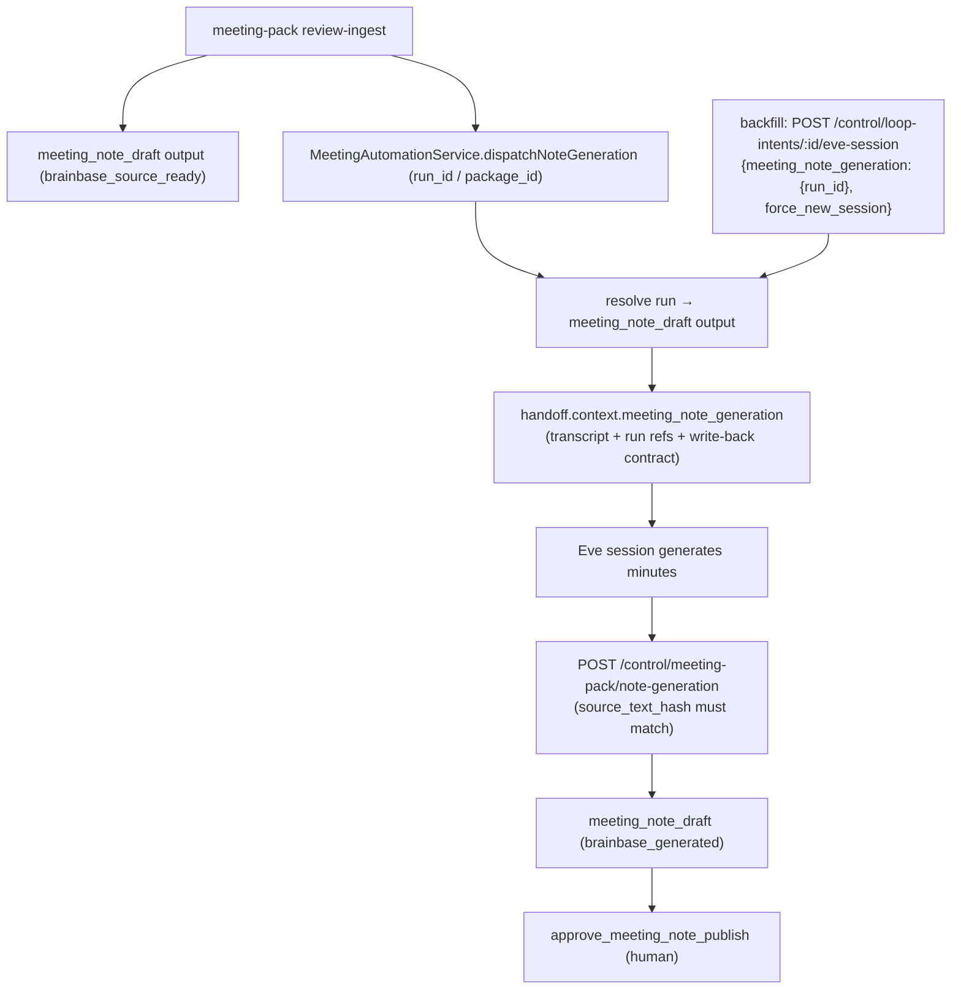

# Eve dispatch handoffにtranscript本文と書き戻し契約を含める

## Story

story-meeting-note-generation-dag-wiring（PR #1018/#1019）でReview Package ingest後に `transcript_to_meeting_note` loop intentをEve sessionへ自動dispatchする配線ができ、PR #1020で認証経路（Basic認証 + Vercel protection bypass）が開通した。しかし実dispatch検証（Eveセッション `wrun_01KX79SVFECJ1CN0VTP1TSTKRY`）で、Eve agentは「transcript・run識別子・書き戻し設定が欠落している」としてfailedエンベロープを返した。

原因は handoff.context の構成にある。`buildEveSessionContext` はloop intent / role agent / template / binding / triggerの制御メタデータのみを渡しており、生成対象の一次資料（正規化transcript）と、生成結果をどこへどう書き戻すかの契約（`POST /api/workflows/control/meeting-pack/note-generation`、`source_text_hash` 一致必須）が含まれていない。loop intentはorg/project/定義ごとの固定ID（複数のmeeting run間で共有）のため、loop intent単体からは対象runを特定できない。

このstoryでは、`transcript_to_meeting_note` のdispatchに対象runの参照（`run_id` / `package_id`）を受け渡し、handoff.contextへ以下を含める:

1. **正規化transcript本文**: 該当runの `meeting_note_draft` output payload（`body` と `source_transcripts[].text`）。
2. **run識別子**: `run_id` / `package_id` / `source_text_hash`。
3. **書き戻し契約**: `POST /api/workflows/control/meeting-pack/note-generation` の必須フィールドとhash一致要件。

これによりEve agentが議事録を生成し、書き戻しAPIで `generation_status: brainbase_source_ready → brainbase_generated` へ遷移できる状態にする。

## Invariants

- INV-handoff-001: `meeting_note_generation` context は `transcript_to_meeting_note` 系のdispatchで対象run参照が与えられた場合にのみ付与する。他のloop intentのdispatch挙動（handoff構造・冪等性・タイムアウト回復）は変えない。
- INV-handoff-002: 対象runの解決は `run_id`（または `package_id` から導出した stable run id）で行い、runの `org_id` / `project_id` がloop intentと一致しない場合はdispatchを拒否する（別プロジェクトのtranscriptをhandoffに載せない）。
- INV-handoff-003: 対象runに `meeting_note_draft` output が存在しない、または `payload.source_text_hash` が欠落している場合、`meeting_note_generation` 参照付きdispatchは明示的なvalidationエラーで失敗する（transcriptなしでEveへ投げない）。
- INV-handoff-004: handoffへ含めるのは該当runのoutput payload由来のデータのみ。continuation_token等のserver-owned secretはこれまで通りhandoffに含めない。
- INV-handoff-005: ingest経由の自動dispatch（`MeetingAutomationService.dispatchNoteGeneration`）はbest-effortのまま。context構築失敗はingest失敗にせず `note_generation_dispatch.status: skipped` + reason としてauditに記録する。
- INV-handoff-006: 書き戻し契約の記述はサーバー実装（`recordNoteGeneration`）の検証仕様（必須フィールド・`source_text_hash` 一致・`run_id`/`package_id` いずれか必須）と一致させる。契約に無い書き込み経路を新設しない。
- INV-handoff-007: `meeting_note_generation` 参照なしの従来dispatch（他のloop intent、手動dispatch）は後方互換で通る。
- INV-handoff-008: handoff contextはeve channel APIの `clientContext` フィールドで送信する。eveの `parseCreateBody` は `context` フィールドをagentへ渡さないため、`clientContext` に載せない限りtranscript・run識別子・書き戻し契約はEve agentに到達しない（`context` はforward compatibilityのため併送する）。

## DAG

## Acceptance Criteria

- [ ] AC-001: `dispatchLoopIntentToEve` は `input.meeting_note_generation.run_id`（または `package_id`）を受け取り、該当runの `meeting_note_draft` output を解決して `handoff.context.meeting_note_generation` を構築する。
- [ ] AC-002: `handoff.context.meeting_note_generation` に `run_id` / `package_id` / `source_text_hash` / transcript本文（`note_source.body` と `source_transcripts`）/ 書き戻し契約（method・path・必須フィールド・hash一致要件）が含まれる。
- [ ] AC-003: ingest成功時の自動dispatchは `meeting_note_generation` 参照（runId/packageId）を渡し、Eveへのhandoffにtranscriptが含まれる。
- [ ] AC-004: runがloop intentと異なるorg/projectに属する場合、dispatchは400（`blocked_meeting_note_generation_scope`）で拒否される。
- [ ] AC-005: 対象runに `meeting_note_draft` outputが無い、または `source_text_hash` が欠落している場合、dispatchは400（`blocked_meeting_note_generation_source_missing`）で拒否される。
- [ ] AC-006: `meeting_note_generation` 参照なしのdispatchは従来どおり成功し、handoff構造は変わらない（後方互換）。
- [ ] AC-007: ingest経由の自動dispatchでcontext構築が失敗した場合もingestは201で完了し、`note_generation_dispatch.status: skipped` + 理由がauditに記録される。
- [ ] AC-008: 既存runへのバックフィル手順（`docs/runbooks/eve-meeting-note-backfill.md`）で、`brainbase_source_ready` のままのrunを列挙し、手動dispatch APIで再dispatchできる。

## Scenario IDs

- S-001: Ingest auto-dispatch hands off the normalized transcript, run identifiers, and write-back contract to Eve, and Eve can address the note-generation write-back API from context alone.
- S-002: A dispatch that references a run in another org/project, or a run without a usable meeting_note_draft source, is rejected before any Eve session is created.
- S-003: Dispatches without a meeting_note_generation reference keep the existing handoff shape and semantics.
- S-004: Operators backfill existing brainbase_source_ready runs through the manual dispatch API following the runbook.

## Architecture Decision

ADR-unnecessary: dispatch入力への対象run参照追加という最小変更を採用。代替案（EveのBrainbase API直接参照、loop intent input_payloadへのtranscript同梱）は比較のうえ却下。境界・影響範囲はdispatch経路（workflow-service.js）に閉じ、公開契約は後方互換（参照なしdispatch不変）。ロールバックはgit revertで安全に戻せる（永続追加はadditiveなrun.metadataのみ）。後続followupとしてバックフィルの重複セッションガードを保留として追跡。書き戻し契約の正本はサーバー実装のまま。

代替案の比較: (1) EveにBrainbase APIを直接読ませる案は、Eve sandboxのネットワーク到達性が保証されないため却下。(2) loop intentの`input_payload`へtranscriptを持たせる案は、loop intentが複数run共有の固定IDで会議ごとの文脈を保持できないため却下。(3) 採用案（dispatch入力への対象run参照追加）が既存契約への影響最小の選択肢である。

境界と影響範囲: 変更はdispatch経路（`workflow-service.js`）とその証跡に閉じる。後方互換性は参照なしdispatchのhandoff構造不変で担保し、公開契約（`note-generation` API）は変更しない。

ロールバック: `git revert`で安全に戻せる。永続追加はadditiveな`run.metadata.meeting_note_generation`（hash参照のみ）で、旧コードはこのフィールドを読まない。

後続followup（許容・非ブロッキング）: バックフィルスクリプトのdispatch済みガード（重複セッション回避）、message override時のタスク指示欠落は保留として追跡する。

## Verification

- Unit: `tests/server/services/workflow-org-agent-control.test.js`
- Unit: `tests/server/routes/workflows.test.js`
- VibePro: `vibepro story diagnose . --id story-eve-dispatch-handoff-transcript-context --run-graphify`
- PR gate: `vibepro pr prepare . --base origin/develop --story-id story-eve-dispatch-handoff-transcript-context`
