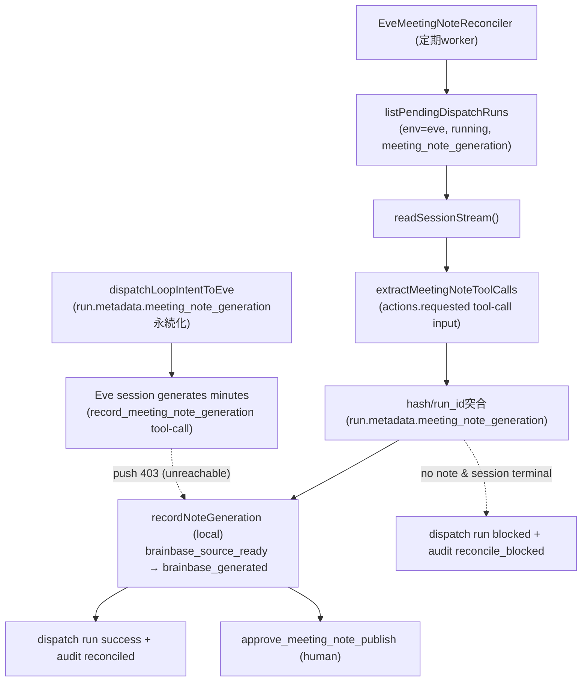

# Eve議事録のpull型reconciler（セッションstream監視→ローカル書き戻し）

## Story

story-eve-dispatch-handoff-transcript-context（PR #1022/#1023）でtranscript同梱handoffがEve agentへ到達し、議事録生成までは成功するようになった。しかしEve→Brainbaseのpush型書き戻しは構造的に不可能であることがe2e検証で確定した: Eve（Vercel `unson/brainbase-meeting-agent`）の書き戻し先 `https://bb.unson.jp` はLightsail上の別brainbaseインスタンスであり、meeting-packの台帳はMacローカル（`localhost:31013`）にのみ存在してVercelから到達不能。`record_meeting_note_generation` の外部POSTはHTTP 403で失敗する。

一方、実セッション（`wrun_01KX82TDZTW4X1A2RVCA51RCRE`）のstream検証で、`record_meeting_note_generation` tool-callの `actions.requested` イベントには生成済み議事録の全文（`org_id` / `project_id` / `run_id` / `package_id` / `source_text_hash` / `note.title` / `note.body`）が、tool実行の成否に関係なく含まれることを確認した。

このstoryでは、書き戻しの向きを反転する（push → pull）:

1. **reconciler worker**: brainbase server内の定期worker（`EveMeetingNoteReconciler`）が、dispatch済みで未完了のEve run（`env=eve` / `status=running` / `metadata.meeting_note_generation` あり）を列挙する。
2. **stream pull**: 既存の `EveSessionClient.readSessionStream()`（Basic認証 + Vercel bypass対応済み）でセッションstreamを取得し、`record_meeting_note_generation` tool-call inputから議事録を抽出する。
3. **突合と書き戻し**: dispatch時に永続化した `run.metadata.meeting_note_generation`（run_id / source_text_hash、PR #1022）と突合し、一致した場合のみローカルの `meetingAutomationService.recordNoteGeneration`（source_text_hash一致検証あり）を呼ぶ。
4. **run閉包**: 書き戻し成功でdispatch runを `success` で閉じる。セッションが議事録なしで終端（parked/completed/failed）した場合は `blocked` にして運用者へ可視化する。

## Invariants

- INV-reconciler-001: 書き戻しはMeeting Automationのnote-generation契約（`MeetingAutomationService.recordNoteGeneration`、`source_text_hash` 完全一致・`meeting_note_draft` output必須）のみを通す。契約に無い書き込み経路を新設しない。
- INV-reconciler-002: streamから抽出した議事録は、dispatch時に永続化した `run.metadata.meeting_note_generation.source_text_hash` / `run_id` と一致した場合のみ採用する。hash不一致のtool-callは書き戻さない。
- INV-reconciler-003: 対象ingest runの `meeting_note_draft` が既に `brainbase_generated` の場合はnoteを再書き込みしない。通常はdispatch runの閉包のみ行うが、同一sessionが進行中かつ候補outputがawaiting-Eveの場合は、noteを変更せず候補tool-callの到着またはsession終端までstreamのpollを継続する（冪等）。
- INV-reconciler-004: セッションが議事録なしで境界（parked / completed / failed）に達したdispatch runは `blocked` + `action_required: operator_review_eve_session` にし、無限ポーリングしない。生成途中（mid-turn）のセッションは変更せず次tickで再確認する。
- INV-reconciler-005: stream取得・書き戻しの一時失敗はrunを変更せずerrorとして記録し、次tickで再試行する（transient failureで状態を壊さない）。
- INV-reconciler-006: 公開承認（`approve_meeting_note_publish`）はBrainbase側humanゲートのまま。reconcilerはdraft更新（`brainbase_source_ready → brainbase_generated`）以上のことをしない。
- INV-reconciler-007: reconcilerはEve session clientが未設定なら何もしない。既存のdispatch経路・ingest経路の挙動は変えない。
- INV-reconciler-008: 監査証跡を残す: 書き戻し成功は `workflow.meeting_pack.note_generation.recorded`（既存）+ `...note_generation.reconciled`（dispatch run向け）、断念は `...note_generation.reconcile_blocked`。

## DAG

## Acceptance Criteria

- [ ] AC-001: reconcilerは対象Eve dispatch run（`env=eve` / `status=running` / `metadata.meeting_note_generation.run_id` / `metadata.runner.session_id`）のみを列挙し、セッションstreamの `record_meeting_note_generation` tool-call inputから議事録を抽出して、ローカル `recordNoteGeneration` で `generation_status: brainbase_source_ready → brainbase_generated` へ遷移させる。
- [ ] AC-002: 書き戻し成功時、dispatch runは `success` / `closure_state: closed` で閉じ、audit `workflow.meeting_pack.note_generation.reconciled`（dispatch run）と `workflow.meeting_pack.note_generation.recorded`（ingest run）が記録される。
- [ ] AC-003: `source_text_hash` が突合値と一致しないtool-callは書き戻されず、セッション終端時はdispatch runが `blocked` になる。
- [ ] AC-004: 生成途中（stream終端が境界イベントでない）のセッションはpendingのまま残り、次回実行で書き戻される。
- [ ] AC-005: 議事録なしでセッションが終端したdispatch runは `blocked` + `action_required: operator_review_eve_session` + audit `reconcile_blocked` になる。
- [ ] AC-006: 対象ingest runが既に `brainbase_generated` の場合、noteは再書き込みされない。候補outputがawaiting-Eveで同一sessionが進行中の場合だけstreamを継続して読み、それ以外はdispatch runを閉じる。
- [ ] AC-007: stream取得失敗はerrorとしてサマリーに記録され、dispatch runは `running` のまま次tickで再試行される。
- [ ] AC-008: `POST /api/workflows/control/meeting-pack/eve-note-reconcile` で手動実行でき、サマリー（checked/recorded/blocked/pending/errors）が返る。未配線時は503。
- [ ] AC-009: 定期実行は `BRAINBASE_EVE_NOTE_RECONCILER_ENABLED` / `_INTERVAL_MS` / `_IMMEDIATE` で制御でき、Eve client未設定時は起動しない。graceful shutdownで停止する。

## Scenario IDs

- S-001: A dispatched Eve session that generated minutes (even when its push write-back failed with 403) is reconciled: the note is recorded locally, the draft transitions to brainbase_generated, and the dispatch run closes with audit evidence.
- S-002: A tampered or mismatched source_text_hash in the session stream is rejected and the dispatch run is surfaced as blocked instead of writing back.
- S-003: In-progress sessions are left pending and reconciled on a later tick; transient stream failures do not mutate run state.
- S-004: Sessions that ended without a note call are marked blocked for operator review; already-generated targets close idempotently without re-writing.
- S-005: Operators can trigger reconciliation manually via the control API and control the scheduler through env vars.

## Architecture Decision

ADR-unnecessary: 既存部品（`EveSessionClient.readSessionStream`・`recordNoteGeneration`・`meeting-source` sync workerのスケジューラ型）を組み合わせた追加的workerで、公開契約の変更はない。

代替案の比較: (1) Eve→Lightsail bb.unson.jp経由の中継書き戻しは、meeting-pack台帳がMacローカルにしかなく台帳二重化を招くため却下。(2) Cloudflare Tunnel等でローカルAPIをEveへ公開する案は、書き込みAPIの外部公開となり認証レルム・セキュリティ境界を壊すため却下。(3) 採用案（Mac側からのpull）は既存の認証済みread経路（session stream）のみを使い、書き込みはローカル内で完結する。

境界と影響範囲: pull workerは `server/services/external-runner/`、書き戻し契約は `server/services/meeting-automation/` が所有する。dispatch経路・ingest経路・note-generationの外部HTTP契約は不変で、hash一致・output存在・scope検証は `MeetingAutomationService.recordNoteGeneration` が正本。

ロールバック: workerとroute追加はadditiveで、`BRAINBASE_EVE_NOTE_RECONCILER_ENABLED=0` で無効化可能。git revertで安全に戻せる（永続変更はdispatch runのstatus/metadata更新とauditのみ）。

## Verification

- Unit: `tests/server/services/eve-meeting-note-reconciler.test.js`
- Unit (regression): `tests/server/routes/workflows.test.js`, `tests/server/services/workflow-org-agent-control.test.js`
- VibePro: `vibepro story diagnose . --id story-eve-meeting-note-pull-reconciler --run-graphify`
- PR gate: `vibepro pr prepare . --base origin/develop --story-id story-eve-meeting-note-pull-reconciler`
