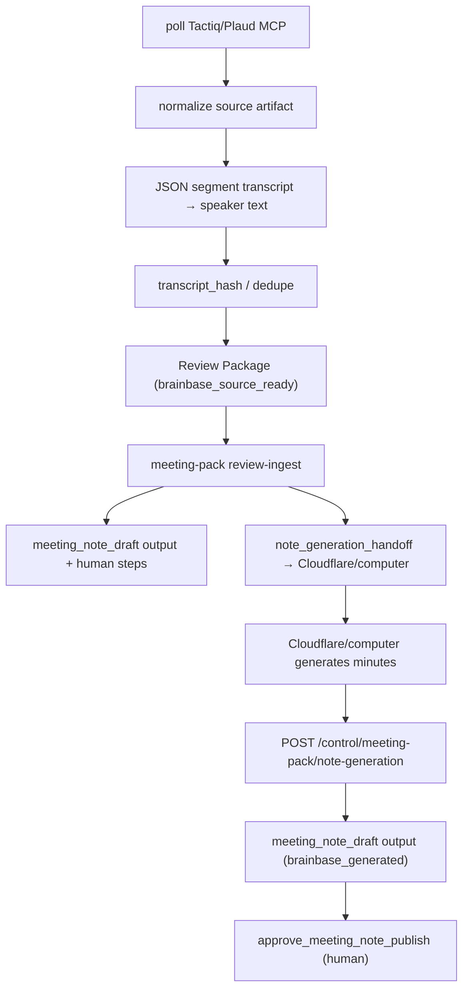

# Meeting Pack ingest後にBrainbase議事録生成DAGを接続する

## Story

story-meeting-source-brainbase-note-generation で、Meeting Source MCP sync workerはprovider transcriptを一次資料としたReview Package（`meeting_note_summary`、`generation_status: brainbase_source_ready`）をingestする契約になった。しかし現状はその「生成用一次資料」がそのまま「議事録ドラフト」outputとして人間承認（要対応）に出ており、`transcript_to_meeting_note` loop（`meeting-note-draft-dag-v1`）を通ってrunnerが生成した議事録は一度も作られない。`brainbase_source_ready` から先へ遷移させる経路がコード上に存在しないためである。

さらに、Plaud MCPのtranscriptはセグメント配列をJSONエンコードした文字列（`[{"content": "お...", "speaker": "Speaker 1", ...}]`）として返るため、一次資料自体が非可読なJSON文字列のまま `source_text` / `text_preview` / 議事録ドラフト本文に流出している。

このstoryでは以下を接続し、「Brainbase DAGを通って生成された議事録が要対応ドラフトに入る」状態にする:

1. **一次資料の可読性保証**: transcriptがJSONセグメント配列文字列の場合、話者付きプレーンテキストへ正規化してから `source_text` にする。
2. **ingest後の生成handoff**: Review Package ingest成功後、Cloudflare/computerが処理できる `note_generation_handoff` を返し、Brainbaseはhandoff準備状態をrun/auditに記録する。
3. **生成結果の書き戻しcontract**: runnerが生成した議事録本文で `meeting_note_draft` outputを更新するcontrol APIを追加し、`generation_status` を `brainbase_source_ready → brainbase_generated` へ遷移させる。

## Invariants

- INV-note-dag-001: `meeting_note_draft` outputの `generation_status` は `brainbase_source_ready → brainbase_generated` の単方向遷移。書き戻しcontract以外の経路で `brainbase_generated` にしてはいけない。
- INV-note-dag-002: 生成書き戻しは対象runの `meeting_note_draft` outputに対してのみ行い、`source_text_hash` の一致を要求する。hash不一致の書き戻しは受け入れない（別会議の議事録を書き込めない）。
- INV-note-dag-003: Review Package ingestは外部runtimeの起動可否に依存しない。`note_generation_handoff` は `ready | blocked` を返し、Brainbaseはruntime sessionを生成しない。
- INV-note-dag-004: Cloudflare/computerの起動、再試行、実行状態は外部runtimeが所有する。Brainbaseはhandoff、結果write-back、承認、監査だけを所有する。
- INV-note-dag-005: 人間承認（`approve_meeting_note_publish`）の既存フローは変更しない。生成はドラフト更新であって公開ではない。
- INV-note-dag-006: transcriptがJSONセグメント配列文字列（Plaud `data_content` 形式）の場合、話者付きプレーンテキストへ展開してから一次資料にする。JSON構造や `\uXXXX` エスケープを含む文字列を `source_text` / `text_preview` / 議事録ドラフト本文に露出させない。
- INV-note-dag-007: 書き戻しcontractは `generator: brainbase_meeting_pack` / `generation_source: transcript_to_meeting_note` の契約を維持し、provider生成note（`provider_note_authoritative: false`）を本文として採用する経路を作らない。
- INV-note-dag-008: 書き戻しはserver-to-server認証を要求せず既存workflows routerの認可（actor project access）に従うが、`org_id` / `project_id` / run帰属の検証は必須。
- INV-note-dag-009: transcript正規化はhash計算（`transcript_hash` / dedupe_key）より前に行い、正規化前後で二重クラスタを作らない（hashは正規化後テキストに対して計算する）。
- INV-note-dag-010: 同一の録音ソース（`source_event.mcp_resource_uri`）は、hash方式の変更でpackage_idが変わっても二重の承認待ちrunを作らない。ingestはpackage_id一致に加えsource artifact一致の二次冪等性を持つ。

## DAG

## Acceptance Criteria

- [ ] AC-001: `normalizeSourceArtifact` はJSONセグメント配列文字列のtranscriptを `Speaker N: content` 形式の複数行テキストへ展開し、`source_text` / `text_preview` にJSON構造・`\uXXXX` エスケープが現れない。
- [ ] AC-002: プレーンテキストtranscriptは従来どおり無変更で通過し、`transcript_hash` / dedupe / cursorの既存挙動は変わらない。
- [ ] AC-003: `ingestReviewPackage` 成功時、レスポンスに `note_generation_handoff` が含まれる。
- [ ] AC-004: loop intentがある場合、handoffは `status: ready`、`runtime_type: cloudflare_computer`、`run_id`、`package_id`、`output_key`、`write_back_path` を返す。
- [ ] AC-005: loop intentがない場合、handoffは `status: blocked` と理由を返し、成功扱いへ丸めない。
- [ ] AC-006: BrainbaseはCloudflare/computer sessionの作成、polling、reconcile APIを持たない。
- [ ] AC-007: `POST /api/workflows/control/meeting-pack/note-generation` は `package_id`（または `run_id`）+ `source_text_hash` + 生成本文を受け取り、`meeting_note_draft` outputのpayloadを更新して `generation_status: brainbase_generated` へ遷移させる。
- [ ] AC-008: `source_text_hash` 不一致の書き戻しは400（`blocked_source_hash_mismatch`）で拒否される。
- [ ] AC-009: 存在しないrun / `meeting_note_draft` output欠落への書き戻しは404/400で拒否される。
- [ ] AC-010: 書き戻し後の再書き戻し（再生成）は許可され、payloadは最新で上書きされ、audit logに記録される。`generation_status` が `brainbase_source_ready` へ後退することはない。
- [ ] AC-011: 既存のhuman steps・task/decision candidates・Graph SSOT playbook・idempotent replayの挙動は変えない。
- [ ] AC-012: hash方式変更等でpackage_idが変わった同一録音の再ingestは、`idempotent_source: source_artifact_match` として既存runへ収束し、重複run/output/human stepを作らない。

## Scenario IDs

- S-001: Plaud JSON segment transcript is normalized into speaker-attributed plain text before hashing, deduping, and Review Package generation.
- S-002: Review Package ingest returns a Cloudflare/computer handoff without creating or polling a runtime session.
- S-004: Re-syncing an already-reviewed recording under a changed hashing scheme converges to the existing run via the stable source artifact key instead of creating a duplicate package.
- S-003: A runner writes the generated meeting note back through the note-generation contract, the meeting_note_draft output transitions to brainbase_generated, and hash-mismatched or misaddressed write-backs are rejected.

## Architecture Decision

ADR-unnecessary: このフォローアップ（PR #1018 のVibeProレビュー指摘消化）は `public/workflows.html` のRun Trace Outputsパネルに既存の `payload.generation_status` を読む表示専用バッジを1つ追加するのみで、新規のstate machine・API contract・データモデルは導入しない。書き戻しcontractやDAG配線は本Storyの元実装（PR #1018）で既にADR相当の設計（DAG節・State Transitions節）が記録済みであり、既存アーキテクチャ内の表示レイヤー変更として扱う。

## Verification

- Unit: `tests/server/meeting-source-mcp-sync-worker.test.js`
- Unit: `tests/server/routes/workflows.test.js`
- Contract: `tests/server/services/meeting-automation-service.test.js`
- VibePro: `vibepro story diagnose . --id story-meeting-note-generation-dag-wiring --run-graphify`
- PR gate: `vibepro pr prepare . --base origin/develop --story-id story-meeting-note-generation-dag-wiring`
