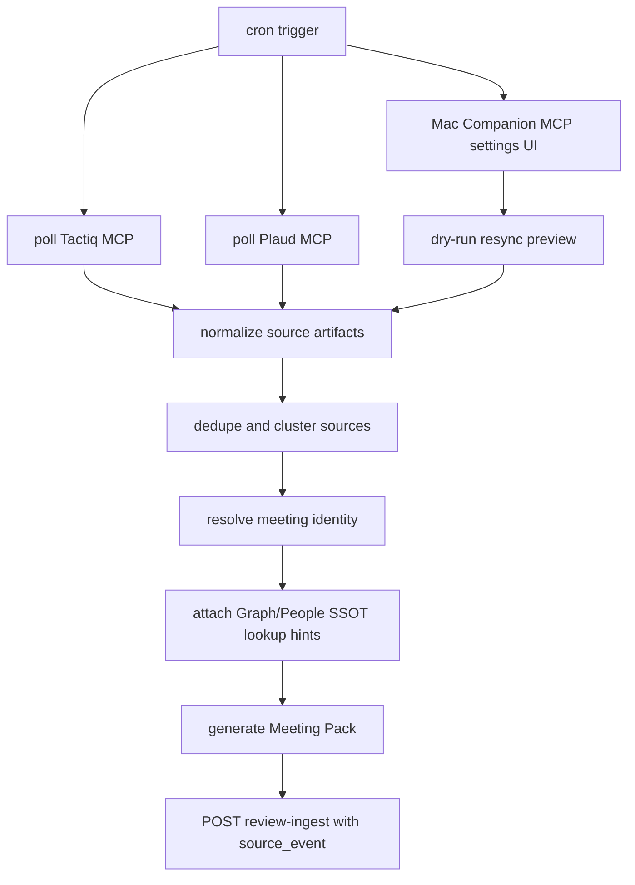

# Meeting Source MCP Sync Worker

## Story

Meeting Packの一次入力はSlack投稿ではなく、TactiqまたはPlaudに蓄積された会議・電話・雑談のTranscript/Noteである。同期workerはcronで定期実行し、Calendarに予定が存在しない会話も漏らさないため、Calendar起点ではなくTactiq MCPとPlaud MCPを直接pollする。

オンライン会議はTactiqを優先し、オフライン会話、電話、Tactiqを使えないオンライン会議はPlaudを優先する。両方に同じ内容が存在する場合は、二重にMeeting Packを作らず、片方をprimary source、もう片方をsupporting sourceとして同一source clusterに統合する。

Mac Companionには、Tactiq/Plaud MCP接続を設定・確認・再同期できるUIを用意する。UIは単なるAPI key入力欄ではなく、接続状態、最終同期時刻、取得可能範囲、未処理件数、重複統合結果、再同期範囲、dry-run preview、エラーを確認できる運用画面にする。

## Invariants

- INV-mcp-sync-001: 同期workerはcronで定期実行され、Calendar eventの存在を前提にしない。
- INV-mcp-sync-002: Tactiq/PlaudのTranscript/Noteが会議内容の事実ソースであり、SlackとCalendarは参照・補完・通知用の補助情報に限定する。
- INV-mcp-sync-003: TactiqとPlaudを両方pollし、片方の取得失敗をもう片方の空結果で上書きしない。
- INV-mcp-sync-004: 同一会議・電話・雑談はprovider source id、content hash、時刻、タイトル、参加者、本文類似度で重複統合し、Meeting Packを二重生成しない。
- INV-mcp-sync-005: `source_event` は同期workerが生成し、Review Package ingestへ渡す。ingest側がTactiq/Plaudへ取りに行かない。
- INV-mcp-sync-006: 同期workerはprovider由来のproject/person hintをReview Packageへ渡すが、People SSOTの正本更新やtask owner確定は行わない。owner解決は既存のBrainbase People SSOT境界で行い、未解決や曖昧さは例外分岐として保持する。
- INV-mcp-sync-007: Mac CompanionのMCP設定UIはsecret値を再表示しない。保存後は接続状態とmetadataだけを表示する。
- INV-mcp-sync-008: MCP設定UIの手動再同期はdry-run previewを経由し、意図せず大量replayしない。
- INV-mcp-sync-009: Mac Companionのgraceful shutdownは同期workerのschedule timerを停止し、後続プロセスを残さない。

## Source Routing Policy

| Source situation | Primary source | Supporting source | Notes |
| --- | --- | --- | --- |
| Online meeting with Tactiq transcript | Tactiq | Plaud if duplicate or backup exists | Tactiq transcriptを一次事実ソースにする |
| Offline meeting | Plaud | Tactiq none | CalendarがなくてもPlaud noteからMeeting Packを作る |
| Phone call | Plaud | Tactiq none | 電話録音・文字起こしを会話単位で扱う |
| Online meeting without Tactiq | Plaud | Calendar/Slack only as hints | Tactiq欠落を例外に残すがPlaudで生成する |
| Both providers contain same conversation | higher completeness score | other provider | 同一clusterへ統合し、二重runを作らない |

## DAG



## Worker State Machine

- S-001 workflow state transition: cron trigger reads enabled MCP provider configs and provider cursors.
- S-002 workflow state transition: Tactiq and Plaud are polled independently for artifacts updated since the provider cursor plus overlap window.
- S-003 workflow state transition: raw provider artifacts are normalized into `source_artifact` records with provider id, title, timestamps, transcript/note text hash, account metadata, and MCP resource URI.
- S-004 workflow state transition: artifacts are deduped into a stable `source_cluster` before any Meeting Pack is generated.
- S-005 workflow state transition: primary source selection uses completeness score and routing policy; non-primary duplicates are stored as supporting sources.
- S-006 workflow state transition: project hints are attached before project-scoped Graph SSOT lookup; missing or multiple project candidates are retained as blocker exceptions by the downstream Meeting Pack/Workflow layer.
- S-007 workflow state transition: People SSOT remains the downstream task-owner authority. The source sync worker passes participant and owner hints only; unresolved owner hints remain candidates, not fake owners.
- S-008 workflow state transition: Meeting Pack generation uses the primary source transcript/note as fact source and attaches `source_event` and `supporting_source_events`.
- S-009 workflow state transition: Review Package is submitted to `POST /api/workflows/control/meeting-pack/review-ingest` only after source cluster idempotency is checked.
- S-010 workflow state transition: provider cursors advance only after artifact normalization and enqueue/ingest result are persisted.
- S-011 workflow state transition: UI-triggered resync uses dry-run preview first, then explicit confirmation with bounded date/source filters.
- S-012 workflow state transition: provider auth errors and rate limits are surfaced in the settings UI and do not become empty sync results.
- S-013 workflow state transition: graceful shutdown stops the Meeting Source MCP scheduled worker before runtime shutdown completes.

## MCP Settings UI

The Mac Companion settings surface must include:

- Provider cards for Tactiq and Plaud with enabled state, connection status, last successful sync, last error, account/workspace identity, and cursor timestamp.
- Connect/reconnect action for each provider through the configured MCP auth flow.
- Secret handling that stores credentials through the existing secure credential boundary and never echoes the secret value after save.
- Test connection action that verifies list/read capability, not only token presence.
- Sync policy controls for poll interval, overlap window, provider priority, and replay date range.
- Manual resync with dry-run preview showing candidate artifacts, dedupe clusters, likely primary source, and expected Meeting Pack count.
- Error panel for auth failure, provider unavailable, rate limit, empty transcript, missing source hash, project unresolved, and duplicate conflict.

## Exception Branches

- `provider_config.missing_provider_config`: Tactiq/Plaud config is absent or disabled. Worker records config error and skips that provider only.
- `provider_auth.auth_failed`: Provider auth failed. UI shows reconnect action; worker does not emit empty result.
- `provider_poll.rate_limited`: Provider rate limit hit. Cursor does not advance; retry is scheduled.
- `source_artifact.empty_transcript`: Artifact metadata exists but transcript/note body is empty. It is not used as fact source.
- `source_artifact.hash_missing`: Artifact cannot produce a stable content hash. It is blocked from idempotent ingest.
- `source_cluster.duplicate_conflict`: Multiple artifacts appear to be the same conversation but primary source cannot be chosen automatically. UI dry-run requires confirmation.
- `project_resolution.missing_project_candidate`: Provider/Calendar/Slack/Graph hints cannot identify project. Review Package generation is blocked or sent with explicit human blocker by the downstream Meeting Pack/Workflow layer.
- `people_resolution.ambiguous_owner`: Owner hint matches multiple People SSOT candidates. The source sync worker does not choose an owner; candidates are shown by the downstream owner-resolution UI.

## Source Event Contract

The worker attaches `source_event` to every Review Package:

```json
{
  "source_system": "tactiq",
  "source_kind": "transcript",
  "meeting_mode": "online",
  "source_id": "tactiq-transcript-123",
  "source_cluster_id": "src-cluster-2026-07-02-abc",
  "mcp_resource_uri": "mcp://tactiq/transcripts/123",
  "title": "Tech Knight 定例",
  "started_at": "2026-07-02T10:00:00+09:00",
  "ended_at": "2026-07-02T11:00:00+09:00",
  "content_sha256": "abc123",
  "calendar_event_id": null,
  "slack_permalink": null,
  "ingested_by": "meeting_source_mcp_sync_worker"
}
```

When both providers contain the same conversation, non-primary sources are attached as `supporting_source_events` and never produce a second Review Package.

## Acceptance Criteria

- AC-001: Worker cron polls both Tactiq and Plaud based on persisted provider cursors without requiring Calendar event data.
- AC-002: Provider poll failures are recorded per provider and never collapsed into zero meeting results.
- AC-003: Raw Tactiq/Plaud artifacts are normalized into stable source artifacts with `mcp_resource_uri`, provider source id, timestamps, title, content hash, and text availability status.
- AC-004: Deduplication prevents duplicate Meeting Packs when Tactiq and Plaud contain the same conversation.
- AC-005: The selected primary source follows the source routing policy and stores supporting duplicates.
- AC-006: Generated Review Packages include `source_event` and optional `supporting_source_events` before calling review-ingest.
- AC-007: Calendar and Slack data can enrich identity/evidence but cannot replace missing Tactiq/Plaud transcript/note facts.
- AC-008: Provider artifacts carry project/person hints into Meeting Pack generation, while authoritative project/person resolution remains in Graph SSOT / People SSOT downstream. Unresolved cases are explicit exceptions, not fabricated defaults.
- AC-009: Mac Companion settings UI can connect/reconnect Tactiq and Plaud, test capability, show status, and expose last sync/error metadata.
- AC-010: Settings UI supports bounded manual resync with dry-run preview before replay.
- AC-011: Secret values are not rendered after save and are read only through the secure credential boundary.
- AC-012: Cursor advancement is idempotent and happens only after normalization and enqueue/ingest persistence.
- AC-013: Graceful shutdown invokes Meeting Source MCP scheduled worker cleanup before the remaining runtime services stop.

## Verification

- Unit: source artifact normalization, source routing, dedupe scoring, cursor advancement, provider failure handling.
- Integration: fake Tactiq/Plaud MCP providers with duplicate and missing-calendar artifacts.
- E2E: Mac Companion settings UI connect/test/resync dry-run flow.
- Replay: 2026-06-25以降のTactiq/Plaud artifactsをdry-runし、Meeting Pack count, duplicate clusters, unresolved projects, unresolved ownersを確認する。
- VibePro: `vibepro story diagnose --run-graphify`, `vibepro spec fingerprint/write/drift`, `vibepro pr prepare`.
